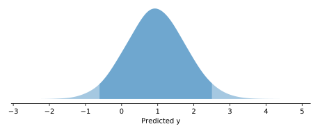
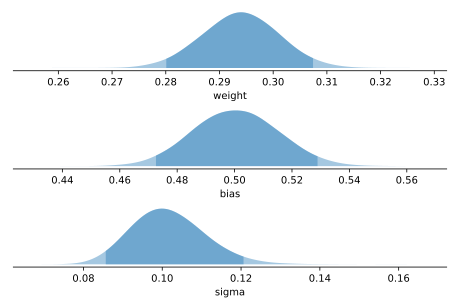
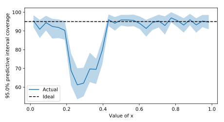

ProbFlow
========

|Docs Badge|

.. |Docs Badge| image:: https://readthedocs.org/projects/probflow/badge/
    :alt: Documentation Status
    :scale: 100%
    :target: http://probflow.readthedocs.io

ProbFlow is a Python package for building Bayesian models with `TensorFlow Probability <http://www.tensorflow.org/probability>`_, performing variational inference with those models, and evaluating the models' inferences.

It's very much still a work in progress.

- **Git repository:** http://github.com/brendanhasz/probflow
- **Documentation:** http://probflow.readthedocs.io
- **Bug reports:** http://github.com/brendanhasz/probflow/issues

Getting Started
---------------

**ProbFlow** allows you to quickly and painlessly build, fit, and evaluate custom Bayesian models (or `ready-made <http://probflow.readthedocs.io/en/latest/ready_made_models.html>`_ ones!) which run on top of `TensorFlow <http://www.tensorflow.org/>`_ and `TensorFlow Probability <http://www.tensorflow.org/probability>`_.

With ProbFlow, the core building blocks of a Bayesian model are parameters, layers, and probability distributions (and, of course, the input data).  Layers define how parameters interact with the independent variables (the features) to predict the probability distribution of the dependent variables (the target).

For example, a simple Bayesian linear regression

.. image:: http://latex.codecogs.com/gif.latex?\large&space;y&space;\sim&space;\text{Normal}(w&space;x&space;&plus;&space;b,&space;\sigma)

can be built with ProbFlow by:

.. code-block:: python

    from probflow import Input, Parameter, ScaleParameter, Normal
    
    feature = Input()
    weight = Parameter()
    bias = Parameter()
    noise_std = ScaleParameter()
    
    predictions = weight*feature + bias
    model = Normal(predictions, noise_std)

Then, the model can be fit using variational inference, in *one line*:

.. code-block:: python

    # x and y are Numpy arrays or pandas DataFrame/Series
    model.fit(x, y)

You can generate predictions for new data:

.. code-block:: python

    # x_test is a Numpy array or pandas DataFrame
    model.predict(x_test)

Compute *probabilistic* predictions for new data, with 95% confidence intervals:

.. code-block:: python

    model.plot_predictive_distribution(x_test, ci=0.95)

Evaluate your model's performance using metrics:

.. code-block:: python

    model.metrics('mse')

Inspect the posterior distributions of your fit model's parameters, with 95% confidence intervals:

.. code-block:: python

    model.plot_posterior(ci=0.95)

Investigate how well your model is capturing uncertainty by examining how accurate its predictive intervals are:

.. code-block:: python

    model.pred_dist_coverage(prc=95.0)

and diagnose *where* your model is having problems capturing uncertainty:

.. code-block:: python

    model.coverage_by(prc=95.0)

ProbFlow also provides more complex layers, such as those required for building Bayesian neural networks.  A multi-layer Bayesian neural network can be built and fit using ProbFlow in only a few lines:

.. code-block:: python

    from probflow import Sequential, Dense, ScaleParameter, Normal

    predictions = Sequential(layers=[
        Dense(units=128),
        Dense(units=64),
        Dense(units=1, activation=None)
    ])
    noise_std = ScaleParameter()
    model = Normal(predictions, noise_std)
    model.fit(x, y)

For convenience, ProbFlow also includes several `ready-made models <http://probflow.readthedocs.io/en/latest/ready_made_models.html>`_ for standard tasks (such as linear regressions, logistic regressions, and multi-layer dense neural networks).  For example, the above linear regression example could have been done with much less work by using ProbFlow's ready-made LinearRegression model:

.. code-block:: python

    from probflow import LinearRegression

    model = LinearRegression()
    model.fit(x, y)

And the multi-layer Bayesian neural net could have been made more easily by using ProbFlow's ready-made DenseRegression model:

.. code-block:: python

    from probflow import DenseRegression

    model = DenseRegression(units=[128, 64, 1])
    model.fit(x, y)

Using parameters, layers, and distributions as simple building blocks, ProbFlow allows for the painless creation of more complicated Bayesian models like generalized linear models, neural matrix factorization models, and mixed effects models.  Take a look at the `examples <http://probflow.readthedocs.io/en/latest/examples.html>`_ section and the `user guide <http://probflow.readthedocs.io/en/latest/user-guide.html>`_ for more!

Installation
------------

Before installing ProbFlow, you'll first need to install `TensorFlow <http://www.tensorflow.org/install/>`_ and `TensorFlow Probability <http://www.tensorflow.org/probability/install>`_.

Then, you can use `pip <http://pypi.org/project/pip/>`_ to install ProbFlow itself from the GitHub source:

.. code-block::
    
    pip install git+http://github.com/brendanhasz/probflow.git

Support
-------

Post bug reports, feature requests, and tutorial requests in `GitHub issues <http://github.com/brendanhasz/probflow/issues>`_.

Contributing
------------

`Pull requests <https://github.com/brendanhasz/probflow/pulls>`_ are totally welcome!  Any contribution would be appreciated, from things as minor as pointing out typos to things as major as writing new layers and distributions.

Why the name, ProbFlow?
-----------------------

Because it's a package for probabilistic modeling, and it's built on TensorFlow.  ¯\\_(ツ)_/¯
