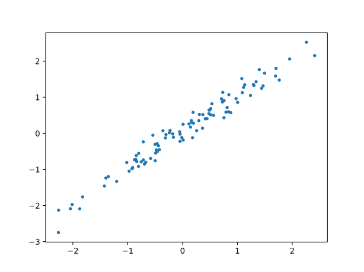
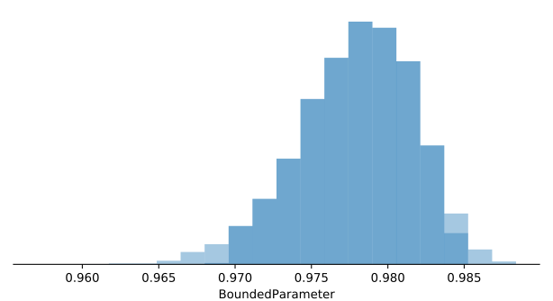
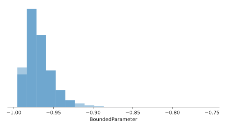

.. _example_correlation:

Bayesian Correlation
====================

.. include:: macros.hrst

TODO: description... 

TODO: math

TODO: diagram

TODO: note that this treats it as a generative model (ie only y no x)

.. tabs::

    .. group-tab:: TensorFlow

        .. code-block:: python3

            import probflow as pf
            import tensorflow as tf

            class BayesianCorrelation(pf.Model):

                def __init__(self):
                    self.rho = pf.BoundedParameter(min=-1, max=1)

                def __call__(self):
                    cov = tf.eye(2) + self.rho()*tf.abs(tf.eye(2)-1)
                    return pf.MultivariateNormal(tf.zeros([2]), cov)

    .. group-tab:: PyTorch

        .. code-block:: python3

            import probflow as pf
            import torch

            class BayesianCorrelation(pf.Model):

                def __init__(self):
                    self.rho = pf.BoundedParameter(min=-1, max=1)

                def __call__(self):
                    cov = torch.eye(2) + self.rho()*torch.abs(torch.eye(2)-1)
                    return pf.MultivariateNormal(torch.zeros([2]), cov)

Then we can instantiate the model.

.. code-block:: python3

    model = BayesianCorrelation()

Let's generate some uncorrelated data.

.. code-block:: python3

    X = np.random.randn(100, 2).astype('float32')
    plt.plot(X[:, 0], X[:, 1], '.')

.. image:: img/examples/correlation/correlation1.svg
   :width: 90 %
   :align: center

If we fit the model on some data which is uncorrelated, we can see that the
posterior distribution for the correlation coefficient :math:`\rho` is 
centered around 0:

.. code-block:: python3

    model.fit(X, learning_rate=0.1)
    model.posterior_plot(ci=0.95, style='hist')

.. image:: img/examples/correlation/correlation2.svg
   :width: 90 %
   :align: center

On the other hand, if we fit the model to some data which is highly correlated,

.. code-block:: python3

    X[:, 1] = X[:, 0] + 0.2*np.random.randn(100).astype('float32')
    plt.plot(X[:, 0], X[:, 1], '.')

Then the posterior distribution for the correlation coefficient :math:`\rho` 
is considerably closer to 1:

.. code-block:: python3

    model = BayesianCorrelation()
    model.fit(X, learning_rate=0.1)
    model.posterior_plot(ci=0.95, style='hist')

Conversely, if we generate negatively correlated data,

.. code-block:: python3

    X = np.random.randn(100, 2).astype('float32')
    X[:, 1] = X[:, 0] - 0.2*np.random.randn(100).astype('float32')
    plt.plot(X[:, 0], X[:, 1], '.')

.. image:: img/examples/correlation/correlation5.svg
   :width: 90 %
   :align: center

The model recovers the negative correlation coefficient:

.. code-block:: python3

    model = BayesianCorrelation()
    model.fit(X, learning_rate=0.1)
    model.posterior_plot(ci=0.95, style='hist')

