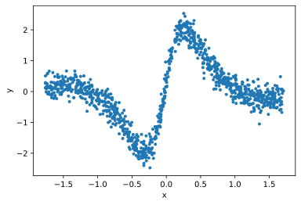
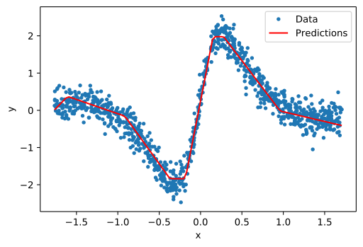
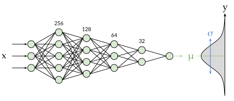
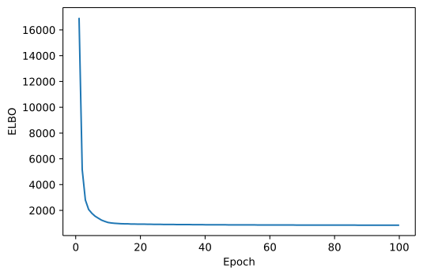

.. _example_fully_connected:

Fully-connected Neural Network |Colab Badge|
============================================

.. |Colab Badge| image:: img/colab-badge.svg
    :target: https://colab.research.google.com/drive/1AgvMHWBAEUpIcrTFY-VhvMGD_RrEKAqG

.. include:: macros.hrst

.. admonition:: TLDR

    .. code-block:: python3

        class DenseRegression(pf.ContinuousModel):
            
            def __init__(self, dims):
                self.net = pf.DenseNetwork(dims)
                self.s = pf.ScaleParameter()

            def __call__(self, x):
                return pf.Normal(self.net(x), self.s())

        units = [x.shape[1], 256, 128, 64, 32, 1] #units per layer
        model = DenseRegression(units)

    or simply

    .. code-block:: python3

        model = pf.DenseRegression(units)

    and then 

    .. code-block:: python3

        model.fit(x, y)

Purely linear regressions aren't able handle complex nonlinear relationships
between predictors and target variables - for that kind of data we can use
neural networks!  Regular neural networks simply provide point estimates, but
Bayesian neural networks (BNNs) give us both estimates and uncertainty
information.  BNNs also have strong regularization "built-in" (which comes
from not only the priors, but also from from the sampling performed during
stochastic variational inference).  This makes it much harder for BNNs to
overfit than regular neural networks.

Let's create some nonlinear data to test our neural networks on.  Later we'll fit a network to some real-world data, but for now let's just use this toy dataset:

.. code-block:: python3

    # Imports
    import probflow as pf
    import numpy as np
    import matplotlib.pyplot as plt
    rand = lambda *x: np.random.rand(*x).astype('float32')
    randn = lambda *x: np.random.randn(*x).astype('float32')
    zscore = lambda x: (x-np.mean(x, axis=0))/np.std(x, axis=0)

    # Create the data
    N = 1024
    x = 10*rand(N, 1)-5
    y = np.sin(x)/(1+x*x) + 0.05*randn(N, 1)

    # Normalize
    x = zscore(x)
    y = zscore(y)

    # Plot it
    plt.plot(x, y, '.')

Building a Neural Network Manually
----------------------------------

First we'll see how to manually create a Bayesian neural network with ProbFlow
from "scratch", to illustrate how to use the :class:`.Module` class, and to
see why it's so handy to be able to define components from which you can build
a larger model.  Then later we'll use ProbFlow's pre-built modules which make
creating neural networks even easier.

Let's create a module which represents just a single fully-connected layer
(aka a "dense" layer).  This layer takes a vector :math:`\mathbf{x}` (of 
length :math:`N_i`), and outputs a vector of length :math:`N_o`.  It 
multiplies the input by its weights (:math:`\mathbf{W}`, a 
:math:`N_i \times N_o` matrix of learnable parameters), and adds a bias
(:math:`\mathbf{b}`, a :math:`N_o`-length vector of learnable parameters).

.. math::

    \text{DenseLayer}(\mathbf{x}) = \mathbf{x}^\top \mathbf{W} + \mathbf{b}

To use ProbFlow to create a module which represents this layer and creates and
keeps track of the weight and bias parameters, create a class which inherits
:class:`.Module`:

.. tabs::

    .. group-tab:: TensorFlow
            
        .. code-block:: python3

            import tensorflow as tf

            class DenseLayer(pf.Module):

                def __init__(self, d_in, d_out):
                    self.w = pf.Parameter([d_in, d_out])
                    self.b = pf.Parameter([1, d_out])

                def __call__(self, x):
                    return x @ self.w() + self.b()

    .. group-tab:: PyTorch
            
        .. code-block:: python3

            import torch

            class DenseLayer(pf.Module):

                def __init__(self, d_in, d_out):
                    self.w = pf.Parameter([d_in, d_out])
                    self.b = pf.Parameter([1, d_out])

                def __call__(self, x):
                    x = torch.tensor(x)
                    return x @ self.w() + self.b()

Side note: we've used ``@``, the 
`infix operator for matrix multiplication <https://docs.python.org/3/whatsnew/3.5.html#whatsnew-pep-465>`_.

Having defined a single layer, it’s much easier to define another 
:class:`.Module` which stacks several of those layers together.  This module 
will represent an entire sub-network of sequential fully connected layers,
with 
`ReLU activation <https://en.wikipedia.org/wiki/Rectifier_(neural_networks)>`_
functions in between each (but no activation after the final layer).  In 
``__init__``, this new module creates and contains several of the 
``DenseLayer`` modules we defined above.

.. tabs::

    .. group-tab:: TensorFlow
            
        .. code-block:: python3

            class DenseNetwork(pf.Module):

                def __init__(self, dims):
                    Nl = len(dims)-1 #number of layers
                    self.layers = [DenseLayer(dims[i], dims[i+1]) for i in range(Nl)]
                    self.activations = (Nl-1)*[tf.nn.relu] + [lambda x: x]

                def __call__(self, x):
                    for i in range(len(self.activations)):
                        x = self.layers[i](x)
                        x = self.activations[i](x)
                    return x

    .. group-tab:: PyTorch
            
        .. code-block:: python3

            class DenseNetwork(pf.Module):

                def __init__(self, dims):
                    Nl = len(dims)-1 #number of layers
                    self.layers = [DenseLayer(dims[i], dims[i+1]) for i in range(Nl)]
                    self.activations = (Nl-1)*[torch.nn.ReLU()] + [lambda x: x]

                def __call__(self, x):
                    x = torch.tensor(x)
                    for i in range(len(self.activations)):
                        x = self.layers[i](x)
                        x = self.activations[i](x)
                    return x

The first thing to notice here is that |Modules| can contain other |Modules|!
This allows you to construct models using hierarchical building blocks, making
testing and debugging of your models much easier, and encourages code reuse.

Also note that we've used TensorFlow (or PyTorch) code within the model!
ProbFlow lets you mix and match ProbFlow operations and objects with operations
from the :ref:`backend you've selected <ug_backend>`.

Finally, we can create an actual |Model| which uses the network Module we've
just created.  This model consists of a normal distribution whose mean is predicted by the neural network.  Note that while the ``__call__`` methods of 
the  Modules above returned tensors, the ``__call__`` method of the Model
below returns a *probability distribution*!

.. code-block:: python3

    class DenseRegression(pf.ContinuousModel):
        
        def __init__(self, dims):
            self.net = DenseNetwork(dims)
            self.s = pf.ScaleParameter()

        def __call__(self, x):
            return pf.Normal(self.net(x), self.s())

Then we can instantiate the model.  We'll create a fully-connected Bayesian
neural network with two hidden layers, each having 32 units.  The first
element of the list passed to the constructor is the number of features (in
this case just one: :math:`x`), and the last element is the number of target
dimensions (in this case also just one: :math:`y`).

.. code-block:: python3

    model = DenseRegression([1, 32, 32, 1])

Then we can fit the network to the data!

.. code-block:: python3

    model.fit(x, y, epochs=1000, lr=0.02)

The fit network can make predictions:

.. code-block:: python3

    # Test points to predict
    x_test = np.linspace(min(x), max(x), 101).astype('float32').reshape(-1, 1)

    # Predict them!
    preds = model.predict(x_test)

    # Plot it
    plt.plot(x, y, '.', label='Data')
    plt.plot(x_test, preds, 'r', label='Predictions')

And because this is a Bayesian neural network, it also gives us uncertainty
estimates.  For example, we can compute the 95% posterior predictive
distribution intervals:

.. code-block:: python3

    # Compute 95% confidence intervals
    lb, ub = model.predictive_interval(x_test, ci=0.95)

    # Plot em!
    plt.fill_between(x_test[:, 0], lb[:, 0], ub[:, 0], 
                     alpha=0.2, label='95% ci')
    plt.plot(x, y, '.', label='Data')

Using the Dense and Sequential Modules
--------------------------------------

ProbFlow comes with some ready-made modules for creating fully-connected 
neural networks.  The :class:`.Dense` module handles creating the weight and
bias parameters, and the :class:`.Sequential` module takes a list of modules
or callables and pipes the output of each into the input of the next.

Using these two modules, we can define the same neural network as above much
more easily:

.. tabs::

    .. group-tab:: TensorFlow
    
        .. code-block:: python3

            class DenseRegression(pf.Model):
                
                def __init__(self, d_in):
                    self.net = pf.Sequential([
                        pf.Dense(d_in, 32),
                        tf.nn.relu,
                        pf.Dense(32, 32),
                        tf.nn.relu,
                        pf.Dense(32, 1),
                    ])
                    self.s = pf.ScaleParameter()

                def __call__(self, x):
                    return pf.Normal(self.net(x), self.s())

    .. group-tab:: PyTorch
    
        .. code-block:: python3

            class DenseRegression(pf.Model):
                
                def __init__(self, d_in):
                    self.net = pf.Sequential([
                        pf.Dense(d_in, 32),
                        torch.nn.ReLU(),
                        pf.Dense(32, 32),
                        torch.nn.ReLU(),
                        pf.Dense(32, 1),
                    ])
                    self.s = pf.ScaleParameter()

                def __call__(self, x):
                    x = torch.tensor(x)
                    return pf.Normal(self.net(x), self.s())

Then we can instantiate and fit the network similarly to before:

.. code-block:: python3

    model = DenseRegression(1)
    model.fit(x, y)

Using the DenseNetwork Module
-----------------------------

The :class:`.DenseNetwork` module can be used to automatically create
sequential models of Dense layers with activations in between (by default,
rectified linear activations). Just pass the number of dimensions per dense
layer as a list, and :class:`.DenseNetwork` will create a fully-connected
neural network with the corresponding number of units, rectified linear
activation functions in between, and no activation function after the final
layer.

For example, to create the same model as above with :class:`.DenseNetwork`
(but without having to write the component modules yourself):

    
.. code-block:: python3

    class DenseRegression(pf.Model):
        
        def __init__(self, dims):
            self.net = pf.DenseNetwork(dims)
            self.s = pf.ScaleParameter()

        def __call__(self, x):
            return pf.Normal(self.net(x), self.s())

Using the DenseRegression or DenseClassifier applications
---------------------------------------------------------

The :class:`.DenseNetwork` module automatically creates sequential dense
layers, but it doesn't include an observation distribuiton.  To create the
same model as before (a multilayer network which predicts the mean of a 
normally-distributed observation distribution), use the 
:class:`.DenseRegression` application:

.. code-block:: python3

    model = pf.DenseRegression([1, 32, 32, 1])
    model.fit(x, y)

To instead use a dense network to perform classification (where the
observation distribution is a categorical distribtuion instead of a normal
distribution), use the :class:`.DenseClassifier` application.

For example, to create a Bayesian neural network (with two hidden layers
containing 32 units each) to perform classification between ``Nc`` categories:

.. code-block:: python3

    # Nf = number of features
    # Nc = number of categories in target

    model = pf.DenseClassifier([Nf, 32, 32, Nc])
    model.fit(x, y)

Fitting a large network to a large dataset
------------------------------------------

|Colab Badge 2|

.. |Colab Badge 2| image:: img/colab-badge.svg
    :target: https://colab.research.google.com/drive/1NhQvWhuIUpkLfleQBX9eP3fMvPIVyF3g

This is cool and all, but do Bayesian neural networks scale? Bayesian models have a reputation for taking a really long time to train - can we fit a Bayesian neural network to a large dataset in any reasonable amount of time?

Let's use ProbFlow to fit a Bayesian neural network to over 1 million samples from New York City's `taxi trip records dataset <https://console.cloud.google.com/marketplace/details/city-of-new-york/nyc-tlc-trips>`_, which is a publicly available BigQuery dataset.

First let's set some settings, including how many samples to use per batch, the number of epochs to train for, and how much of the data to use for validation.

.. code-block:: python3

    # Batch size
    BATCH_SIZE = 1024

    # Number of training epochs
    EPOCHS = 100

    # Proportion of samples to hold out
    VAL_SPLIT = 0.2

I'll skip the data loading and cleaning code here, though `check out the colab <https://colab.research.google.com/drive/1NhQvWhuIUpkLfleQBX9eP3fMvPIVyF3g>`_ if you want to see it! Once we've loaded the data, we have ``x_taxi``, the normalized predictors, which includes the pickup and dropoff locations, and the time and date of the pickup:

.. code-block:: python3

    x_taxi.head()

================  ===============  =================  ================  ==========  ===========  ===========
pickup_longitude  pickup_latitude  dropoff_longitude  dropoff_latitude  min_of_day  day_of_week  day_of_year
================  ===============  =================  ================  ==========  ===========  ===========
-0.219310         0.745995         2.165016           4.864790          -0.768917   1.507371     0.321964
-0.079724         -0.021950        3.029199           0.673444          -0.241391   -0.023185    1.348868
-0.617643         -0.531016        0.149039           0.158556          -0.100370   -0.023185    0.399466
3.054433          0.806405         -0.242285          0.066294          0.087659    0.487000     -0.937446
3.275032          0.662305         -0.550953          0.044937          0.226069    -1.553742    -1.557464
...               ...              ...                ...               ...         ...          ...
================  ===============  =================  ================  ==========  ===========  ===========

And ``y_taxi``, the (normalized) trip durations which our model will be trying to predict:

.. code-block:: pycon

    >>> y_taxi.head()
    0    0.890518
    1    1.430678
    2    2.711816
    3    1.541603
    4    1.976256
    Name: trip_duration, dtype: float32

Let's split this data into training data and data to be used for validation.

.. code-block:: python3

    # Train / validation split
    train_N = int(x_taxi.shape[0]*(1.-VAL_SPLIT))
    x_train = x_taxi.values[:train_N, :]
    y_train = y_taxi.values[:train_N].reshape(-1, 1)
    x_val = x_taxi.values[train_N:, :]
    y_val = y_taxi.values[train_N:].reshape(-1, 1)

Now our training set has over 1.2M rows!

.. code-block:: pycon

    >>> print(x_train.shape, y_train.shape)
    (1253485, 7) (1253485, 1)

To model this data, we'll use a 5-layer fully-connected Bayesian neural network. The first layer will have 256 units, then the second will have 128, and so on. The final layer will have a single unit whose activation corresponds to the network's prediction of the mean of the predicted distribution of the (normalized) trip duration.

We can create a Bayesian neural network with this structure pretty easily using ProbFlow's :class:`.DenseRegression` model:

.. code-block:: python3

    model = pf.DenseRegression([7, 256, 128, 64, 32, 1])

To see how many parameters the model contains, use the ``n_parameters`` property of the model. This includes all the weights, the biases, and the standard deviation parameter:

.. code-block:: pycon

    >>> model.n_parameters
    45314

You can also see the total number of underlying variables used for optimization. That is, all the variables used to parameterize the variational posteriors. Since all the parameters in our current model have 2 variables per parameter, this is exactly twice the number of parameters (the weights and biases have normally-distributed variational posteriors which have 2 variables: the mean and the standard deviation, and the noise standard deviation parameter has a Gamma-derived variational posterior and so also has two underlying variables, the concentration and the rate). However, this might not always be the case: certain variational posteriors could have only one variable per parameter (e.g. those with Deterministic or Exponential variational posteriors), or more (e.g. a Student's t-distribution, which has 3).

.. code-block:: pycon

    >>> model.n_variables
    90628

The training of any ProbFlow model can be controlled using :doc:`callbacks <api_callbacks>`, which are similar to `Keras callbacks <https://keras.io/callbacks>`_. These can be used to do things such as anneal the learning rate, record the performance of the model over the course of training, record the values of parameters over the course of training, stop training early when some desired performance level is reached, and more!

We'll use three different callbacks during training. First, we'll make a callback to record the evidence lower bound (ELBO), the loss used for training the model, over the course of training. Also, we'll use a callback to record the predictive performance of our model on validation data, using the mean absolute error. Finally, we'll create a callback which anneals the learning rate: it starts at a high learning rate and decreases to ~0 over the course of training.

.. code-block:: python3

    # Record the ELBO
    monitor_elbo = pf.MonitorELBO()

    # Record the mean absolute error on validation data
    monitor_mae = pf.MonitorMetric('mae', x_val, y_val)

    # Anneal the learning rate from ~2e-4 to ~0
    lr_scheduler = pf.LearningRateScheduler(lambda e: 2e-4-2e-6*e)

    # List of callbacks
    callbacks = [monitor_elbo, monitor_mae, lr_scheduler]

Also, keep in mind that you can :doc:`build your own callback <ug_callbacks>` pretty easily if you need to perform custom actions during training!

Then we can fit the model, using those callbacks!

.. code-block:: python3

    model.fit(x_train, y_train,
              epochs=EPOCHS,
              batch_size=BATCH_SIZE,
              callbacks=callbacks)

Currently, this takes around 2.5 hrs, but that's using non-optimized eager execution.  I'm working on adding support for autograph in TF and tracing in PyTorch, which makes things 3-10 times faster!

After the model has been fit, using it to predict new data is just as easy as before:

.. code-block:: python3

    preds = model.predict(x_val)

We can also easily compute various :meth:`metrics <probflow.models.Model.metric>` of our model's performance on validation data. For example, to compute the mean absolute error:

.. code-block:: pycon

    >>> model.metric('mae', x_val, y_val)
    0.32324722

Also, since we used a callback to record the ELBO over the course of training, we can plot that and see that it has decreased over training and has mostly converged.

.. code-block:: python3

    monitor_elbo.plot()

We also used a callback to record the mean absolute error of our model on validation data, and our error decreases over the course of training to reach pretty good performance!

.. code-block:: python3

    monitor_mae.plot()

.. image:: img/examples/fully_connected/output_33_0.svg
   :width: 80 %
   :align: center

And we also used a callback to anneal the learning rate over the course of training, and we can plot that as well to validate that it actually decreased the learning rate:

.. code-block:: python3

    lr_scheduler.plot()

.. image:: img/examples/fully_connected/output_35_0.svg
   :width: 80 %
   :align: center

Perhaps most importantly, since this is a Bayesian network, we have access to the uncertainty associated with the model's predictions:

.. code-block:: python3

    # Plot predicted distributions
    model.pred_dist_plot(x_val[:6, :], ci=0.95,
                         individually=True, cols=2)

    # Show true values
    for i in range(6):
        plt.subplot(3, 2, i+1)
        plt.axvline(y_val[i])
        plt.xlim([-4, 4])
        plt.xlabel('')

.. image:: img/examples/fully_connected/output_37_1.svg
   :width: 80 %
   :align: center

ProbFlow also has :class:`.DataGenerator` objects which make training models on large datasets easier (similar to `Keras Sequences <https://keras.io/utils#sequence>`_). Using DataGenerators, you can train models on datasets which are too large to fit into memory by loading data from disk (or from wherever!) batch-by-batch. You can also use them to do on-the-fly data augmentation like random rotation/scaling, random swap, or `mixup <https://arxiv.org/abs/1710.09412>`_!

For more complicated examples of using ProbFlow to build neural-network-based models, check out these other examples:

* :doc:`example_time_to_event`
* :doc:`example_mixture_density`
* :doc:`example_nmf`
* :doc:`example_variational_autoencoder`
