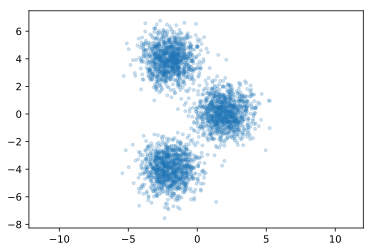
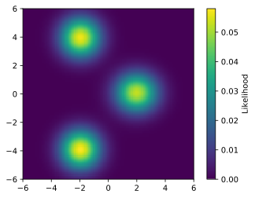
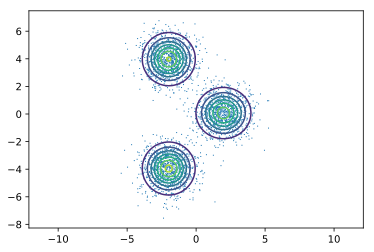

.. _example_gmm:

Gaussian Mixture Model
======================

|Colab Badge|

.. |Colab Badge| image:: img/colab-badge.svg
    :target: https://colab.research.google.com/drive/1SdlacjbhVVRhRtb9JeMxn0GcN5kYfoBT

.. include:: macros.hrst

.. code-block:: python3

    import numpy as np
    import matplotlib.pyplot as plt
    import tensorflow as tf
    import tensorflow_probability as tfp
    tfd = tfp.distributions

    import probflow as pf

Another type of 
`generative model <https://en.wikipedia.org/wiki/Generative_model>`_ is a 
`mixture model <https://en.wikipedia.org/wiki/Mixture_model>`_, where the
distribution of datapoints is modeled as the combination ("mixture") of
multiple individual distributions.  A common type of mixture model is the 
`Gaussian mixture model <https://en.wikipedia.org/wiki/Mixture_model#Gaussian_mixture_model>`_, 
where the data-generating distribution is modeled as the mixture of several
Gaussian distributions.

Here's some data generated by sampling points from three two-dimensional Gaussian distributions:

.. code-block:: python3

    # Generate some data
    N = 3*1024
    X = np.random.randn(N, 2).astype('float32')
    X[:1024, :] += [2, 0]
    X[1024:2048, :] -= [2, 4]
    X[2048:, :] += [-2, 4]

    # Plot the data
    plt.plot(X[:, 0], X[:, 1], '.', alpha=0.2)

Let's model the data using a Bayesian Gaussian mixture model.  The model has 
:math:`k \in 1, \dots , K` mixture components - we'll use multivariate normal
distributions.  To match the data we generated, we'll use :math:`K = 3` mixture
components in :math:`D = 2` dimensions.

Each of the :math:`K` normal distributions has a mean (:math:`\mu`) and a
standard deviation (:math:`\sigma`) in each dimension.  For simplicity we'll
assume the covariance of the Gaussians are diagonal.  Each of the mixture
distributions also has a weight (:math:`\theta`), where all the weights sum to
1.

The probability of a datapoint :math:`i` being generated by mixture component
:math:`k` is modeled with a categorical distribution, according to the weights:

.. math::

    k_i \sim \text{Categorical} (\boldsymbol{\theta})

And then the likelihood of that datapoint's observed values are determined by the :math:`k`-th mixture component's distribution:

.. math::

    \mathbf{y}_i \sim \mathcal{N}_D (\boldsymbol{\mu}_{k_i}, ~ \boldsymbol{\sigma}_{k_i})

Let's make that model using ProbFlow.  We'll use :class:`.DirichletParameter`
for the weights, which uses a 
`Dirichlet distribution <https://en.wikipedia.org/wiki/Dirichlet_distribution>`_
as the variational prior, because the weights must sum to 1.  As with the
:ref:`correlation model <example_correlation>`, this is a generative model -
we're not predicting :math:`y` given :math:`x`, but rather are just fitting the
data-generating distribution - and so the ``__call__`` method has no inputs.

.. code-block:: python3

    class GaussianMixtureModel(pf.Model):

        def __init__(self, k, d):
            self.mu = pf.Parameter([k, d])
            self.sigma = pf.ScaleParameter([k, d])
            self.theta = pf.DirichletParameter(k)

        def __call__(self):
            dists = tfd.MultivariateNormalDiag(self.mu(), self.sigma())
            return pf.Mixture(dists, probs=self.theta())

Compare constructing the above model (using ProbFlow) to the complexity of
constructing the model with 
`"raw" TensorFlow and TensorFlow Probability <https://brendanhasz.github.io/2019/06/12/tfp-gmm.html#model>`_.

Then, we can instantiate the model and fit it to the data!

.. code-block:: python3

    model = GaussianMixtureModel(3, 2)
    model.fit(X, lr=0.03, epochs=500, batch_size=1024)

To look at the fit mixture density over possible values of :math:`X`, we can
compute and plot the probability of the model over a grid:

.. code-block:: python3
    
    # Compute log likelihood at each point on a grid
    Np = 100 #number of grid points
    xx = np.linspace(-6,6,Np)
    Xp, Yp = np.meshgrid(xx, xx)
    Pp = np.column_stack([Xp.ravel(), Yp.ravel()])
    probs = model.prob(Pp.astype('float32'))
    probs = np.reshape(probs, (Np, Np))

    # Show the fit mixture density
    plt.imshow(probs,
               extent=(-6, 6, -6, 6),
               origin='lower')

The density lines up well with the points used to fit the model!

.. code-block:: python3

    # Plot the density and original points
    plt.plot(X[:, 0], X[:, 1], ',', zorder=-1)
    plt.contour(xx, xx, probs)

