.. _example_linear_regression:

Linear Regression
=================

|Colab Badge|

.. |Colab Badge| image:: img/colab-badge.svg
    :target: https://colab.research.google.com/drive/1evt7LXWEd8V6YUV1SoqG18skZxSlEDsY

.. include:: macros.hrst

.. code-block:: python3

    import numpy as np
    import pandas as pd
    import matplotlib.pyplot as plt
    import seaborn as sns
    import tensorflow as tf
    randn = lambda *x: np.random.randn(*x).astype('float32')

    import probflow as pf

Simple Linear Regression
------------------------

A simple linear regression is one of the simplest (`discriminative <https://en.wikipedia.org/wiki/Discriminative_model>`_) Bayesian models - it's just fitting a line to some data points!  Suppose we have some data for which we have the :math:`x` values, and we want to predict the :math:`y` values:

.. code-block:: python3

    # Generate some data
    x = randn(100)
    y = 2*x -1 + randn(100)

    # Plot it
    plt.plot(x, y, '.')

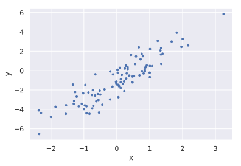

With a Bayesian regression, we predict the expected value using two
parameters: the slope (:math:`w`) and the intercept (:math:`b`) of the fit
line.  Then, we model the datapoints as being drawn from a normal distribution
(with standard deviation :math:`\sigma`) centered at that expected value.

.. math::

    y \sim \text{Normal}(wx+b, ~ \sigma)

To create this model with ProbFlow, we'll create an instance of the
:class:`.ContinuousModel` class (because our target variable is continuous). 
In the ``__init__`` method, we'll define the parameters of the model.  Then in
the ``__call__`` method, we'll use samples from those parameters to generate
probabilistic predictions.

.. tabs::

    .. group-tab:: TensorFlow
            
        .. code-block:: python3

            class SimpleLinearRegression(pf.ContinuousModel):

                def __init__(self):
                    self.w = pf.Parameter(name='Weight')
                    self.b = pf.Parameter(name='Bias')
                    self.s = pf.ScaleParameter(name='Std')

                def __call__(self, x):
                    return pf.Normal(x*self.w()+self.b(), self.s())

    .. group-tab:: PyTorch
            
        .. code-block:: python3

            import torch

            class SimpleLinearRegression(pf.ContinuousModel):

                def __init__(self):
                    self.w = pf.Parameter(name='Weight')
                    self.b = pf.Parameter(name='Bias')
                    self.s = pf.ScaleParameter(name='Std')

                def __call__(self, x):
                    x = torch.tensor(x)
                    return pf.Normal(x*self.w()+self.b(), self.s())

After defining the model class, we just need to create an instance of the model, and then we can fit it to the data using stochastic variational inference!

.. code-block:: python3

    model = SimpleLinearRegression()
    model.fit(x, y)

Now that we've fit the model, we can use it to make predictions on some test data:

.. code-block:: python3

    # Make predictions
    x_test = np.array([-3, 3]).astype('float32')
    preds = model.predict(x_test)

    # Plot em
    plt.plot(x_test, preds, 'r')
    plt.plot(x, y, '.')

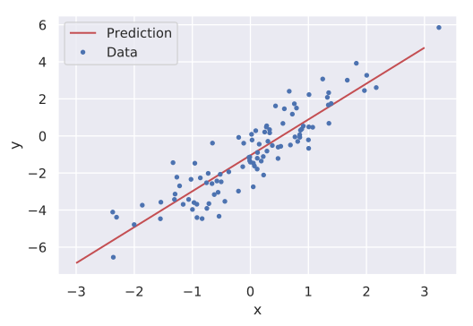

Or view the residuals of the model's predictions (the difference between the
actual and predicted values):

.. code-block:: python3

    model.residuals_plot(x, y)

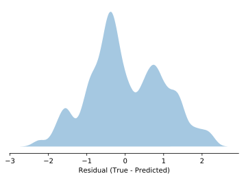

Since this is a probabilistic model, we can also look at the posterior
distributions of our parameters (that is, the probability distributions over
what the model thinks the true values of the parameters are):

.. code-block:: python3

    model.posterior_plot(ci=0.95)

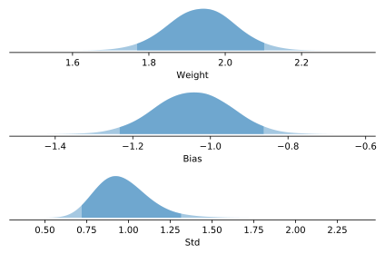

We can also get the model's confidence intervals on its predictions:

.. code-block:: python3

    # Compute 95% predictive confidence intervals
    x_eval = np.linspace(-3, 3, 100).astype('float32')
    lb, ub = model.predictive_interval(x_eval, ci=0.9)

    # Plot em
    plt.fill_between(x_eval, lb, ub, alpha=0.2)
    plt.plot(x, y, '.')

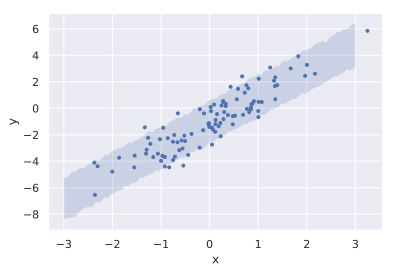

Or on just a single datapoint:

.. code-block:: python3

    model.pred_dist_plot(x_eval[:1], ci=0.95)

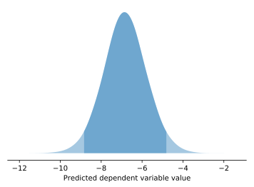

Or draw sample predictions from the model:

.. code-block:: python3

    # Draw sample fits from the model
    x_eval = np.array([-3, 3]).astype('float32')
    samples = model.predictive_sample(x_eval, n=100)

    # Plot em
    x_plot = np.broadcast_to(x_eval[:, np.newaxis], samples.T.shape)
    plt.plot(x_plot, samples.T, 'r', alpha=0.1)
    plt.plot(x, y, '.')

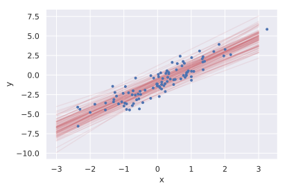

And view the `Bayesian R-squared distribution <https://doi.org/10.1080/00031305.2018.1549100>`_!

.. code-block:: python3

    model.r_squared_plot(x, y)

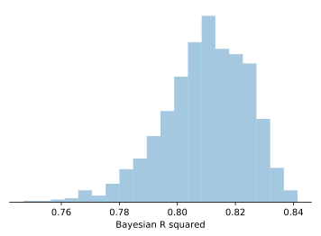

Multiple Linear Regression
--------------------------

A multiple linear regression is when we have multiple features (independent
variables), and a single target (dependent variable).  It's just like a simple
linear regression, except each feature gets its own weight:

.. math::

    y \sim \text{Normal}(x_1 w_1 + x_2 w_2 + \dots + x_N w_N + b, ~ \sigma)

or, if we represent the features and weights as vectors:

.. math::

    y \sim \text{Normal}(\mathbf{x}^\top \mathbf{w} + b, ~ \sigma)

Let's generate a dataset with multiple features.  Also, we'll store the data
in a `Pandas <https://pandas.pydata.org/>`_ DataFrame to see how ProbFlow
works with Pandas!

.. code-block:: python3

    # Settings
    D = 3   #number of dimensions
    N = 100 #number of datapoints

    # Generate some data
    x = pd.DataFrame(randn(N, D))
    weights = randn(D, 1)
    y = x @ weights - 1 + 0.2*randn(N, 1)

    # Plot em
    for i in range(D):
        plt.subplot(1, D, i+1)
        sns.regplot(x[i], y[0])

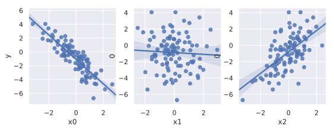

We can create pretty much the same model as before, except we'll create
:math:`\mathbf{w}` as a vector parameter, and because our input is now a
pandas DataFrame, we'll call ``df.values`` to get the underlying numpy array. 
Also note that below we're using the ``@`` operator, which is the 
`infix operator for matrix multiplication <https://www.python.org/dev/peps/pep-0465/>`_.

.. tabs::

    .. group-tab:: TensorFlow
            
        .. code-block:: python3

            class MultipleLinearRegression(pf.ContinuousModel):

                def __init__(self, dims):
                    self.w = pf.Parameter([dims, 1], name='Weights')
                    self.b = pf.Parameter(name='Bias')
                    self.s = pf.ScaleParameter(name='Std')

                def __call__(self, x):
                    return pf.Normal(x.values @ self.w() + self.b(), self.s())

    .. group-tab:: PyTorch
            
        .. code-block:: python3

            class MultipleLinearRegression(pf.ContinuousModel):

                def __init__(self, dims):
                    self.w = pf.Parameter([dims, 1], name='Weights')
                    self.b = pf.Parameter(name='Bias')
                    self.s = pf.ScaleParameter(name='Std')

                def __call__(self, x):
                    x = torch.tensor(x.values)
                    return pf.Normal(x @ self.w() + self.b(), self.s())

Again, just instantiate the model and fit it to the data.  You can control the
learning rate and the number of epochs used to fit the data with the ``lr``
and ``epochs`` keyword arguments:

.. code-block:: python3

    model = MultipleLinearRegression(3)
    model.fit(x, y, lr=0.1, epochs=300)

And again we can view the posterior distributions for our parameters, but this
time our weight parameter is a vector with three elements, so each has an
independent posterior:

.. code-block:: python3

    model.posterior_plot(ci=0.95)

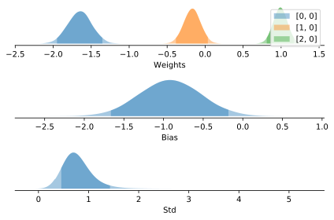

Using the Dense Module
----------------------

The :class:`.Dense` module can also be used to build a linear regression:

.. code-block:: python3

    class LinearRegression(pf.ContinuousModel):

        def __init__(self, dims):
            self.layer = pf.Dense(dims, 1)
            self.s = pf.ScaleParameter()

        def __call__(self, x):
            return pf.Normal(self.layer(x.values), self.s())

    # Fit it!
    model = LinearRegression(3)
    model.fit(x, y)

Using the LinearRegression Model
--------------------------------

But the easiest way to do a linear regression with ProbFlow is to use the
pre-built :class:`.LinearRegression` model:

.. code-block:: python3

    model = pf.LinearRegression(3)
    model.fit(x, y)

Using the MultivariateNormalParameter
-------------------------------------

So far, our parameters have been completely independent.  We might want to
model the full joint distribution, to allow for a potential correlation
between the parameters.  For that, we can use 
:class:`.MultivariateNormalParameter`, which creates a parameter that has a
multivariate normal posterior, with full covariance.  We'll index the
parameter in ``__call__``, which automatically takes a slice from a sample of
the parameter.

.. tabs::

    .. group-tab:: TensorFlow
    
        .. code-block:: python3

            class LinearRegression(pf.ContinuousModel):

                def __init__(self, dims):
                    self.betas = pf.MultivariateNormalParameter(dims+2)

                def __call__(self, x):
                    w = self.betas[:-2]
                    b = self.betas[-2]
                    s = tf.nn.softplus(self.betas[-1])
                    return pf.Normal(x.values @ w + b, s)

    .. group-tab:: PyTorch
    
        .. code-block:: python3

            class LinearRegression(pf.ContinuousModel):

                def __init__(self, dims):
                    self.betas = pf.MultivariateNormalParameter(dims+2)

                def __call__(self, x):
                    x = torch.tensor(x.values)
                    w = self.betas[:-2]
                    b = self.betas[-2]
                    s = torch.nn.Softplus()(self.betas[-1])
                    return pf.Normal(x @ w + b, s)

Then we can instantiate the model and fit it:

.. code-block:: python3

    model = LinearRegression(3)
    model.fit(x, y, lr=0.1, epochs=300)

Now the covariance between parameters has also been modeled:

.. code-block:: python3

    samples = model.betas.posterior_sample(n=10000)
    sns.kdeplot(samples[:, 0, 0], samples[:, 1, 0])

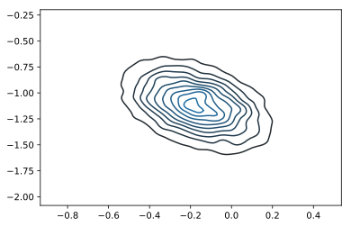
