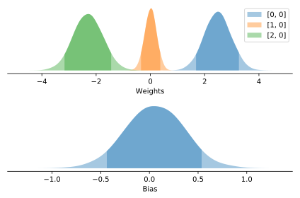
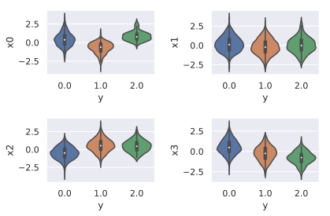
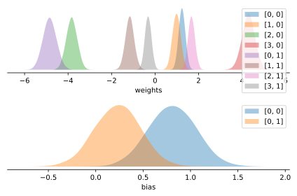

.. _example_logistic_regression:

Logistic Regression
===================

|Colab Badge|

.. |Colab Badge| image:: img/colab-badge.svg
    :target: https://colab.research.google.com/drive/10b4zBofgCfU1SgpGZoQXmcn1g2jGO-AG

.. include:: macros.hrst

.. code-block:: python3

    import numpy as np
    import matplotlib.pyplot as plt
    import seaborn as sns
    randn = lambda *x: np.random.randn(*x).astype('float32')

    import probflow as pf

In the last example, both :math:`x` and :math:`y` were continuous variables (their values ranged from :math:`-\infty` to :math:`\infty`).  What if our output variable is binary?  That is, suppose the output variable can take only one of two values, 0 or 1, and so we need a classification model.

Let's create a dataset which has 3 continuous features, and a target variable with 2 classes: 

.. code-block:: python3

    # Settings
    N = 1000 #number of datapoints
    D = 3    #number of features

    # Generate data
    x = randn(N, D)
    w = np.array([[2.], [0.1], [-2.]]).astype('float32')
    noise = randn(N, 1)
    y = np.round(1./(1.+np.exp(-(x@w+noise))))

    # Plot it
    for i in range(D):
        plt.subplot(1, D, i+1)
        sns.violinplot(x=y[:, 0], y=x[:, i])

.. image:: img/examples/logistic_regression/output_4_0.svg
   :width: 99 %
   :align: center

Building a Logistic Regression Manually
---------------------------------------

A `logistic regression <https://en.wikipedia.org/wiki/Logistic_regression>`_
is a model where our output variable is categorical.  It's basically the same
thing as a linear regression, except we pipe the linearly predicted value
through a nonlinear function to get the probability of the output class:

.. math::

    p(y=1) = f( \mathbf{x}^\top \mathbf{w} + b )

where :math:`f` is usually the 
`logistic function <https://en.wikipedia.org/wiki/Logistic_function>`_.  Or, 
with :math:`>2` classes, a 
`softmax <https://en.wikipedia.org/wiki/Softmax_function>`_.

If our target variable has only 2 possible classes, we can model this using a
`Bernoulli distribution <https://en.wikipedia.org/wiki/Bernoulli_distribution>`_:

.. math::

    y \sim \text{Bernoulli}( f( \mathbf{x}^\top \mathbf{w} + b ) )

To create this model in ProbFlow, we'll create a class which inherits 
:class:`.CategoricalModel`, because the target variable is categorical 
(either 0 or 1).  Again, in the ``__init__`` method we define the parameters
of the model, and in the ``__call__`` method we compute probabilistic
predictions given the parameters and the input data:

.. tabs::

    .. group-tab:: TensorFlow
            
        .. code-block:: python3

            class LogisticRegression(pf.CategoricalModel):

                def __init__(self, dims):
                    self.w = pf.Parameter([dims, 1], name='Weights')
                    self.b = pf.Parameter([1, 1], name='Bias')

                def __call__(self, x):
                    return pf.Bernoulli(x @ self.w() + self.b())

    .. group-tab:: PyTorch
            
        .. code-block:: python3

            import torch
            
            pf.set_backend('pytorch')

            class LogisticRegression(pf.CategoricalModel):

                def __init__(self, dims):
                    self.w = pf.Parameter([dims, 1], name='Weights')
                    self.b = pf.Parameter([1, 1], name='Bias')

                def __call__(self, x):
                    x = torch.tensor(x)
                    return pf.Bernoulli(x @ self.w() + self.b())

Note that by default, the :class:`.Bernoulli` distribution treats its inputs
as logits (that is, it passes the inputs through a sigmoid function to get the
output class probabilities).  To force it to treat the inputs as raw
probability values, use the ``probs`` keyword argument to the :class:`.Bernoulli`
constructor.

Then we can instantiate our model class,

.. code-block:: python3

    model = LogisticRegression(D)

And fit it to the data!

.. code-block:: python3

    model.fit(x, y, lr=0.01)

Now we can plot the posterior distributions for the weights and the bias, and 
can see that the model recovered the values we used to generate the data:

.. code-block:: python3

    model.posterior_plot(ci=0.9)

Using the LogisticRegression module
-----------------------------------

An even easier way to do a logistic regression with ProbFlow is to use the
pre-built :class:`.LogisticRegression` model:

.. code-block:: python3

    model = pf.LogisticRegression(D)
    model.fit(x, y, lr=0.01)
    model.posterior_plot(ci=0.9)

Multinomial Logistic Regression
-------------------------------

The :class:`.LogisticRegression` model even handles when :math:`y` has multiple
classes (that is, a
`Multinomial logistic regression <https://en.wikipedia.org/wiki/Multinomial_logistic_regression>`_).
Let's generate some data with 4 features, where the target has 3 possible
classes:

.. code-block:: python3

    # Settings
    N = 1000 #number of datapoints
    D = 4    #number of features
    K = 3    #number of target classes

    # Generate data
    x = randn(N, D)
    w = randn(D, K)
    noise = randn(N, 1)
    y = np.argmax(x@w+noise, axis=1).astype('float32')

    # Plot it
    for i in range(D):
        plt.subplot(2, 2, i+1)
        sns.violinplot(x=y, y=x[:, i])

The ``k`` keyword argument to :class:`.LogisticRegression` sets the number of
classes of the dependent variable.

.. code-block:: python3

    model = pf.LogisticRegression(D, k=K)
    model.fit(x, y, lr=0.01, epochs=200)
    model.posterior_plot()

And we can predict the target class given the features:

.. code-block:: pycon

    >>> model.predict(x[:5, :])
    array([0, 0, 1, 2, 1], dtype=int32)

Or even compute the posterior predictive probability of the target class for
test datapoints:

.. code-block:: python3

    x_test = randn(1, D)
    model.pred_dist_plot(x_test)

.. image:: img/examples/logistic_regression/output_24_2.svg
   :width: 70 %
   :align: center
