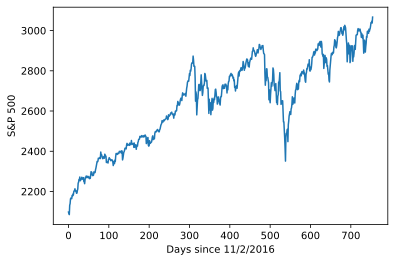
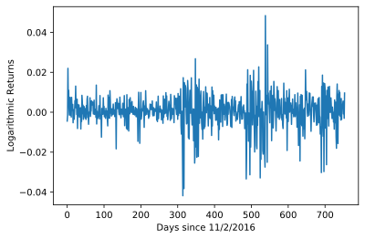
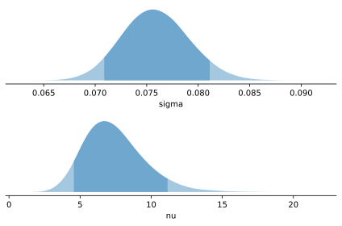
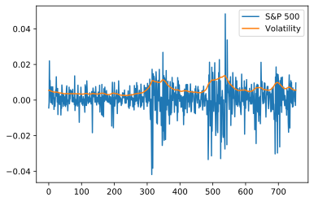

.. _example_stochastic_volatility:

Stochastic Volatility Model
===========================

.. include:: macros.hrst

.. code-block:: python3

    import numpy as np
    import pandas as pd
    import matplotlib.pyplot as plt
    import tensorflow as tf
    import probflow as pf

`Stochastic volatility models <https://en.wikipedia.org/wiki/Stochastic_volatility>`_
are often used to model the variability of stock prices over time. 
The `volatility <https://en.wikipedia.org/wiki/Volatility_(finance)>`_ is 
the standard deviation of the logarithmic returns over time.  Instead of 
assuming that the volatility is constant, stochastic volatility 
models have latent parameters which model the volatility at each moment in 
time.

This example is pretty similar to the
`PyMC example <https://docs.pymc.io/notebooks/stochastic_volatility.html>`_
stochastic volatility model, with a few differences specific to stochastic
variational inference (as opposed to the PyMC example which uses MCMC).

Data
----

We'll fit a model to the volatility of the S&P 500 day-by-day returns.  S&P 500
performance data can be found 
`here <https://us.spindices.com/indices/equity/sp-500>`_.
Let's load the data from the past three years.

.. code-block:: python3

    df = pd.read_csv('PerformanceGraphExport.csv')

We can view the raw index values over time:

.. code-block:: python3

    # Plot raw S&P 500 performance
    plt.plot(df['S&P 500'])
    plt.ylabel('S&P 500')
    plt.xlabel('Days since 11/2/2016')

But we can also compute the difference in logarithmic returns, which we'll
model to estimate the volatility.  Note that at some time points the index is
not very volatile (e.g. from time 100-250), while at other times the index is
very volatile (e.g. from 300-400 and at ~500).

.. code-block:: python3

    # Compute logarithmic returns
    y = df['S&P 500'].values
    y = np.log(y[1:]) - np.log(y[:-1])
    y = y.reshape((1, y.shape[0])).astype('float32')
    N = y.shape[1]

    # Plot it
    plt.plot(y.T)
    plt.ylabel('Logarithmic Returns')
    plt.xlabel('Days since 11/2/2016')

Model
-----

At each timepoint (:math:`i`) we'll model the logarithmic returns at that 
timepoint (:math:`y_i`).  The model allows the volatility to change over time,
such that each time point has a volatility controlled by a parameter for that
time point (:math:`s_i`).  We'll use a 
`Student t-distribution <https://en.wikipedia.org/wiki/Student%27s_t-distribution>`_
to model the logarithmic returns, with degrees of freedom :math:`\nu` (a free
parameter):

.. math::

    y_i \sim \text{StudentT}(\nu, ~ 0, ~ \exp(s_i))

However, we can't allow the scale parameters (:math:`s_i`) at each timepoint
to be completely independent, or the model will just overfit the data!  So,
we'll constrain the volatility at any timepoint :math:`i` to be similar to the
volatility at the previous timepoint :math:`i-1`, and add another parameter 
:math:`\sigma` which controls how quickly the volatility can change over time:

.. math::

    s_i \sim \text{Normal}(s_{i-1}, ~ \sigma)

We'll use normal distributions as the variational posteriors for each :math:`s`
parameter, and log normal distributions for :math:`\nu` and :math:`\sigma`, 
with the following priors:

.. math::

    \begin{align*}
    \log(\sigma) & \sim \text{Normal}(-3, ~ 0.2) \\
    \log(\nu) & \sim \text{Normal}(0, ~ 1)
    \end{align*}

Let's build this model with ProbFlow.  There's one major difference between the
PyMC version (which uses MCMC) and our model (which uses SVI): because the
prior on each :math:`s_i` is :math:`\text{Normal}(s_{i-1}, ~ \sigma)`, in 
``__call__`` we'll add the KL loss due to the divergence between those two
distributions (as we would with a regular parameter's variational posterior
and prior).

.. code-block:: python3

    class StochasticVolatility(pf.Model):

        def __init__(self, N):
            self.s = pf.Parameter([1, N], prior=None)
            self.sigma = pf.Parameter(name='sigma',
                                      prior=pf.Normal(-3, 0.1), 
                                      transform=tf.exp)
            self.nu = pf.Parameter(name='nu',
                                   prior=pf.Normal(0, 1),
                                   transform=tf.exp)

        def __call__(self):
            s_posteriors = pf.Normal(self.s.posterior().mean()[:, 1:],
                                     self.s.posterior().stddev()[:, 1:])
            s_priors = pf.Normal(self.s.posterior().mean()[:, :-1],
                                 self.sigma())
            self.add_kl_loss(s_posteriors, s_priors)
            return pf.StudentT(self.nu(), 0, tf.exp(self.s()))

The we can instantiate the model,

.. code-block:: python3

    model = StochasticVolatility(N)

And fit it to the data!

.. code-block:: python3

    model.fit(y, batch_size=1, epochs=1000)

Inspecting the Fit
------------------

We can take a look at the posterior distributions for the :math:`\sigma` and
:math:`\nu` parameters:

.. code-block:: python3

    model.posterior_plot(['sigma', 'nu'], ci=0.9)

But more importantly, we can plot the MAP estimate of the volatility over time:

.. code-block:: python3

    plt.plot(y.T)
    plt.plot(np.exp(model.s.posterior_mean().T))
    plt.legend(['S&P 500', 'Volatility'])

And since this is a Bayesian model, we also have access to uncertainty as to
the amount of volatility at each time point:

.. code-block:: python3

    # Sample from the posterior
    Ns = 50
    samples = model.s.posterior_sample(Ns).reshape((Ns, N))

    # Plot the posterior over time
    plt.plot(y.T)
    plt.plot(np.exp(samples.T), 'r', alpha=0.05)
    plt.legend(['S&P 500', 'Volatility'])
    plt.show()

