.. _example_time_to_event:

Censored Time-to-Event Model
============================

|Colab Badge|

.. |Colab Badge| image:: img/colab-badge.svg
    :target: https://colab.research.google.com/drive/12xf2Tzub3coM6YSZthEboQaFbaPiqTOm

.. include:: macros.hrst

.. code-block:: python3

    import numpy as np
    import matplotlib.pyplot as plt
    import tensorflow as tf
    import tensorflow_probability as tfp
    tfd = tfp.distributions
    randn = lambda *x: np.random.randn(*x).astype('float32')

    import probflow as pf

The problem of predicting how long it will be until some event happens again is a pretty common one.  For example, time-to-event prediction problems include:

* customer churn modeling (predicting how long it will be before a customer makes their next purchase)
* predictive maintenance (predicting how long it will be until some component of a vehicle or machine breaks)
* rare event prediction (like predicting how long it will be until the next earthquake or flood in some area)
* survival analysis (such as predicting how long a person will live given certian risk factors)
* various healthcare problems (like predicting how long it will be until a patient's next heart attack).

But a big problem with time-to-event prediction is that, depending on your data, much of your data could be `censored <https://en.wikipedia.org/wiki/Censoring_(statistics)>`_ .  Censoring is when some of your data is only partially known.  Suppose we're trying to predict the time to a customer's next purchase.  We have a history of their purchases: they bought something in January, then again in March.  If we're building a predictive model in September, then we have one datapoint from that customer which is *not* censored: in January their time to next purchase was 3 months (in March!).  But we also have another datapoint which *is* censored: their time-to-purchase after the 2nd purchase.  We know it must be at *least* 6 months (since they haven't bought anything since), but how much greater?  7 months?  A year?  Maybe they'll never buy again!  This incomplete knowledge of a datapoint is called censoring, and that datapoint is "censored".

In this example we'll see how to build these time-to-event models using ProbFlow.  First we'll first look at the drawbacks of using a naive model to predict the time to events, then we'll see how to build a time-to-event model which can handle censored data properly, and finally we'll extend that model to use deep Bayesian neural networks for prediction!

We'll be using these models to predict (simulated!) customer purchasing behavior, but basically the same model can be used for many of the other time-to-event prediction applications mentioned above.

First let's simulate some customer purchase data:

.. code-block:: python3

    # Generate time-to-event data
    N = 100 #number of customers
    D = 2   #number of predictors
    x = randn(N, D)
    w = np.array([[1.], [-1.]]).astype('float32')
    b = randn(1, 1)
    y = tfd.Exponential(tf.nn.softplus(x@w + b)).sample().numpy()

    # Simulate purchase times
    t_stop = 10 #time of data collection
    t1 = t_stop*np.random.rand(N)
    t2 = t1 + y[:, 0]
    cix = t2>t_stop
    cid = np.arange(N) #customer id

    # Plot em
    plt.plot(np.row_stack((t1[~cix], t2[~cix])), 
             np.row_stack((cid, cid))[:, ~cix], 'g')
    plt.plot(np.row_stack((t1[cix], t_stop+0*t2[cix])), 
             np.row_stack((cid, cid))[:, cix], 'r')
    plt.plot(t1, cid, '.')
    plt.plot(t2[~cix], cid[~cix], 'g.')
    plt.axvline(t_stop, color='k', linestyle=':')

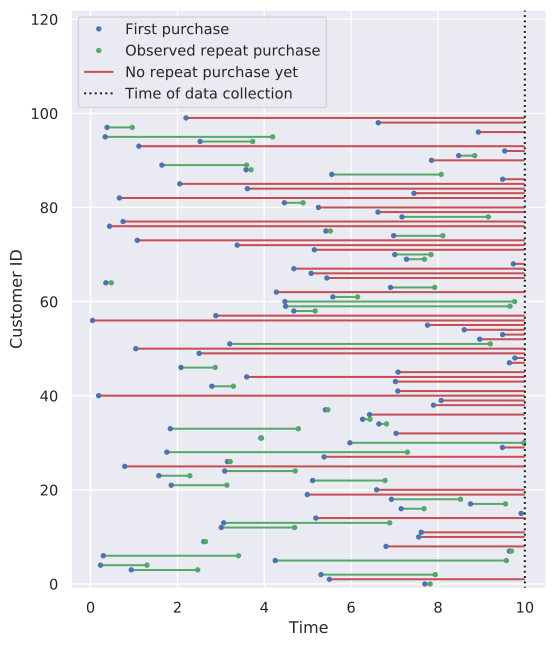

In the plot above, each row corresponds to a single customer.  The blue dots are the customer's first purchase, and the green dots (and line in between) correspond to when that customer made a second purchase.  The red lines correspond to customers who haven't made a second purchase before the time we collected the data to train the predictive model.

Our predictive model will be trying to predict the time until a customer's next purchase based on various features about the customer.  We've just simulated two random features, but in reality there could be many more, and these features would correspond to things like number of purchases in the past month, number of ads for our site they've viewed recently, their average product review score for products they've bought from us, etc.

We can take a look at the relationship between each of our simulated features and the log time-to-next-purchase.

.. code-block:: python3

    # Plot the data
    for d in range(D):
        plt.subplot(1, 2, d+1)
        plt.plot(x[:, d], y, '.')
        plt.plot(x[cix, d], y[cix], 'ro')
        plt.yscale('log')

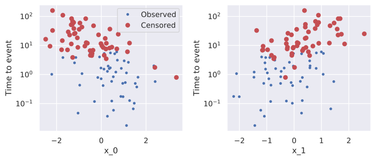

Some features (like :math:`x_1`) make it more likely that the next purchase will take longer to occur (they make the customer more likely to "churn"), while other features (like :math:`x_0`) make it more likely that the next purchase will happen sooner.

However, the points in red haven't actually occurred by the time we collect the data to train our model!  The :math:`y` values correspond to what the actual time-to-events *would* be, but when fitting the models below, that data is censored - that is, we won't have access to the true :math:`y` values, we'll just know that the purchase has still not yet occurred after some amount of time.

Regular Time-to-Event Model
---------------------------

One option is to just toss the data from customers who haven't made a second purchase, because we don't know when that second purchase would be made!  With this method, we'll just fit a model to only the time-to-second-purchase datapoints which were actually observed.

Here's the time-to-next-purchase data for only customers who actually *have* made a second purchase.

.. code-block:: python3

    # Use only datapoints which were observed
    y_train = y[~cix, :]
    x_train = x[~cix, :]

    # Plot em
    plt.plot(y_train, '.')

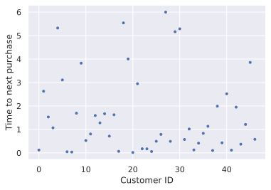

To model customers' time to their next purchase, we'll use a simple linear estimator with an `Exponential observation distribution <https://en.wikipedia.org/wiki/Exponential_distribution>`_.  The model predicts the expected time to the next event by multiplying the feature values (:math:`\mathbf{x}`) by some learnable weights (:math:`\mathbf{w}`), and then adding a bias (:math:`b`).  Then the likelihood of the actual time to event (:math:`t`) is modeled by an exponential distribution with that predicted rate,

.. math::
    
    t ~ \sim ~ \text{Exponential}(f(\mathbf{x}^\top \mathbf{w} + b))

where the :math:`f(\cdot)` function is just some transform to ensure the predicted rate is positive (we'll use the `softplus <https://en.wikipedia.org/wiki/Rectifier_(neural_networks)#Softplus>`_ function, but you could instead use :math:`\exp` or something).

This model is pretty straightforward to build using ProbFlow:

.. code-block:: python3

    class RegularSurvivalModel(pf.ContinuousModel):

        def __init__(self, d):
            self.w = pf.Parameter([d, 1], name='w')
            self.b = pf.Parameter([1, 1], name='b')

        def __call__(self, x):
            preds = tf.nn.softplus(x @ self.w() + self.b())
            return tfd.Exponential(preds)

Or equivalently, but more compactly, we can use a :class:`.Dense` module:

.. code-block:: python3

    class RegularSurvivalModel(pf.ContinuousModel):

        def __init__(self, d):
            self.layer = pf.Dense(d)

        def __call__(self, x):
            return tfd.Exponential(tf.nn.softplus(self.layer(x)))

Then we can instantiate the model,

.. code-block:: python3

    model1 = RegularSurvivalModel(D)

And fit it to the (subset of the) data!

.. code-block:: python3

    model1.fit(x_train, y_train, lr=0.02, epochs=1000)

Let's take a look at how the model's estimate of the parameters match up with the actual values we used to generate the data.  The distributions below are the model's posteriors, and the vertical lines are the actual values of each parameter which we used to generate the data.

.. code-block:: python3

    # Show model posteriors
    model1.posterior_plot(ci=0.9)

    # True parameter values
    plt.subplot(2, 1, 1)
    plt.axvline(w[0], color='C0')
    plt.axvline(w[1], color='C1')
    plt.subplot(2, 1, 2)
    plt.axvline(b, color='C0')

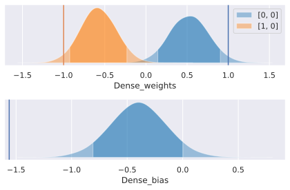

While the model gets the parameters in kind of the right direction (i.e., :math:`w_0>0`, :math:`w_1<0`, and :math:`b<0`), there is definitely a systematic bias happening which leads to the parameters not being estimated correctly!

Something we might do to try and use the censored data - at least a little bit - is to simply set the :math:`y` values for events which have not yet occurred to the time we've been waiting.  That is, we just set the :math:`y` values for censored events to the time between the last event and the time at which we want to fit the model.  As if we assume that all customers who haven't yet made a 2nd purchase make one the instant we collect the data.  That would look like this:

.. code-block:: python3

    # Set nonobserved datapoints to time waiting
    x_train = x
    y_train = y.copy()
    y_train[cix, 0] = t_stop-t1[cix]

    # Plot em
    plt.plot(y_train, '.')

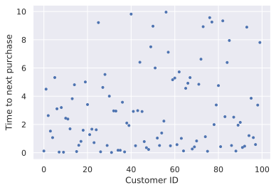

Then we can again try fitting the model to that quasi-censored data.

.. code-block:: python3

    # Instantiate and fit a new model
    model = RegularSurvivalModel(D)
    model.fit(x_train, y_train, lr=0.02, epochs=1000)

    # Show model posteriors
    model.posterior_plot(ci=0.9)

    # True parameter values
    plt.subplot(2, 1, 1)
    plt.axvline(w[0], color='C0')
    plt.axvline(w[1], color='C1')
    plt.subplot(2, 1, 2)
    plt.axvline(b, color='C0')

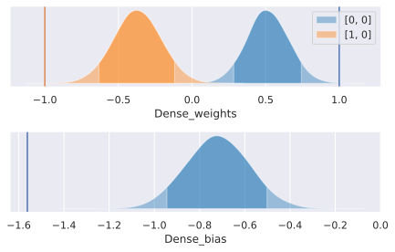

That's just as bad!

Censored Time-to-Event Model
----------------------------

The bias in the previous model happens because we only used a specific subset of the data (the non-censored data) to train the model!  Or, in the second case, because we systematically changed those values (we set the :math:`y` values of censored datapoints to the time between the first purchase and the time of model fitting).

With the first model, where we omitted censored data completely, we were simply computing the model likelihood based off the likelihood of the observed time-to-events along the predicted exponential distribution.

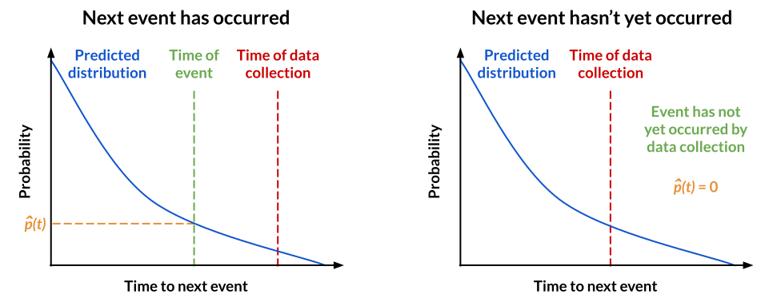

And for the second attempt above, where we assumed the second event occurred at the time of model-fitting, we used the likelihood of the time between the previous event and the time of model fitting along the predicted distribution.

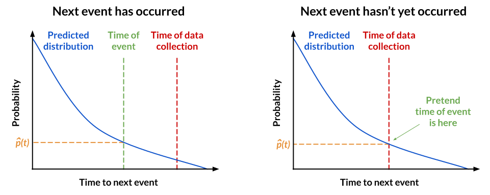

However, it's possible to build a model which accounts for the fact that some of the data is censored, and uses information about the fact that an event has *not yet occurred* after some specific amount of time.  This method takes advantage of the fact that we're using a probability distribution to model the time-to-event values.  

The fact that the event has not yet been observed after :math:`t` time means that we know the true time-to-event is *at least* :math:`t`.  Therefore, we can use the predicted probability distribution to compute the probability under the curve after the time of data collection, which gives us the probability of :math:`t` occuring after that time, according to the predicted probability distribution.  This allows our model to learn even from the censored datapoints, because it encourages the parameters to "push" the predicted time-to-event past the censoring time.

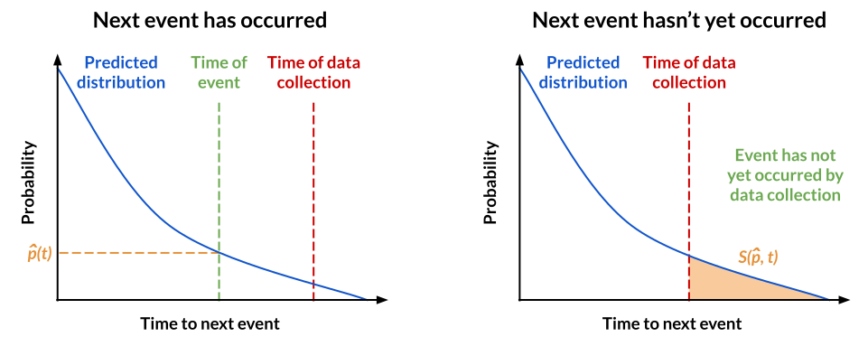

This probability density under the curve above some value can be computed using the `survival function <https://en.wikipedia.org/wiki/Survival_function>`_ of a distribution :math:`S(p, t)` (aka the complementary cumulative distribution function), which is the cumulative probability of some probability distribution :math:`p` *after* a given value :math:`t`,

.. math::

    S(p, t) = \int_t^\infty p(x) ~ dx

So, if we have our predicted observation distribution as before:

.. math::

    \hat{p} = \text{Exponential}(f(\mathbf{x}^\top \mathbf{w} + b))

Then, depending on whether the event was observed by the time we collected the data or not, we can compute the likelihood using either the predicted distribution's likelihood or its survival function:

.. math::

    p(t~|~\mathbf{x},\mathbf{w},b) ~ = ~ 
        \begin{cases}
        \hat{p}(t) & \text{if event was observed after } t \text{ time} \\
        S(\hat{p}, t) & \text{if event not yet observed after } t \text{ time}
        \end{cases}

To indicate events which have not yet been observed, we'll set their :math:`y` values to be the negative of the time after which they've not yet been observed.  (We could instead just use the positive value of the time after which the event hasn't yet been observed, and the add another column to :math:`x` which indicates whether an event was actually observed or is censored, but I found just negating the :math:`y` values to be simpler). Importantly, the new model will treat positive and negative :math:`y` values fundamentally differently.

.. code-block:: python3

    # Use all the data!
    x_train = x
    y_train = y.copy()

    # Neg. wait time w/ still no observation
    y_train[cix, 0] = t1[cix]-t_stop

    # Plot it
    plt.plot(y_train[cix], 'r.')
    plt.plot(y_train[~cix], 'g.')
    plt.xlabel('Customer ID')
    plt.ylabel('Observed time to next purchase\n'
               'or neg time w/o repeat purchase')
    plt.show()

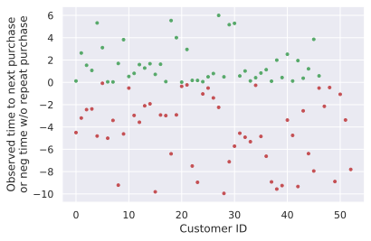

Let's use ProbFlow to create a model which actually takes advantage of the censored information intelligently.  The generation of the predictions will be exactly the same as before: we use a linear model to estimate the expected time to event, and use an exponential observation distribution.  So, the ``__init__`` and ``__call__`` methods are the same as before.

However, we'll change how we compute the likelihood.  With the previous model, ProbFlow automatically used the probability of y on the predicted exponential distribution as the likelihood.  However, now we want to use that only for the observed datapoints, and use the survival probability (the area under the curve after the censoring time) as the likelihood for events which have not yet been observed!  To acheive this, we'll override the ``log_likelihood`` method (which by default just returns ``self(x).log_prob(y)``).

.. code-block:: python3

    class CensoredSurvivalModel(pf.ContinuousModel):

        def __init__(self, d):
            self.layer = pf.Dense(d)

        def __call__(self, x):
            return tfd.Exponential(tf.nn.softplus(self.layer(x)))

        def log_likelihood(self, x, y):
            """If y>=0, that's the time to the observed event.
            If y<0, it has not yet been observed after -y time!"""

            # Predicted distributions
            dist = self(x)

            # Likelihoods of observed time-to-events
            obs_ll = dist.log_prob(y)[y>=0]

            # Likelihoods of events not yet observed
            non_ll = dist.log_survival_function(-y)[y<0]

            # Return the sum of log likelihoods
            return tf.reduce_sum(obs_ll) + tf.reduce_sum(non_ll)

After instantiating the model,

.. code-block:: python3

    model2 = CensoredSurvivalModel(D)

We can fit it to the data - and this time we can use *all* the data!

.. code-block:: python3

    model2.fit(x_train, y_train, lr=0.02, epochs=1000)

How do the posteriors look?

.. code-block:: python3

    # Show model posteriors
    model2.posterior_plot(ci=0.9)

    # True parameter values
    plt.subplot(2, 1, 1)
    plt.axvline(w[0], color='C0')
    plt.axvline(w[1], color='C1')
    plt.subplot(2, 1, 2)
    plt.axvline(b, color='C0')

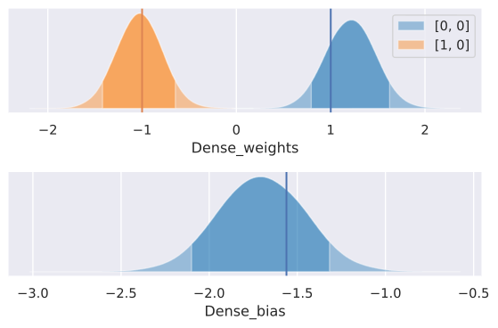

With this new model that accounts for censoring, the estimates are much closer to the values we actually used to generate the data!

Also, if we compare the predictions of this model with the previous model, the new model's predictions are much more likely to reflect the actual time-to-events.

.. code-block:: python3

    # Make predictions with both models
    y_pred1 = model1.predict(x)
    y_pred2 = model2.predict(x)

    # Compare predictions from two models
    plt.plot(y, y_pred1, '.')
    plt.plot(y, y_pred2, '.')
    plt.plot([0.1, 100], [0.1, 100], 'k:')
    plt.xscale('log')
    plt.yscale('log')

.. image:: img/examples/time_to_event/output_36_0.svg
   :width: 80 %
   :align: center

Notice that the regular model (trained on only the data from events which were already observed) *severely* and systematically underestimates the time-to-event for datapoints with a long time-to-event.  Like, by an order of magnitude!!

Obviously the severity of this problem depends on how much of your data is censored.  For example if you're a credit card company, most of your customers probably use their credit cards on a regular basis, and so the fraction of your time-to-next-purchase events which are censored for a given time cutoff will probably be very small, and using a regular model will be almost as good as using a censored model.  However if you're, say, an online retail company trying to predict churn, there will be a much larger contingent of infrequent buyers, which as in the above example would cause a regular model to be highly biased, and so using a censored model would be much more important.

But because the censored model is exactly equivalent to the regular model in the case of no censored events, and better in all other cases, it's probably a good idea to just always use a censored model!

Deep Time-to-Event Model
------------------------

Sometimes though, a simple linear estimator like the one used in the previous model won't be enough to capture complex patterns in your data.  We can build a much more expressive time-to-event model by using deep neural networks for estimation!  ProbFlow makes adding neural network components to your model much simpler via the :class:`.DenseNetwork` module.

One easy way to do this is to just have a neural network predict the expected time to the next event.  This is exactly the same as the earlier censored model, but instead of a simple linear estimator, we swap in a neural net.

.. code-block:: python3

    class DeepSurvivalModel(pf.ContinuousModel):

        def __init__(self, dims):
            self.net = pf.DenseNetwork(dims)

        def __call__(self, x):
            return tfd.Exponential(tf.nn.softplus(self.net(x)))

        def log_likelihood(self, x, y):
            """Same as before"""
            dist = self(x)
            obs_ll = dist.log_prob(y)[y>=0]
            non_ll = dist.log_survival_function(-y)[y<0]
            return tf.reduce_sum(obs_ll) + tf.reduce_sum(non_ll)

However, the Exponential distribution doesn't separately predict the estimated time-to-event and the uncertainty as to that estimate: the uncertainty is always proportional to the expected time-to-event.  This limits the expressiveness of the model quite a bit, because there is no way for the model to express that it is highly confident that the time to event is some specific nonzero value (because the probability of the Exponential distribution is always greatest at :math:`x=0` and decreases as :math:`x` increases).

.. code-block:: python3

    # Plot some Exponential distributions
    xx = np.linspace(0, 4, 500)
    for p in [1, 2, 3, 4]:
        plt.plot(xx, tfd.Exponential(p).prob(xx))

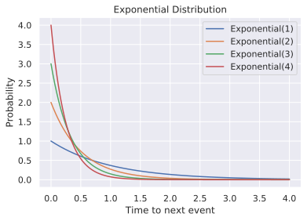

To allow our network to predict both the expected time-to-event and the uncertainty, we can use a `Gamma <https://en.wikipedia.org/wiki/Gamma_distribution>`_ observation distribution (though other options we could use include the `Weibull <https://en.wikipedia.org/wiki/Weibull_distribution>`_, `Log-logistic <https://en.wikipedia.org/wiki/Log-logistic_distribution>`_, or `Log-normal <https://en.wikipedia.org/wiki/Log-normal_distribution>`_ distributions).  Together, the two parameters of the Gamma distribution (the 
concentration parameter :math:`\alpha` and the rate parameter :math:`\beta`) control both the mean of the distribution and how broad the distribution is.  By having our neural network predict these two parameters, we allow it to predict not only the expected time-to-event (as with the Exponential model), but also the uncertainty associated with that estimate.

Let's take a look at some Gamma distributions.  Unlike the Exponential distribution, the Gamma distribution is able to have peaks at values greater than 0 (though with the right choice of parameters it can also behave just like an Exponential distribution).

.. code-block:: python3

    # Plot some Gamma distributions
    xx = np.linspace(0, 10, 500)
    for p in [[1, 1], [5, 5], [10, 4], [15, 3]]:
        plt.plot(xx, tfd.Gamma(*p).prob(xx))

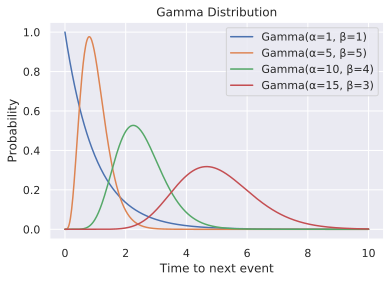

Unfortunately, using the Gamma distribution instead of the Exponential distribution causes an issue we need to work around (as does using any other positively bounded distribution that isn't the Exponential distribution).  

TLDR: TensorFlow throws a hissy fit when there's a NaN or infinite value in the same tensor as the one you want to use to compute the gradient, so we have to do a hacky workaround.

Long version: This is kind of a mundane TensorFlow and TensorFlow Probability specific issue, but I'll elaborate in the astronomically unlikely event that anyone's interested: TensorFlow doesn't compute the gradients correctly when there are NaN/infinities in a vector used to compute those gradients, even when you select only the elements which aren't NaN/inf (using ``tf.where``, ``tf.boolean_mask``, or logical indexing).  See `this issue <https://github.com/tensorflow/tensorflow/issues/2540>`_ and this `other issue <https://github.com/tensorflow/tensorflow/issues/20091>`_ for more info.  The Exponential distribution didn't give us this issue since it has such a heavy tail, so it's hard to get over/underflow in the log of the survival function - but that's much easier with the Gamma distribution.  Also, it just so happened that in a weird quirk of the TensorFlow Probability implementation, their Exponential distribution returns valid values with negative x values, so it wasn't causing NaN values either.  To get around this, basically we have to first run the model to compute the log probabilities, figure out which ones are NaN or infinite, then re-run the model using only the datapoints which ended up not having NaN or infinite log probabilities, to ensure that TensorFlow doesn't hurt its sensitive little eyes when it sees NaN values.  That is, we use `gradient clipping <https://deepai.org/machine-learning-glossary-and-terms/gradient-clipping>`_, but in a fantastically complicated way such that TensorFlow *never even has to see* the large/small gradients.  (I'm totally not grumpy about it or anything haha)

That's why the ``log_likelihood`` function below is so much more complicated - but it's doing exactly the same thing.  So, here's the model which uses two deep Bayesian neural networks: one to predict each of the parameters of the Gamma distribution which approximates the time to the next event.

.. code-block:: python3

    class DeepSurvivalModel(pf.ContinuousModel):

        def __init__(self, dims):
            self.a_net = pf.DenseNetwork(dims) #net to predict alpha
            self.b_net = pf.DenseNetwork(dims) #net to predict beta

        def __call__(self, x):
            a = tf.nn.softplus(self.a_net(x))
            b = tf.nn.softplus(self.b_net(x))
            return tfd.Gamma(a, b)

        def log_likelihood(self, x, y):
            """If y>=0, that's the time to the observed event.
            If y<0, it has not yet been observed after -y time!"""

            def grad_safe_indexed_gamma_lp(x, y, lp_fn, ix_fn, min_lp=-100):
                a = tf.nn.softplus(self.a_net(x))
                b = tf.nn.softplus(self.b_net(x))
                ix = ix_fn(y[:, 0]) #indexes to use (observed vs not)
                y_ix = tf.boolean_mask(y, ix, axis=0)
                a_ix = tf.boolean_mask(a, ix, axis=0)
                b_ix = tf.boolean_mask(b, ix, axis=0)
                lp = lp_fn(tfd.Gamma(a_ix, b_ix), y_ix)
                safe = lp[:, 0]>min_lp #indexes with "safe" log probs
                y_safe = tf.boolean_mask(y_ix, safe, axis=0)
                a_safe = tf.boolean_mask(a_ix, safe, axis=0)
                b_safe = tf.boolean_mask(b_ix, safe, axis=0)
                return lp_fn(tfd.Gamma(a_safe, b_safe), y_safe)

            # Likelihoods of observed datapoints
            obs_ll = grad_safe_indexed_gamma_lp(x, y,
                lambda dist, y: dist.log_prob(y),
                lambda y: y>=0)
            
            # Likelihoods of datapoints which were not observed
            non_ll = grad_safe_indexed_gamma_lp(x, y,
                lambda dist, y: dist.log_survival_function(-y),
                lambda y: y<0)
            
            # Return the sum of log likelihoods
            return tf.reduce_sum(obs_ll) + tf.reduce_sum(non_ll)

Then we can instantiate the neural-network-based time-to-event model:

.. code-block:: python3

    model = DeepSurvivalModel([D, 1])

TODO: fit it to some `data <https://console.cloud.google.com/marketplace/details/obfuscated-ga360-data/obfuscated-ga360-data>`_

**See also**

* `WTTE-RNN - Less hacky churn prediction <https://ragulpr.github.io/2016/12/22/WTTE-RNN-Hackless-churn-modeling>`_ by Egil Martinsson
* `Modeling Censored Time-to-Event Data Using Pyro <https://eng.uber.com/modeling-censored-time-to-event-data-using-pyro>`_
* `Survival analysis <https://en.wikipedia.org/wiki/Survival_analysis>`_
