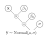

.. _examples:

Examples
========

.. toctree::
   :maxdepth: 2
   :caption: Contents:
   :hidden:

.. include:: macros.hrst

TODO: intro

TODO: make sure to have diagrams for each model

.. contents:: Outline

Linear Regression
-----------------

TODO: explain a basic (bayesian) 1D linear regression:

.. math::

    \mathbf{y} \sim \text{Normal}(\mathbf{x} \beta_1 + \beta_0, \sigma)

TODO: diagram...

TODO: manually:

.. code-block:: python

    from probflow import Input, Parameter, Normal

    feature = Input()
    weight = Parameter()
    bias = Parameter()
    noise_std = ScaleParameter()

    predictions = weight*feature + bias
    model = Normal(predictions, noise_std)
    model.fit(x, y)

TODO: look at posteriors and model criticism etc

TODO: multiple linear regression, posteriors, etc

TODO: with Dense (which automatically uses x as input if none is specified):

.. code-block:: python

    from probflow import Dense, Parameter, Normal

    predictions = Dense()
    noise_std = ScaleParameter()

    model = Normal(predictions, noise_std)
    model.fit(x, y)

TODO: how to access posterior elements from within the Dense layer

TODO: with ready-made model:

.. code-block:: python

    from probflow import LinearRegression

    model = LinearRegression()
    model.fit(x, y)

TODO: how to access posterior elements from within the LinearRegression model

Logistic Regression
-------------------

TODO: same idea as above just w/ predictions as input to logits for a bernoulli dist.  First do 1-variable, then w/ Dense, then w/ ready-made model

Densely-connected Neural Network
--------------------------------

TODO: manually w/ Parameter s,

TODO: then w/ Sequential, 

.. code-block:: python

    from probflow import Sequential, Dense, ScaleParameter, Normal

    predictions = Sequential(layers=[
        Dense(units=128),
        Dense(units=64),
        Dense(units=1)
    ])
    noise_std = ScaleParameter()
    model = Normal(predictions, noise_std)
    model.fit(x, y)

TODO: then w/ DenseNet, which automatically creates sequential dense layers, but NOT the normal dist on top

.. code-block:: python

    from probflow import Sequential, Dense, ScaleParameter, Normal

    predictions = DenseNet(units=[128, 64, 1])
    noise_std = ScaleParameter()
    model = Normal(predictions, noise_std)
    model.fit(x, y)

TODO: then w/ DenseRegression (adds a normal dist observation dist) or DenseClassifier (adds a Bernoulli dist):

.. code-block:: python

    from probflow import DenseRegression

    model = DenseRegression(units=[128, 64, 1])
    model.fit(x, y)

Batch Normalization
-------------------

Batch normalization can be performed using the :class:`.BatchNormalization` class.  For example, to add batch normalization to the dense neural network from the previous section:

.. code-block:: python

    from probflow import BatchNormalization, Sequential, Dense, ScaleParameter, Normal

    predictions = Sequential(layers=[
        Dense(units=128),
        BatchNormalization(),
        Dense(units=64),
        BatchNormalization(),
        Dense(units=1)
    ])
    noise_std = ScaleParameter()
    model = Normal(predictions, noise_std)
    model.fit(x, y)

Robust Dual-module Neural Network
---------------------------------

TODO: dual-module net which estimates predictions and uncertainty separately, and uses a t-dist for the observation dist

.. code-block:: python

    predictions = DenseNet(units=[128, 64, 32, 1])
    noise_std = DenseNet(units=[128, 64, 32, 1])
    model = Cauchy(predictions, noise_std)
    model.fit(x, y)

.. _examples_glm:

Poisson Regression (GLM)
------------------------

TODO: description...

.. code-block:: python

    from probflow import Dense, Exp, Poisson

    predictions = Exp(Dense())
    model = Poisson(predictions)
    model.fit(x, y)

.. _examples_nmf:

Neural Matrix Factorization
---------------------------

TODO: description...

TODO: for a vanilla matrix factorization

.. code-block:: python

    from probflow import *

    #df = DataFrame w/ 3 columns: 'user_id', 'item_id', and 'rating'

    # User and item IDs
    users = Input('user_id')
    items = Input('item_id')

    # Matrix Factorization
    user_vec = Embedding(users, dims=50)
    item_vec = Embedding(items, dims=50)
    predictions = Dot(user_vec, item_vec)
    error = ScaleParameter()

    # Fit a model w/ normally-distibuted error
    model = Normal(predictions, error)
    model.fit(df[['user_id', 'item_id']], df['rating'])

or for neural matrix factorization https://arxiv.org/abs/1708.05031

.. code-block:: python

    from probflow import *

    #df = DataFrame w/ 3 columns: 'user_id', 'item_id', and 'rating'

    # User and item IDs
    users = Input('user_id')
    items = Input('item_id')

    # Matrix Factorization
    user_vec_mf = Embedding(users, dims=50)
    item_vec_mf = Embedding(items, dims=50)
    predictions_mf = Dot(user_vec_mf, item_vec_mf)

    # Neural Collaborative Filtering
    user_vec_ncf = Embedding(users, dims=50)
    item_vec_ncf = Embedding(items, dims=50)
    ncf_in = Cat([user_vec_ncf, item_vec_ncf])
    predictions_ncf = DenseNet(ncf_in, units=[128, 64, 32])
    
    # Combine the two methods
    predictions = Dense(Cat([predictions_mf, predictions_ncf]))
    error = ScaleParameter()

    # Fit a model w/ normally-distibuted error
    model = Normal(predictions, error)
    model.fit(df[['user_id', 'item_id']], df['rating'])

Or if you have implicit data (0 or 1 for whether the user has interacted with 
the item), use model = Bernoulli(logits=predictions)

Or if there are discrete scores (e.g. 1-10), then use a BetaBinomial 
TODO: w/ Dense and Embedding layers, then w/ NeuralMatrixFactorization

.. _examples_mixed_effects:

Mixed Effects and Multilevel Models
-----------------------------------

Basic multilevel model:

.. math::
   
   \beta_s \sim \mathcal{N}(0, \sigma^2_\beta), ~ s = 1, ... , N
   
   y_{is} \sim \mathcal{N}(\mu + \beta_s, \sigma^2), ~ i = 1, ..., n_s, ~ s = 1, ... , N

Can be fit using probflow by:

.. code-block:: python

    from probflow import Parameter, ScaleParameter, Normal

    # df = DataFrame with 2 columns: 'group' and 'observation'
    N = df['group'].nunique()

    G = Input('Group')
    
    pop_mean = Parameter()
    pop_std = ScaleParameter()
    data_std = ScaleParameter()
    
    beta = Parameter(shape=N, prior=Normal(0, pop_std))
    model = Normal(pop_mean + beta[G], data_std)
