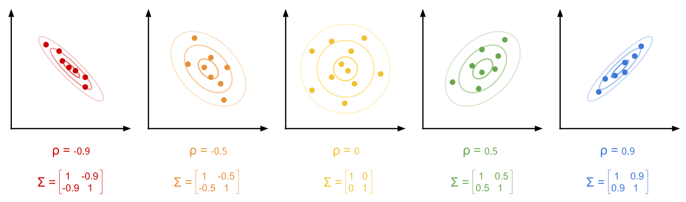
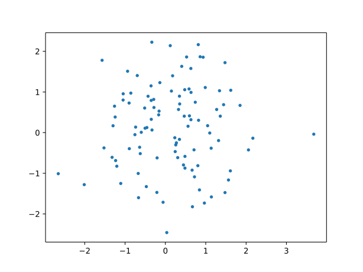
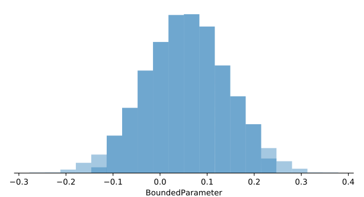
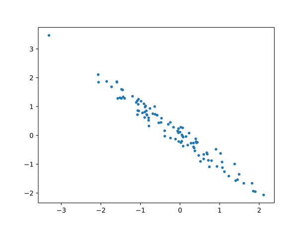

Bayesian Correlation
====================

|Colab Badge|

.. |Colab Badge| image:: ../img/colab-badge.svg
    :target: https://colab.research.google.com/drive/19ZbyyIXh7kRa3lusY3sK5lWkpFvxkgOn

.. include:: ../macros.hrst

.. code-block:: python3

    import numpy as np
    import matplotlib.pyplot as plt
    randn = lambda *x: np.random.randn(*x).astype('float32')

    import probflow as pf

The `Pearson correlation coefficient <https://en.wikipedia.org/wiki/Pearson_correlation_coefficient>`_, :math:`\rho`, between two variables is the value that you need to multiply the individual variances of those variables to get the covariance between the two:

.. math::

    \rho_{x,y} = \frac{\text{cov} (x, y)}{\text{var}(x) ~ \text{var}(y)}

To model a correlation probabilistically, we can model our datapoints as being drawn from a multivariate normal distribution, with covariance matrix :math:`\Sigma`.  The correlation coefficient is reflected in the off-diagonal elements of the correlation matrix (we'll just assume the data is normalized, and so all the diagonal elements are 1).

This is because (according to the definition of the correlation coefficient), the covariance matrix can be expressed using only the per-variable variances and the correlation coefficient:

.. math::

    \Sigma =
    \begin{bmatrix}
       \text{var}(x) & \text{cov}(x, y) \\
       \text{cov}(x,y) & \text{var}(y)\\
    \end{bmatrix} =
    \begin{bmatrix}
       \text{var}(x) & \rho ~ \text{var}(x) \text{var}(y) \\
       \rho ~ \text{var}(x) \text{var}(y) & \text{var}(y)\\
    \end{bmatrix}

Or, if we assume the input has been `standardized <https://en.wikipedia.org/wiki/Standard_score>`_:

.. math::

    \Sigma =
    \begin{bmatrix}
       1 & \rho \\
       \rho & 1 \\
    \end{bmatrix}

So, basically what we're doing is optimizing the correlation coefficient such that it gives us a Gaussian distribution which best fits the data points.

This is our first example of a `generative model <https://en.wikipedia.org/wiki/Generative_model>`_, where we're not trying to *predict* :math:`y` given :math:`x`.  Instead, we're interested in the data-generating distribution itself, from which the correlation coefficient can be derived.  With this type of generative model, we'll treat all the data as the dependent variable, and so our ``__call__`` function will have no input.  The only thing predicting the distribution of the data is the model and its parameters.

.. tabs::

    .. group-tab:: TensorFlow

        .. code-block:: python3

            import tensorflow as tf

            class BayesianCorrelation(pf.Model):

                def __init__(self):
                    self.rho = pf.BoundedParameter(min=-1, max=1)

                def __call__(self):
                    cov = tf.eye(2) + self.rho()*tf.abs(tf.eye(2)-1)
                    return pf.MultivariateNormal(tf.zeros([2]), cov)

    .. group-tab:: PyTorch

        .. code-block:: python3

            import torch

            class BayesianCorrelation(pf.Model):

                def __init__(self):
                    self.rho = pf.BoundedParameter(min=-1, max=1)

                def __call__(self):
                    cov = torch.eye(2) + self.rho()*torch.abs(torch.eye(2)-1)
                    return pf.MultivariateNormal(torch.zeros([2]), cov)

Then we can instantiate the model.

.. code-block:: python3

    model = BayesianCorrelation()

Let's generate some uncorrelated data.

.. code-block:: python3

    X = np.random.randn(100, 2).astype('float32')
    plt.plot(X[:, 0], X[:, 1], '.')

If we fit the model on some data which is uncorrelated, we can see that the
posterior distribution for the correlation coefficient :math:`\rho` is
centered around 0:

.. code-block:: python3

    model.fit(X, lr=0.1)
    model.posterior_plot(ci=0.95, style='hist')

On the other hand, if we fit the model to some data which is highly correlated,

.. code-block:: python3

    X[:, 1] = X[:, 0] + 0.2*np.random.randn(100).astype('float32')
    plt.plot(X[:, 0], X[:, 1], '.')

.. image:: img/correlation/correlation3.svg
   :width: 70 %
   :align: center

Then the posterior distribution for the correlation coefficient :math:`\rho`
is considerably closer to 1:

.. code-block:: python3

    model = BayesianCorrelation()
    model.fit(X, lr=0.1)
    model.posterior_plot(ci=0.95, style='hist')

.. image:: img/correlation/correlation4.svg
   :width: 70 %
   :align: center

Conversely, if we generate negatively correlated data,

.. code-block:: python3

    X = np.random.randn(100, 2).astype('float32')
    X[:, 1] = -X[:, 0] + 0.2*np.random.randn(100).astype('float32')
    plt.plot(X[:, 0], X[:, 1], '.')

The model recovers the negative correlation coefficient:

.. code-block:: python3

    model = BayesianCorrelation()
    model.fit(X, lr=0.1)
    model.posterior_plot(ci=0.95, style='hist')

.. image:: img/correlation/correlation6.svg
   :width: 70 %
   :align: center
