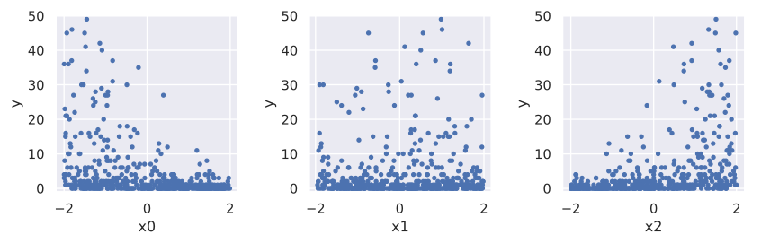
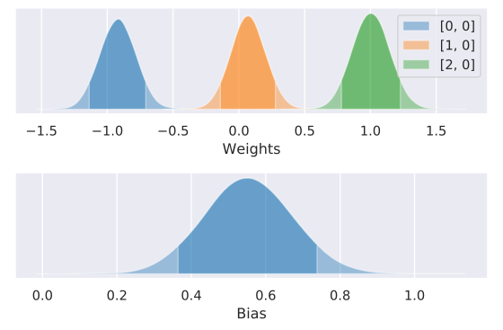
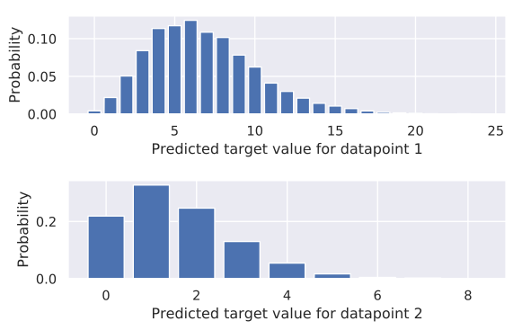

Poisson Regression (GLM) |Colab Badge|
======================================

.. |Colab Badge| image:: ../img/colab-badge.svg
    :target: https://colab.research.google.com/drive/1ARkpzwzlv5GWWEKiZpZ-FHuL_Dn905KW

.. include:: ../macros.hrst

.. admonition:: TLDR

    .. code-block:: python3

        class PoissonRegression(pf.DiscreteModel):

            def __init__(self, d):
                self.w = pf.Parameter([d, 1]) #weights
                self.b = pf.Parameter([1, 1]) #bias

            def __call__(self, x):
                return pf.Poisson(tf.exp(x @ self.w() + self.b()))

        model = PoissonRegression(x.shape[1])
        model.fit(x, y)

In the :doc:`linear <linear_regression>` and
:doc:`logistic <logistic_regression>` regression examples, we created
models which dealt with target variables which were continuous and categorical,
respectively.  But what if our target variable is, say, counts?  In this case,
the target variable is neither continuous (it can only take non-negative
integer values) nor categorical (the number could theoretically be anywhere
from :math:`0` to :math:`\infty`, and there is a definite ordering of the  values).

With discrete data like this (counts of events during some period of time), we
can model the target variable as being generated by a 
`Poisson distribution <https://en.wikipedia.org/wiki/Poisson_distribution>`_.
Let's generate a dataset which has 3 continuous features, and a 
Poisson-distributed target variable.

.. code-block:: python3

    # Imports
    import probflow as pf
    import numpy as np
    import matplotlib.pyplot as plt
    rand = lambda *x: np.random.rand(*x).astype('float32')
    randn = lambda *x: np.random.randn(*x).astype('float32')

    # Settings
    N = 512 #number of datapoints
    D = 3   #number of features

    # Data
    x = rand(N, D)*4-2
    w = np.array([[-1.], [0.], [1.]])
    rate = np.exp(x@w + randn(N, D))
    y = np.random.poisson(rate).astype('float32')

    # Plot it
    for i in range(D):
        plt.subplot(1, D, i+1)
        plt.plot(x[:, i], y[:, 0], '.')

We can use a
`Poisson regression <https://en.wikipedia.org/wiki/Poisson_regression>`_
to model this kind of data.  Like a logistic regression, a Poisson regression
is a type of 
`generalized linear model <https://en.wikipedia.org/wiki/Generalized_linear_model>`_
(GLM).  In a GLM, we use weight and bias parameters to compute a scalar
prediction from the features, pipe that scalar through some function, and use
the output as the mean of some observation distribution.  With a Poisson
regression, the function we use is the exponential function, and the 
observation distribution is the
`Poisson distribution <https://en.wikipedia.org/wiki/Poisson_distribution>`_.

.. math::

    y \sim \text{Poisson}(\exp ( \mathbf{x}^\top \mathbf{w} + b ))

Let's build that model with ProbFlow.  Note that our model class below inherits
:class:`.DiscreteModel`, because the target variable is discrete (it can only
take integer values :math:`\geq 0`), and we use the :class:`.Poisson`
observation distribution.

.. tabs::

    .. group-tab:: TensorFlow

        .. code-block:: python3

            import tensorflow as tf

            class PoissonRegression(pf.DiscreteModel):

                def __init__(self, dims):
                    self.w = pf.Parameter([dims, 1], name='Weights')
                    self.b = pf.Parameter([1, 1], name='Bias')

                def __call__(self, x):
                    return pf.Poisson(tf.exp(x @ self.w() + self.b()))

    .. group-tab:: PyTorch

        .. code-block:: python3

            import torch

            class PoissonRegression(pf.DiscreteModel):

                def __init__(self, dims):
                    self.w = pf.Parameter([dims, 1], name='Weights')
                    self.b = pf.Parameter([1, 1], name='Bias')

                def __call__(self, x):
                    x = torch.tensor(x)
                    return pf.Poisson(torch.exp(x @ self.w() + self.b()))

Then, we can create an instance of our model and fit it to the data:

.. code-block:: python3

    model = PoissonRegression(D)
    model.fit(x, y, epochs=500)

We can see that the model recovers the paramers we used to generate the data 
(except for the bias ... :/  )

.. code-block:: python3

    model.posterior_plot(ci=0.9)

And we can make predictions using either the mean or the mode of the predicted
distribution:

.. code-block:: pycon

    >>> x_test = randn(5, D)
    >>> model.predict(x_test) #mean by default
    array([[0.24128665],
           [0.80167174],
           [6.486554  ],
           [1.5575557 ],
           [6.112662  ]], dtype=float32)
    >>> model.predict(x_test, method='mode')
    array([[0.],
           [0.],
           [6.],
           [1.],
           [6.]], dtype=float32)

Also, when we plot the posterior predictive distribution for a test datapoint,
we can see that the predictions are discrete (integer values :math:`\geq 0`):

.. code-block:: python3

    model.pred_dist_plot(x_test[2:4, :])

