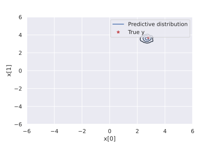
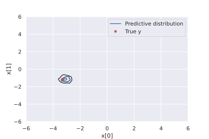
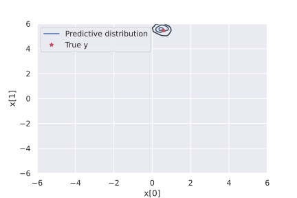
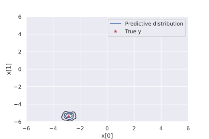
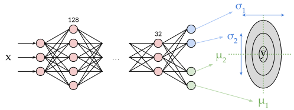

Multivariate Regression |Colab Badge|
=====================================

.. |Colab Badge| image:: ../img/colab-badge.svg
    :target: https://colab.research.google.com/drive/1gKi16njBvB8E8P9Il9hF0C-MG8iImeu5?usp=sharing

.. include:: ../macros.hrst

A multivariate regression is one where the target (dependent) variable has multiple dimensions instead of the usual 1.  For example, predicting a location in 3D space, or a location on a 2D map.

Let's generate a dataset which has 7 features, and the target variable is 3-dimensional.

.. code-block:: python3

    # Imports
    import numpy as np
    import matplotlib.pyplot as plt
    import seaborn as sns
    import tensorflow as tf
    import probflow as pf
    np.random.seed(12345)
    tf.random.set_seed(12345)
    randn = lambda *x: np.random.randn(*x).astype('float32')

    # Data with multiple output dimensions
    N = 512
    Di = 7
    Do = 3
    x = randn(N, Di)
    w = randn(Di, Do)
    y = x @ w + 0.3*randn(N, Do)

Homoscedastic Multivariate Regression
-------------------------------------

The simplest way to do a multivariate regression would be to predict the mean in each dimension, and assume the variance is constant in each dimension (but allow the variance to be different in each of the output dimensions).  Then the observation distribution is a :class:`.MultivariateNormal` instead of just a :class:`.Normal` distribution:

.. code-block:: python3

    class MultivariateRegression(pf.Model):

        def __init__(self, dims):
            self.net = pf.DenseNetwork(dims)
            self.std = pf.ScaleParameter(dims[-1])

        def __call__(self, x):
            loc = self.net(x)
            cov = tf.linalg.diag(self.std())
            return pf.MultivariateNormal(loc, cov)

Then we can create the model and fit it:

.. code-block:: python3

    model = MultivariateRegression([Di, Do])
    model.fit(x, y, epochs=1000)

Now our model's output/predictions are in multiple dimensions (note that the predictions are in 3 dimensions but we're only plotting the first 2):

.. code-block:: python3

    for i in range(5):
        y_pred = model.predictive_sample(x[i:i+1, :])
        sns.kdeplot(y_pred[:, 0, 0], y_pred[:, 0, 1])
        plt.plot(y[i, 0], y[i, 1], 'r*')
        plt.show()

.. image:: img/multivariate_regression/predictive_1.svg
   :width: 70 %
   :align: center

Note that the above is simply doing a multivariate linear regression - to use a basic feed-forward neural network instead, one would just add more elements to the ``dims`` list (to add hidden layers).  E.g. the following would use a neural network with three hidden layers, the first w/ 128 units, the 2nd with 64 units, and the last w/ 32 units:

.. code-block:: python3

    model = MultivariateRegression([Di, 128, 64, 32, Do])

Heteroscedastic Multivariate Regression
---------------------------------------

But, the previous model assumes the variance doesn't change as a function of the input variables!  To allow for that, we can separately model the mean and the variance as a function of the predictors:

.. code-block:: python3

    class MultivariateRegression(pf.Model):

        def __init__(self, dims):
            self.mean_net = pf.DenseNetwork(dims)
            self.std_net = pf.DenseNetwork(dims)

        def __call__(self, x):
            loc = self.mean_net(x)
            cov = tf.linalg.diag(tf.exp(self.std_net(x)))
            return pf.MultivariateNormal(loc, cov)

Which can then be fit with:

.. code-block:: python3

    model = MultivariateRegression([Di, Do])
    model.fit(x, y, epochs=1000)

In this case to use a neural network, while you could just add elements to ``dims`` like before, this would just mean you're using two completely separate neural networks to predict the mean and the variances.  Maybe a more efficient way to do it would be to use two separate heads of your network.  So: there's a neural network, then a single linear layer on top of that neural network predicts the means, and another single linear layer predicts the variance, like this:

.. code-block:: python3

    class MultivariateRegression(pf.Model):

        def __init__(self, dims, head_dims):
            self.net = pf.DenseNetwork(dims)
            self.mean = pf.DenseNetwork(head_dims)
            self.std = pf.DenseNetwork(head_dims)

        def __call__(self, x):
            z = self.net(x)
            loc = self.mean(z)
            cov = tf.linalg.diag(tf.exp(self.std(z)))
            return pf.MultivariateNormal(loc, cov)

Which could then be created like this (note that the last element of ``dims`` and the first element of ``head_dims`` should match):

.. code-block:: python3

    model = MultivariateRegression([Di, 128, 64, 32], [32, Do])
    model.fit(x, y, epochs=1000)

Note that, as long as long as you're not modeling the covariance structure of the target (i.e., the predicted covariance matrix only has nonzero elements along the diagonal), you can accomplish basically the same thing using :class:`.LinearRegression` or :class:`.DenseRegression` (note that this is using ``Do`` independent normal distributions, instead of a single multivariate normal distribution):

.. code-block:: python3

    model = pf.LinearRegression(x.shape[1], y.shape[1])

or

.. code-block:: python3

    model = pf.DenseRegression([x.shape[1], y.shape[1]])
