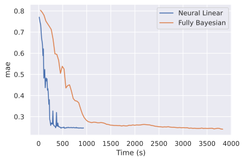
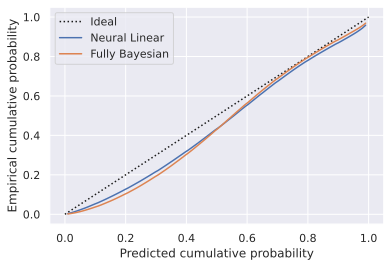

Neural Linear Model |Colab Badge|
=================================

.. |Colab Badge| image:: ../img/colab-badge.svg
    :target: https://colab.research.google.com/drive/1ry_26gIbuydlC7Guk5fWuym-6nYJaAbq

.. include:: ../macros.hrst

.. admonition:: TLDR

    .. code-block:: python3

        class NeuralLinear(pf.ContinuousModel):

            def __init__(self, dims):
                self.net = pf.DenseNetwork(dims, probabilistic=False)
                self.loc = pf.Dense(dims[-1], 1)
                self.std = pf.Dense(dims[-1], 1)

            def __call__(self, x):
                h = tf.nn.relu(self.net(x))
                return pf.Normal(self.loc(h), tf.math.softplus(self.std(h)))

        model = NeuralLinear([x.shape[1], 256, 128, 64, 32])
        model.fit(x, y)

The neural linear model is an efficient way to get posterior samples and
uncertainty out of a regular neural network.  Basically, you just slap a
Bayesian linear regression on top of the last hidden layer of a regular
(non-Bayesian, non-probabilistic) neural network.  It was first proposed for
use with Bayesian optimization (`Snoek et al., 2015
<https://arxiv.org/abs/1502.05700>`_), but has applications in reinforcement
learning (see `Riquelme et al., 2018 <https://arxiv.org/abs/1802.09127>`_ and
`Azizzadenesheli and Anandkumar, 2019 <https://arxiv.org/abs/1802.04412>`_),
active learning, AutoML (`Zhou and Precioso, 2019
<https://arxiv.org/abs/1904.00577>`_), and just Bayesian regression problems in
general (`Ober and Rasmussen, 2019 <https://arxiv.org/abs/1912.08416>`_).

Bayesian linear regressions have a closed form solution, so the usual approach
for training a neural linear model is to first train the neural network to
minimize the (for example) mean squared error.  Then in a second step, compute
the closed-form solution to the Bayesian linear regression regressing the last
hidden layer's activations onto the target variable.  Here we'll just use
variational inference to train the neural network and Bayesian regression
together end-to-end.

Load data
---------

We'll be training models to predict taxi fares given the origin, destination,
and time of the trip.  The data we'll use comes from the `New York City Taxi
and Limousine Commission dataset
<https://console.cloud.google.com/marketplace/product/city-of-new-york/nyc-tlc-trips>`_,
which is a public BigQuery dataset.  I'll skip the data loading and feature
engineering here (see `the colab
<https://colab.research.google.com/drive/1ry_26gIbuydlC7Guk5fWuym-6nYJaAbq>`_
for all of that!), but at the end of the day we're left with around 2.4 million
training samples and little over half a million validation samples, in the form
of four numpy arrays:

.. code-block:: python3

    x_train  # training features, size (2399893, 9)
    y_train  # training target, size (2399893, 1)
    x_val  # validation features, size (600107, 9)
    y_val  # validation target, size (600107, 1)

Fitting the Neural Linear Model
-------------------------------

Let's create a neural linear model with ProbFlow.  ProbFlow's :class:`.Dense`,
:class:`.DenseNetwork`, and :class:`.DenseRegression` classes take a
``probabilistic`` keyword argument, which when ``True`` (the default), uses
parameters which are probabilistic (i.e., they use Normal distributions as the
variational posteriors).  But when the ``probabilistic`` kwarg is set to
``False``, then the parameters are totally non-probabilistic (i.e. a
Deterministic distribution, aka a `Dirac function
<https://en.wikipedia.org/wiki/Dirac_delta_function>`_, is used as the
"variational posterior").  So, with ``probabilistic = False``, ProbFlow won't
model any uncertainty as to those parameters' values (like your run-of-the-mill
non-Bayesian neural network would).

So, to create a neural linear model, we can just create a regular
non-probabilistic neural network using :class:`.DenseNetwork` with
``probabilistic = False``, and then perform a Bayesian linear regression on top
of the final hidden layer (using the :class:`.Dense` class - we'll also predict
the noise error to allow for heteroscedasticity).

.. code-block:: python3

    class NeuralLinear(pf.ContinuousModel):

        def __init__(self, dims):
            self.net = pf.DenseNetwork(dims, probabilistic=False)
            self.loc = pf.Dense(dims[-1], 1)  # probabilistic=True by default
            self.std = pf.Dense(dims[-1], 1)  # probabilistic=True by default

        def __call__(self, x):
            h = tf.nn.relu(self.net(x))
            return pf.Normal(self.loc(h), tf.math.softplus(self.std(h)))

However, one thing that really helps is to define what initialization we want
for the head of the network which predicts the standard deviation.  You don't
*need* to, but a lot of random initializations can lead to bad fits otherwise.
Basically we're just initializing the layer which predicts the noise standard
deviation such that the standard deviation is small early in training.
Otherwise the noise coming from the variational posteriors overwhelms the
signal coming from the data, and so the network is unable to learn.
Initializing the standard deviation head to output small values allows the
network to learn the means early in training, and then later in training the
variational posteriors can expand to capture the uncertainty properly.

So, to set the values at which our variables for that layer are initialized,

.. code-block:: python3

    std_kwargs = {
        "weight_kwargs": {
            "initializer": {
                "loc": 0,
                "scale": -2,
            }
        },
        "bias_kwargs": {
            "initializer": {
                "loc": -2,
                "scale": -2,
            }
        }
    }

And then we can re-define our neural linear model using that initialization
(exactly the same as before, except we've added ``**std_kwargs``):

.. code-block:: python3

    class NeuralLinear(pf.ContinuousModel):

        def __init__(self, dims):
            self.net = pf.DenseNetwork(dims, probabilistic=False)
            self.loc = pf.Dense(dims[-1], 1)
            self.std = pf.Dense(dims[-1], 1, **std_kwargs)

        def __call__(self, x):
            h = tf.nn.relu(self.net(x))
            return pf.Normal(self.loc(h), tf.math.softplus(self.std(h)))

Then we can instantiate the model.  We'll use a fully-connected sequential
architecture, where the first hidden layer has 128 units, the second has 64,
and the third has 32.

.. code-block:: python3

    model = NeuralLinear([x.shape[1], 128, 64, 32])

We'll also use a :class:`.MonitorMetric` callback to monitor the mean absolute
error of the model's predictions on the validation data over the course of
training.  Additionally, we'll anneal the learning rate from 0.0005 to near
zero over the course of training using a :class:`.LearningRateScheduler`
callback.

.. code-block:: python3

    nlm_mae = pf.MonitorMetric('mae', x_val, y_val)
    nlm_lrs = pf.LearningRateScheduler(lambda e: 5e-4 + e * 5e-6)

Then, we can fit the model!

.. code-block:: python3

    nlm_model.fit(
        x_train,
        y_train,
        batch_size=2048,
        epochs=100,
        callbacks=[nlm_mae, nlm_lrs]
    )

Fitting a fully Bayesian network
--------------------------------

For comparison, let's also fit a fully Bayesian model (i.e., one where *all*
the parameters of the network are modeled using Normal distributions as their
variational posteriors).  We'll define it in exactly the same way as the neural
linear model, except that we'll use ``probabilistic = True`` (the default) when
initializing the :class:`.DenseNetwork`.

.. code-block:: python3

    class FullyBayesianNetwork(pf.ContinuousModel):

        def __init__(self, dims):
            self.net = pf.DenseNetwork(dims)
            self.loc = pf.Dense(dims[-1], 1)
            self.std = pf.Dense(dims[-1], 1, **std_kwargs)

        def __call__(self, x):
            h = tf.nn.relu(self.net(x))
            return pf.Normal(self.loc(h), tf.math.softplus(self.std(h)))

And we'll initialize it using the exact same architecture:

.. code-block:: python3

    bnn_model = FullyBayesianNetwork([x_train.shape[1], 128, 64, 32])

Again we'll monitor the MAE over the course of training, and anneal the
learning rate:

.. code-block:: python3

    bnn_mae = pf.MonitorMetric('mae', x_val, y_val)
    bnn_lrs = pf.LearningRateScheduler(lambda e: 5e-4 + e * 5e-6)

And then we can fit it:

.. code-block:: python3

    bnn_model.fit(
        x_train,
        y_train,
        batch_size=2048,
        epochs=100,
        callbacks=[bnn_mae, bnn_lrs]
    )

Accuracy and time
-----------------

Let's compare how long it took each network to reach similar levels of
accuracy.  We can use the :class:`.MonitorMetric` callback objects to plot the
mean absolute error as a function of walltime.

.. code-block:: python3

    # Plot wall time vs mean absolute error
    nlm_mae.plot(x="time", label="Neural Linear")
    bnn_mae.plot(x="time", label="Fully Bayesian")
    plt.legend()
    plt.show()

So the neural linear model is a lot faster to train!  Both models seem to be
able to reach similar levels of accuracy, but the neural linear model just gets
to a given accuracy level more quickly.

Uncertainty calibration
-----------------------

But is the neural linear model - a mostly non-Bayesian network - at all
well-calibrated in terms of its uncertainty estimates?  We can measure the
calibration of the model (how accurate its uncertainty estimates are) using
calibration curves and the expected calibration error for regression (`Kuleshov
et al., 2018 <https://arxiv.org/abs/1807.00263>`_).

Essentially, the calibration curve plots the proportion of samples which our
model predicts to have less than or equal to some cumulative probability,
against the actual proportion of samples.  In other words, 10% of samples
should fall below the model's predicted lower 10th percentile confidence
interval, 20% of samples should fall below the model's predicted lower 20th
percentile confidence interval, and so on, all the way up to the 100th
percentile.  If the model is perfectly calibrated, these values will match, and
we'll end up with a calibration curve which goes along the identity line from
(0, 0) to (1, 1).

Then, the expected calibration error is just a metric of how far our model's
calibration deviates from the ideal calibration curve (i.e., what the
calibration curve would be if the model were perfectly calibrated - the
identity line).  Check out the docs for
:meth:`.ContinuousModel.expected_calibration_error` for a more formal
definition.

ProbFlow's :class:`.ContinuousModel` class has methods to compute both the
calibration curve and the expected calibration error.  So, all we need to do to
view the calibration curve is:

.. code-block:: python3

    # Plot each model's calibration curve
    nlm_model.calibration_curve_plot(
        x_val, y_val, batch_size=10000, label="Neural Linear"
    )
    bnn_model.calibration_curve_plot(
        x_val, y_val, batch_size=10000, label="Fully Bayesian"
    )
    plt.legend()
    plt.show()

Note that for :meth:`.ContinuousModel.calibration_curve_plot` above (and for
:meth:`.ContinuousModel.expected_calibration_error` below) we're using the
``batch_size`` keyword argument to perform the computation in batches.
Otherwise, if we tried to run the calculation using all ~600,000 samples in the
validation data as one single ginormous batch, we'd run out of memory!

To view the expected calibration error, we can just use
:meth:`.ContinuousModel.expected_calibration_error` (lower is better):

.. code-block:: pycon

    >>> nlm_model.expected_calibration_error(x_val, y_val, batch_size=10000)
    0.00307
    >>> bnn_model.expected_calibration_error(x_val, y_val, batch_size=10000)
    0.00412

Both the neural linear model and the fully Bayesian network have pretty good
calibration errors!  With different data splits and different random
initializations, one or the other comes out technically on top, but I'd say
they're about the same on average.  Given that the neural linear model is so
much faster to train, as long as you aren't specifically interested in the
posteriors of the neural network parameters, there's definitely an upside to
using this hybrid method to get the advantages of Bayesian modeling
(uncertainty quantification, separation of epistemic and aleatoric uncertainty,
etc) with most of the efficiency advantages of training a normal non-Bayesian
neural network!

References
----------

* Jasper Snoek, Oren Rippel, Kevin Swersky, Ryan Kiros, Nadathur Satish,
  Narayanan Sundaram, Md. Mostofa Ali Patwary, Prabhat, Ryan P. Adams.
  `Scalable Bayesian Optimization Using Deep Neural
  Networks <https://arxiv.org/abs/1502.05700>`_, 2015
* Carlos Riquelme, George Tucker, and Jasper Snoek.
  `Deep Bayesian Bandits Showdown <https://arxiv.org/abs/1802.09127>`_, 2018
* Sebastian W. Ober and Carl Edward Rasmussen.
  `Benchmarking the Neural Linear Model for Regression
  <https://arxiv.org/abs/1912.08416>`_, 2019
* Kamyar Azizzadenesheli and Animashree Anandkumar.
  `Efficient Exploration through Bayesian Deep Q-Networks
  <https://arxiv.org/abs/1802.04412>`_, 2019
* Weilin Zhou and Frederic Precioso.
  `Adaptive Bayesian Linear Regression for Automated Machine Learning
  <https://arxiv.org/abs/1904.00577>`_, 2019

