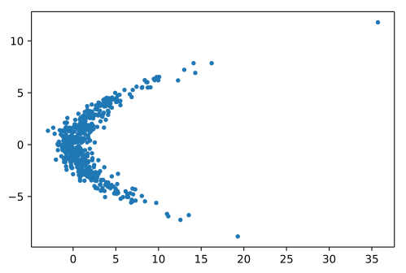
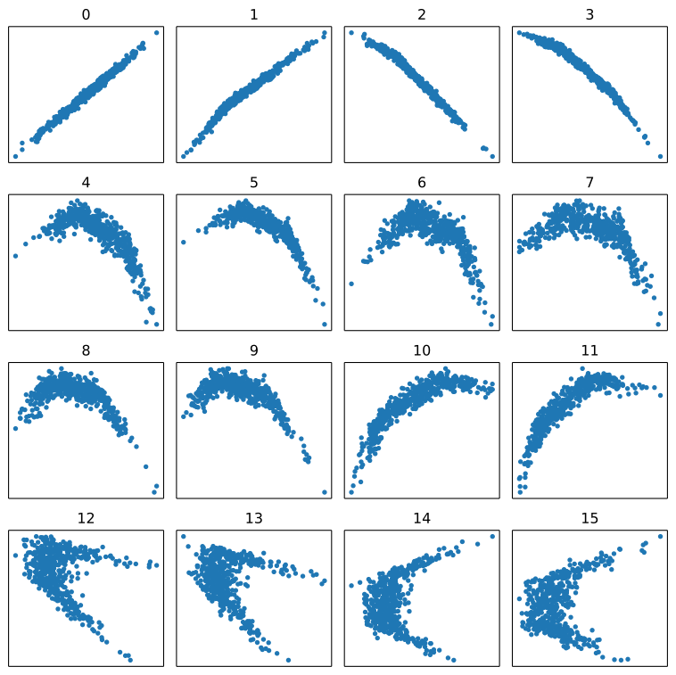

Normalizing Flows
=================

.. include:: ../macros.hrst

.. code-block:: python3

    import numpy as np
    import matplotlib.pyplot as plt
    import tensorflow as tf
    import tensorflow_probability as tfp
    tfd = tfp.distributions
    tfb = tfp.bijectors

    import probflow as pf

TODO: description, math, diagram

.. note::
    This example only works with the TensorFlow backend (using
    `bijectors <https://www.tensorflow.org/probability/api_docs/python/tfp/bijectors>`_),
    but one could implement a similar model using
    `PyTorch transforms <https://pytorch.org/docs/stable/distributions.html#module-torch.distributions.transforms>`_.

Let's create some data which has a wonky shape, and which would be difficult
to model with a standard probability distribution.

.. code-block:: python3

    N = 512
    x = 3*np.random.randn(N, 2)
    x[:, 0] = 0.25*np.square(x[:, 1])
    x[:, 0] += np.random.randn(N)
    plt.plot(x[:, 0], x[:, 1], '.')

To create the normalizing flow, we'll first create a
`bijector <https://www.tensorflow.org/probability/api_docs/python/tfp/bijectors>`_
to represent an invertible leaky rectified linear transformation.

.. code-block:: python3

    class LeakyRelu(tfb.Bijector):

        def __init__(self, alpha=0.5):
            super().__init__(forward_min_event_ndims=0)
            self.alpha = alpha

        def _forward(self, x):
            return tf.where(x>=0, x, x*self.alpha)

        def _inverse(self, y):
            return tf.where(y>=0, y, y/self.alpha)

        def _inverse_log_det_jacobian(self, y):
            return tf.math.log(tf.where(y>=0, 1., 1./self.alpha))

The source distribution will be a standard multivariate normal distribution,
and the affine transformations and "leakiness" of the rectified linear
transformations will be parameterized by :class:`.DeterministicParameter`
parameters, which are non-probabilistic (but still have priors).

.. code-block:: python3

    class MlpNormalizingFlow(pf.Model):

        def __init__(self, Nl, d):
            self.base_dist = tfd.MultivariateNormalDiag([0., 0.])
            self.V = [pf.DeterministicParameter([d, d]) for _ in range(Nl)]
            self.s = [pf.DeterministicParameter([d]) for _ in range(Nl)]
            self.L = [pf.DeterministicParameter([int(d*(d+1)/2)]) for _ in range(Nl)]
            self.a = [pf.DeterministicParameter([1]) for _ in range(Nl-1)]

        def __call__(self, n_steps=None):
            n_steps = 2*len(self.V)-1 if n_steps is None else n_steps
            bijectors = []
            for i in range(len(self.V)):
                bijectors += [tfb.Affine(
                    scale_tril=tfb.ScaleTriL().forward(self.L[i]()),
                    scale_perturb_factor=self.V[i](),
                    shift=self.s[i]())]
                if i < len(self.V)-1:
                    bijectors += [LeakyRelu(alpha=tf.abs(self.a[i]()))]
            return tfd.TransformedDistribution(
                distribution=self.base_dist,
                bijector=tfb.Chain(bijectors[:n_steps]))

Then we can create and fit the model to the data:

.. code-block:: python3

    Nl = 8 #number of layers
    model = MlpNormalizingFlow(Nl, 2)
    model.fit(x, epochs=1e4, lr=0.02)

Comparing the data points to samples from the base distribution transformed
by the normalizing flow, we can see that the transformations have warped the
base distribution to match the distribution of the data.

.. code-block:: python3

    # Plot original points and samples from the model
    plt.plot(x[:, 0], x[:, 1], '.')
    S = model().sample((512,))
    plt.plot(S[:, 0], S[:, 1], '.')

.. image:: img/normalizing_flows/output_7_0.svg
   :width: 70 %
   :align: center

And because normalizing flows are made up of invertible transformations, we
can evaluate the probability of the distribution at any arbitrary point on a
grid and compare that transformed probability distribution to the original
data:

.. code-block:: python3

    # Compute probabilities
    res = 200
    xx, yy = np.meshgrid(np.linspace(-5, 20, res), np.linspace(-10, 10, res))
    xy = np.hstack([e.reshape(-1, 1) for e in [xx, yy]])
    probs = model().prob(xy).numpy()

    # Plot them
    plt.imshow(probs.reshape((res, res)),
               origin='lower', extent=(-5, 20, -10, 10))
    plt.plot(x[:, 0], x[:, 1], 'r,')

.. image:: img/normalizing_flows/output_8_1.svg
   :width: 70 %
   :align: center

And we can use the ``n_steps`` kwarg to view samples after each successive
transformation in the flow.  We start with the base distribution (a standard
multivariate Gaussian), and the flow stepwise distorts and transforms that
distribution until it approximates the data.

.. code-block:: python3

    for i in range(2*Nl):
        plt.subplot(4, 4, i+1)
        S = model(n_steps=i).sample((512,))
        plt.plot(S[:, 0], S[:, 1], '.')

.. math::

    ~

Also see:

- Eric Jang's `great tutorial <https://blog.evjang.com/2018/01/nf1.html>`_ on normalizing flows, which this example is based on.
- Danilo Jimenez Rezende & Shakir Mohamed. `Variational Inference with Normalizing Flows <http://proceedings.mlr.press/v37/rezende15.html>`_. *PLMR*, 2015.

