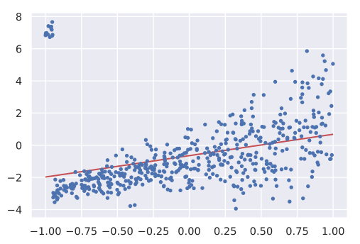
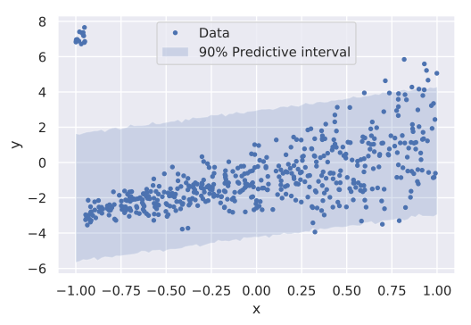
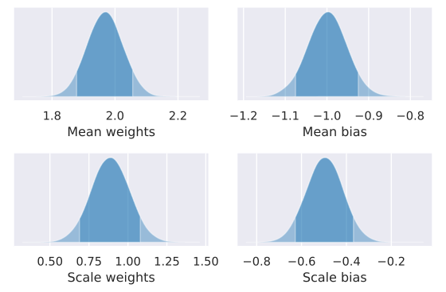

Robust Heteroscedastic Regression |Colab Badge|
===============================================

.. |Colab Badge| image:: ../img/colab-badge.svg
    :target: https://colab.research.google.com/drive/1Mh9Uaby9tsPftoF0-w2NlqHeOhlQB_Nu

.. include:: ../macros.hrst

.. admonition:: TLDR

    .. code-block:: python3

        class RobustHeteroscedasticRegression(pf.ContinuousModel):

            def __init__(self, dims):
                self.m = pf.Dense(dims)
                self.s = pf.Dense(dims)

            def __call__(self, x):
                return pf.Cauchy(self.m(x), tf.exp(self.s(x)))

        model = RobustHeteroscedasticRegression(x.shape[1])
        model.fit(x, y)

With a :doc:`linear regression <linear_regression>`, the amount of
noise is usually assumed to be constant.  But a lot of real data is
`heteroscedastic <https://en.wikipedia.org/wiki/Heteroscedasticity>`_ - that
is, the amount of noise changes as a function of the independent variable(s).
Also, most real data isn't perfectly normally distributed, and has some amount
of outliers.

Let's generate some data which is heteroscedastic and also contains outliers.

.. code-block:: python3

    # Imports
    import probflow as pf
    import numpy as np
    import matplotlib.pyplot as plt
    rand = lambda *x: np.random.rand(*x).astype('float32')
    randn = lambda *x: np.random.randn(*x).astype('float32')

    # Settings
    N = 512 #number of datapoints
    D = 1   #number of features

    # Heteroscedastic data
    x = 2*rand(N, D)-1
    y = x*2. - 1. + np.exp(x)*randn(N, 1)

    # Add some outliers
    y[x<-0.95] += 10

    # Plot it
    plt.plot(x, y, '.')

.. image:: img/heteroscedastic/output_4_0.svg
   :width: 70 %
   :align: center

The problem with a regular Linear Regression
--------------------------------------------

Let's try fitting a regular linear regression to this data.

.. code-block:: python3

    model = pf.LinearRegression(D)
    model.fit(x, y, lr=0.02, epochs=500)

The first problem is that the regular linear regression systematically
overestimates the target value for data points which have feature values
similar to the outliers (around :math:`x \approx -1`).

.. code-block:: python3

    # Make predictions
    x_test = np.linspace(-1, 1, 100).astype('float32').reshape((100, 1))
    preds = model.predict(x_test)

    # Plot em
    plt.plot(x, y, '.')
    plt.plot(x_test, preds, 'r')

Another problem is that the regular linear regression assumes the variance is
constant over different feature values, and so the model can't capture the
changing variance which is obviously present in the data.  It systematically
overestimates the variance for datapoints with low :math:`x` values, and
underestimates the variance for datapoints with high :math:`x` values:

.. code-block:: python3

    # Compute 95% predictive confidence intervals
    lb, ub = model.predictive_interval(x_test, ci=0.9)

    # Plot em
    plt.fill_between(x_test[:, 0], lb[:, 0], ub[:, 0], alpha=0.2)
    plt.plot(x, y, '.')

Robust Heteroscedastic Regression
---------------------------------

To allow the model to capture this change in variance, we'll add to the model
weights which use the features to predict the variance.  Just like a regular
linear regression, we'll use the features to predict the mean:

.. math::

    \mu = \mathbf{x}^\top \mathbf{w}_\mu + b_\mu

But unlike a regular linear regression, we'll use additional weights to predict
the scale of the distribution (after passing it through an exponential
function, because the scale must be positive):

.. math::

    \gamma = \exp ( \mathbf{x}^\top \mathbf{w}_\gamma + b_\gamma )

Also, to perform a regression which is robust to outliers, we'll use a
`Cauchy distribution <https://en.wikipedia.org/wiki/Cauchy_distribution>`_ as
the observation distribution, which has heavier tails than a Normal
distribution (and so is less affected by outlier values).

.. math::

    y \sim \text{Cauchy}(\mu, ~ \gamma)

Let's create this model with ProbFlow:

.. tabs::

    .. group-tab:: TensorFlow

        .. code-block:: python3

            import tensorflow as tf

            class RobustHeteroscedasticRegression(pf.ContinuousModel):

                def __init__(self, dims):
                    self.wm = pf.Parameter([dims, 1], name='Mean weights')
                    self.bm = pf.Parameter([1, 1], name='Mean bias')
                    self.ws = pf.Parameter([dims, 1], name='Scale weights')
                    self.bs = pf.Parameter([1, 1], name='Scale bias')

                def __call__(self, x):
                    means = x @ self.wm() + self.bm()
                    stds = tf.exp(x @ self.ws() + self.bs())
                    return pf.Cauchy(means, stds)

    .. group-tab:: PyTorch

        .. code-block:: python3

            import torch

            class RobustHeteroscedasticRegression(pf.ContinuousModel):

                def __init__(self, dims):
                    self.wm = pf.Parameter([dims, 1], name='Mean weights')
                    self.bm = pf.Parameter([1, 1], name='Mean bias')
                    self.ws = pf.Parameter([dims, 1], name='Scale weights')
                    self.bs = pf.Parameter([1, 1], name='Scale bias')

                def __call__(self, x):
                    x = torch.tensor(x)
                    means = x @ self.wm() + self.bm()
                    stds = torch.exp(x @ self.ws() + self.bs())
                    return pf.Cauchy(means, stds)

And fit it to the data:

.. code-block:: python3

    model = RobustHeteroscedasticRegression(D)
    model.fit(x, y, lr=0.02, epochs=500)

Taking a look at the parameter posteriors, we can see that the model has recovered the parameter values we used to generate the data:

.. code-block:: python3

    model.posterior_plot(ci=0.9, cols=2)

More importantly, the robust heteroscedastic model neither under- or
overestimates the target values:

.. code-block:: python3

    # Make predictions
    preds = model.predict(x_test)

    # Plot em
    plt.plot(x, y, '.')
    plt.plot(x_test, preds, 'r')

.. image:: img/heteroscedastic/output_18_0.svg
   :width: 70 %
   :align: center

And it is able to capture the changing variance as a function of the feature(s):

.. code-block:: python3

    # Compute 95% predictive confidence intervals
    lb, ub = model.predictive_interval(x_test, ci=0.9)

    # Plot em
    plt.fill_between(x_test[:, 0], lb[:, 0], ub[:, 0], alpha=0.2)
    plt.plot(x, y, '.')

.. image:: img/heteroscedastic/output_20_0.svg
   :width: 70 %
   :align: center

Using a Student's t-distribution
--------------------------------

Note that with a robust regression, you could also use a
`Student's t-distribution <https://en.wikipedia.org/wiki/Student%27s_t-distribution>`_
and estimate the degrees of freedom as well (to model how heavy the tails of
the distribution are):

.. tabs::

    .. group-tab:: TensorFlow

        .. code-block:: python3

            class RobustHeteroscedasticRegression(pf.ContinuousModel):

                def __init__(self, dims):
                    self.mw = pf.Parameter([dims, 1], name='Mean weight')
                    self.mb = pf.Parameter([1, 1], name='Mean bias')
                    self.sw = pf.Parameter([dims, 1], name='Scale weight')
                    self.sb = pf.Parameter([1, 1], name='Scale bias')
                    self.df = pf.ScaleParameter(name='Degrees of freedom')

                def __call__(self, x):
                    means = x @ self.wm() + self.bm()
                    stds = tf.exp(x @ self.ws() + self.bs())
                    return pf.StudentT(self.df(), means, stds)

    .. group-tab:: PyTorch

        .. code-block:: python3

            class RobustHeteroscedasticRegression(pf.ContinuousModel):

                def __init__(self, dims):
                    self.mw = pf.Parameter([dims, 1], name='Mean weight')
                    self.mb = pf.Parameter([1, 1], name='Mean bias')
                    self.sw = pf.Parameter([dims, 1], name='Scale weight')
                    self.sb = pf.Parameter([1, 1], name='Scale bias')
                    self.df = pf.ScaleParameter(name='Degrees of freedom')

                def __call__(self, x):
                    x = torch.tensor(x)
                    means = x @ self.wm() + self.bm()
                    stds = torch.exp(x @ self.ws() + self.bs())
                    return pf.StudentT(self.df(), means, stds)
