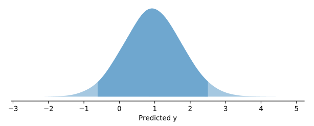
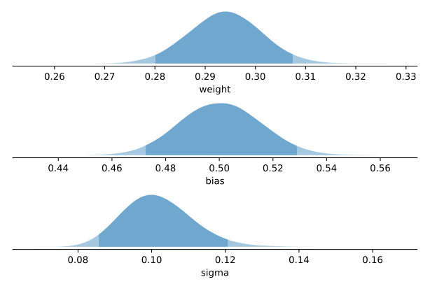
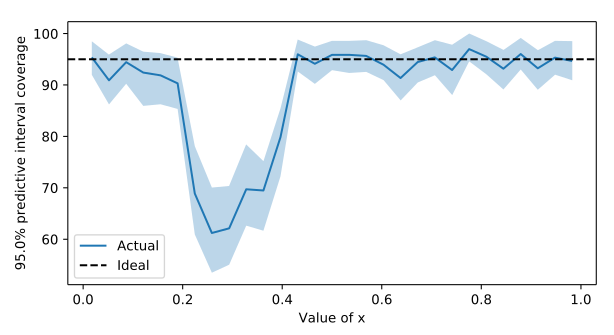
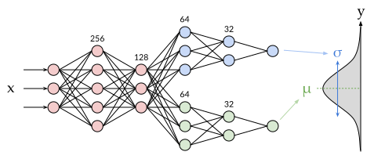

ProbFlow
========

.. meta::
    :property=og\:image: https://raw.githubusercontent.com/brendanhasz/probflow/master/docs/img/probflow_og_image.png
    :property=og\:image\:width: 1200
    :property=og\:image\:height: 1200

|Version Badge|  |Build Badge|  |Docs Badge|  |Coverage Badge|

.. |Version Badge| image:: https://img.shields.io/pypi/v/probflow
    :target: https://pypi.org/project/probflow/

.. |Build Badge| image:: https://github.com/brendanhasz/probflow/workflows/tests/badge.svg
    :target: https://github.com/brendanhasz/probflow/actions?query=branch%3Amaster

.. |Docs Badge| image:: https://readthedocs.org/projects/probflow/badge/
    :target: http://probflow.readthedocs.io

.. |Coverage Badge| image:: https://codecov.io/gh/brendanhasz/probflow/branch/master/graph/badge.svg
    :target: https://codecov.io/gh/brendanhasz/probflow

.. toctree::
   :maxdepth: 1
   :caption: Contents:
   :hidden:

   user_guide/user_guide
   examples/examples
   api/api
   dev_guide/dev_guide
   todo

.. include:: macros.hrst

ProbFlow is a Python package for building probabilistic Bayesian models with
|TensorFlow 2.0| or |PyTorch|, performing stochastic variational inference with
those models, and evaluating the models' inferences.  It provides both
high-level |Modules| for building Bayesian neural networks, as well as
low-level |Parameters| and |Distributions| for constructing custom Bayesian
models.

It's very much still a work in progress.

- **Git repository:** http://github.com/brendanhasz/probflow
- **Documentation:** http://probflow.readthedocs.io
- **Bug reports:** http://github.com/brendanhasz/probflow/issues

Getting Started
---------------

**ProbFlow** allows you to quickly and :raw-html:`<del>painlessly</del>` less
painfully build, fit, and evaluate custom Bayesian models (or :doc:`ready-made
<api/applications>` ones!) which run on top of either |TensorFlow| and
|TensorFlow Probability| or |PyTorch|.

With ProbFlow, the core building blocks of a Bayesian model are parameters and
probability distributions (and, of course, the input data).  Parameters define
how the independent variables (the features) predict the probability
distribution of the dependent variables (the target).

For example, a simple Bayesian linear regression

.. math::

    y \sim \text{Normal}(w x + b, \sigma)

can be built by creating a ProbFlow |Model|:

.. tabs::

    .. group-tab:: TensorFlow

        .. code-block:: python3

            import probflow as pf
            import tensorflow as tf

            class LinearRegression(pf.ContinuousModel):

                def __init__(self):
                    self.weight = pf.Parameter(name='weight')
                    self.bias = pf.Parameter(name='bias')
                    self.std = pf.ScaleParameter(name='sigma')

                def __call__(self, x):
                    return pf.Normal(x*self.weight()+self.bias(), self.std())

            model = LinearRegression()

    .. group-tab:: PyTorch

        .. code-block:: python3

            import probflow as pf
            import torch

            class LinearRegression(pf.ContinuousModel):

                def __init__(self):
                    self.weight = pf.Parameter(name='weight')
                    self.bias = pf.Parameter(name='bias')
                    self.std = pf.ScaleParameter(name='sigma')

                def __call__(self, x):
                    x = torch.tensor(x)
                    return pf.Normal(x*self.weight()+self.bias(), self.std())

            model = LinearRegression()

Then, the model can be fit using stochastic variational inference, in *one line*:

.. code-block:: python3

    # x and y are Numpy arrays or pandas DataFrame/Series
    model.fit(x, y)

You can generate predictions for new data:

.. code-block:: pycon

    # x_test is a Numpy array or pandas DataFrame
    >>> model.predict(x_test)
    [0.983]

Compute *probabilistic* predictions for new data, with 95% confidence intervals:

.. code-block:: python3

    model.pred_dist_plot(x_test, ci=0.95)

Evaluate your model's performance using various metrics:

.. code-block:: pycon

    >>> model.metric('mse', x_test, y_test)
    0.217

Inspect the posterior distributions of your fit model's parameters, with 95% confidence intervals:

.. code-block:: python3

    model.posterior_plot(ci=0.95)

Investigate how well your model is capturing uncertainty by examining how accurate its predictive intervals are:

.. code-block:: pycon

    >>> model.pred_dist_coverage(ci=0.95)
    0.903

and diagnose *where* your model is having problems capturing uncertainty:

.. code-block:: python3

    model.coverage_by(ci=0.95)

ProbFlow also provides more complex modules, such as those required for building :doc:`Bayesian neural networks <examples/fully_connected>`.  Also, you can mix ProbFlow with TensorFlow (or PyTorch!) code.  For example, even a somewhat complex multi-layer Bayesian neural network like this:

Can be built and fit with ProbFlow in only a few lines:

.. tabs::

    .. group-tab:: TensorFlow

        .. code-block:: python3

            class DensityNetwork(pf.ContinuousModel):

                def __init__(self, units, head_units):
                    self.core = pf.DenseNetwork(units)
                    self.mean = pf.DenseNetwork(head_units)
                    self.std  = pf.DenseNetwork(head_units)

                def __call__(self, x):
                    z = tf.nn.relu(self.core(x))
                    return pf.Normal(self.mean(z), tf.exp(self.std(z)))

            # Create the model
            model = DensityNetwork([x.shape[1], 256, 128], [128, 64, 32, 1])

            # Fit it!
            model.fit(x, y)

    .. group-tab:: PyTorch

        .. code-block:: python3

            class DensityNetwork(pf.ContinuousModel):

                def __init__(self, units, head_units):
                    self.core = pf.DenseNetwork(units)
                    self.mean = pf.DenseNetwork(head_units)
                    self.std  = pf.DenseNetwork(head_units)

                def __call__(self, x):
                    x = torch.tensor(x)
                    z = torch.nn.ReLU()(self.core(x))
                    return pf.Normal(self.mean(z), torch.exp(self.std(z)))

            # Create the model
            model = DensityNetwork([x.shape[1], 256, 128], [128, 64, 32, 1])

            # Fit it!
            model.fit(x, y)

For convenience, ProbFlow also includes several :doc:`pre-built models </api/applications>` for standard tasks (such as linear regressions, logistic regressions, and multi-layer dense neural networks).  For example, the above linear regression example could have been done with much less work by using ProbFlow's ready-made :class:`LinearRegression <probflow.applications.LinearRegression>` model:

.. code-block:: python3

    model = pf.LinearRegression(x.shape[1])
    model.fit(x, y)

And a multi-layer Bayesian neural net can be made easily using ProbFlow's ready-made :class:`DenseRegression <probflow.applications.DenseRegression>` model:

.. code-block:: python3

    model = pf.DenseRegression([x.shape[1], 128, 64, 1])
    model.fit(x, y)

Using parameters and distributions as simple building blocks, ProbFlow allows
for the painless creation of more complicated Bayesian models like
:doc:`generalized linear models <examples/glm>`, :doc:`deep time-to-event
models <examples/time_to_event>`, :doc:`neural matrix factorization
<examples/nmf>` models, and :doc:`Gaussian mixture models <examples/gmm>`.  You
can even :doc:`mix probabilistic and non-probabilistic models
<examples/neural_linear>`!  Take a look at the :doc:`examples/examples` and the
:doc:`user_guide/user_guide` for more!

Installation
------------

If you already have your desired backend installed (i.e. Tensorflow/TFP or
PyTorch), then you can just do:

.. code-block:: bash

    pip install probflow

Or, to install both ProbFlow and a specific backend,

.. tabs::

    .. tab:: TensorFlow CPU

        .. code-block:: bash

            pip install probflow[tensorflow]

    .. tab:: TensorFlow GPU

        .. code-block:: bash

            pip install probflow[tensorflow_gpu]

    .. tab:: PyTorch

        .. code-block:: bash

            pip install probflow[pytorch]

Support
-------

Post bug reports, feature requests, and tutorial requests in `GitHub issues <http://github.com/brendanhasz/probflow/issues>`_.

Contributing
------------

`Pull requests <https://github.com/brendanhasz/probflow/pulls>`_ are totally welcome!  Any contribution would be appreciated, from things as minor as pointing out typos to things as major as writing new applications and distributions.  For info on how to set up a development environment and run the tests, see the :doc:`dev_guide/dev_guide`.

Why the name, ProbFlow?
-----------------------

Because it's a package for probabilistic modeling, and it was built on TensorFlow.  ¯\\_(ツ)_/¯
