.. _ug_parameters:

Parameters
==========

|Colab Badge|

.. |Colab Badge| image:: img/colab-badge.svg
    :target: https://colab.research.google.com/drive/1I7xFnHZ1mfTvKZgl7Nyt0NfYzRNdtMy5

.. include:: macros.hrst

|Parameters| are values which characterize the behavior of a model.  For
example, the intercept and slope of the best-fit line in a linear regression
are the parameters of that linear regression model. When fitting a model, we
want to find the values of the parameters which best allow the model to
explain the data. However, with Bayesian modeling we want not only to find the
single *best* value for each parameter, but a probability distribution which
describes how likely any given value of a parameter is to be the best or true
value.

Parameters have both priors (probability distributions which describe how
likely we think different values for the parameter are *before* taking into
consideration the current data), and posteriors (probability distributions 
which describe how likely we think different values for the parameter are
*after* taking into consideration the current data).  The prior is set 
to a specific distribution before fitting the model.  While the *type* of 
distribution used for the posterior is set before fitting the model, the 
shape of that distribution (the value of the variables which define the
distribution's shape) is optimized while fitting the model.
See the :ref:`ug_math` section for more info.

Creating a Parameter
--------------------

To create a parameter, create an instance of the :class:`.Parameter` class:

.. code-block:: python3

    import probflow as pf
    param = pf.Parameter()

The parameter can be given a unique name via the ``name`` keyword argument, which will be shown when plotting information about the parameter:

.. code-block:: python3

    param = pf.Parameter(name='weight')

You can also create an array of independent parameters of the same type using
the ``shape`` keyword argument.  For example, to create a vector of 3 
independent parameters, 

.. code-block:: python3

    param = pf.Parameter(shape=3)

or a :math:`5 \times 3` matrix of parameters:

.. code-block:: python3

    param = pf.Parameter(shape=[5, 3])

Specifying the Variational Posterior
^^^^^^^^^^^^^^^^^^^^^^^^^^^^^^^^^^^^

To set what distribution to use as the variational posterior for a parameter,
pass a |Distribution| class to the ``posterior`` keyword argument of the
parameter when initializing that parameter.  For example, to create a
parameter which uses a normal distribution for its variational posterior:

.. code-block:: python3

    param = pf.Parameter(posterior=pf.Normal)

The default variational posterior on a parameter is a :class:`.Normal` 
distribution. However, we can manually set the prior on any parameter to be
any |Distribution| (with any parameters).  For example, to instead create a 
parameter which uses a Cauchy distribution as the variational posterior:

.. code-block:: python3

    param = pf.Parameter(posterior=pf.Cauchy)

Setting the Prior
^^^^^^^^^^^^^^^^^

To set the prior on a parameter, pass a |Distribution| object to the ``prior``
keyword argument of the constructor when initializing that parameter.  For
example, to create a parameter with a prior of :math:`\text{Normal(0, 1)}`:

.. code-block:: python3

    param = pf.Parameter(prior=pf.Normal(0, 1))

The default prior on a parameter is a :class:`.Normal` distribution with a
mean of 0 and a standard deviation of 1.  However, we can manually set the
prior on any parameter to be any |Distribution| (with any parameters).
The only limitation is that the backend must be able to analytically compute
the Kullback–Leibler divergence between the prior and the posterior (which is
usually possible as long as you use the same type of distribution for both the
prior and posterior).

Transforming Parameters
^^^^^^^^^^^^^^^^^^^^^^^

Sometimes it's useful to transform the samples from a parameter after sampling
from the variational posterior distribution.  You could do this manually each 
time, of course, but for convenience ProbFlow provides a ``transform`` keyword
argument.  The transform should be a function which uses operations from your
backend (either TensorFlow or PyTorch) to transform the sample values.

For example, a parameter which uses a normal distribution as the variational 
posterior will have posterior samples above and below zero:

.. code-block:: python3

    param = pf.Parameter()
    param.posterior_plot()

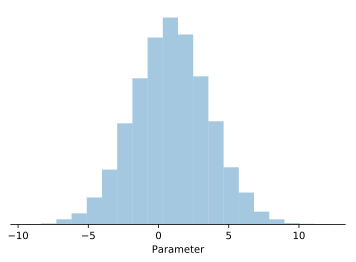

But if we initialize a parameter with a softplus transform, the samples
will all be greater than zero (because the samples were piped through the
softplus function):

.. code-block:: python3

    import tensorflow as tf
    param = pf.Parameter(transform=lambda x: tf.nn.softplus(x))
    param.posterior_plot()

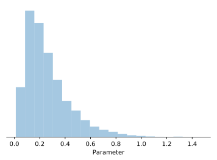

One thing to note is that the transform only applies to samples from the 
variational posterior distribution, and doesn't transform both the prior and
posterior distributions with a Jacobian adjustment.  So, make sure the prior
and untransformed posterior are in the same space!  I.e. if you're using a 
Normal variational posterior with an exponential ``transform``, you should use
a Normal prior, not a LogNormal prior.

Setting the variable initializers
^^^^^^^^^^^^^^^^^^^^^^^^^^^^^^^^^

The posterior distributions have one or more variables which determine the 
shape of the distribution (these are the variables which are optimized over
the course of training).  You can set how the values of the variables are
initialized at the beginning of training. The default is to use
`Xavier initialization <http://proceedings.mlr.press/v9/glorot10a.html>`_
(aka Glorot initialization) for the mean of the default Normal posterior
distribution, and a shifted Xavier initializer for the standard deviation
variable.

To use a custom initializer, use the ``initializer`` keyword argument to the
parameter constructor.  Pass a dictionary where the keys are the variable
names and the values are functions which have one argument - the parameter's 
shape - and return a tensor of initial values.  For example, to create a 
matrix of parameters with Normal priors and posteriors, and initialize the
posterior's ``loc`` (the mean) variable by drawing values from a normal 
distribution, and the ``scale`` (the standard deviation) parameter with all
ones:

.. code-block:: python3

    def randn_fn(shape):
        return tf.random.normal(shape)

    def ones_fn(shape):
        return tf.ones(shape)

    init_dict = {'loc': randn_fn, 'scale': ones_fn}
    param = pf.Parameter(initializer=init_dict)

Setting the variable transforms
^^^^^^^^^^^^^^^^^^^^^^^^^^^^^^^

The raw untransformed variables can be transformed before they are used to 
construct the variational posterior.  This comes in handy when you want the 
underlying variables which are being optimized to be unconstrained, but 
require the variables to take certain values to construct the variational 
posterior.

For example, if we're using a normal distribution as the variational posterior
for a parameter, we need the standard deviation parameter to be positive
(because the variance can't be negative!).  But, we want to optimize the
variable in unconstrained space.  In this case, we can use a softplus
function to transform the unconstrained (raw) variable into a value which is 
always positive.  To define what transforms to use for each unconstrained 
variable, pass a dictionary to the ``var_transform`` keyword argument
when initializing a parameter, where the keys are strings (the names of the
variables) and the values are callables (the transforms to apply).

.. code-block:: python3

    transforms = {'loc': None, 'scale': tf.nn.softplus}

    param = pf.Parameter(initializer=init_dict,
                         var_transform=transforms)

There's no transformation for the ``loc`` variable because that variable can
take any value, and so it doesn't need to be transformed.

The transforms in the example above are the default transforms for a
Parameter, which assumes a Gaussian variational posterior.

The ``var_transform`` keyword argument can be used with more complicated
functions, for example see the implementation of
:class:`.MultivariateNormalParameter` which uses ``var_transform`` to
implement the log Cholesky reparameterization, which transforms 
:math:`N(N+1)/2` unconstrained variables in to a :math:`N \times N` 
covariance matrix.

Working with Parameters
-----------------------

After a parameter is created, you can take samples from its variational
posterior, as well as examine and plot the posterior and priors.

Sampling from a Parameter's variational posterior
^^^^^^^^^^^^^^^^^^^^^^^^^^^^^^^^^^^^^^^^^^^^^^^^^

Parameters return a sample from their variational posterior when called:

.. code-block:: python3

    param = pf.Parameter()
    sample = param()

This method should be used for sampling from parameters' posteriors inside
a model, because it returns a backend tensor.  Depending on the context, 
the sample will either be a random sample from the variational distribution
(used during model fitting, drawing epistemic samples, or predictive samples)
or the variational posterior's mean (used during prediction, drawing aleatoric
samples, and computing the residuals).  See `creating a model <ug_models>`_ for more info.

You can also index a parameter to take a slice of a sample from the 
parameter's variational posterior distribution.  This will even work with
vectors of indexes as slices, for example:

.. code-block:: python3

    ix = tf.constant([0, 2, 2, 0, 1, 4, 3])
    param = pf.Parameter(shape=[5, 3])
    sample = param[ix, :]

    #sample is a tf.Tensor
    #sample.shape == (7, 3)
    #sample[0, :] == sample[3, :]
    #sample[1, :] == sample[2, :]

Examining a Parameter's variational posterior
^^^^^^^^^^^^^^^^^^^^^^^^^^^^^^^^^^^^^^^^^^^^^

To get the mean of a parameter as a numpy array (*not* as a backend tensor),
use the :meth:`posterior_mean <.Parameter.posterior_mean>` method:

.. code-block:: python3

    param = pf.Parameter()
    mean = param.posterior_mean()

To get a sample from the variational posterior distribution as a numpy array 
(as opposed to getting a sample as a backend tensor using ``__call__``), use
the :meth:`posterior_sample <.Parameter.posterior_sample>` method:

.. code-block:: python3

    sample = param.posterior_sample()
    # sample is a scalar ndarray

To specify how many samples to get, use the ``n`` keyword argument:

.. code-block:: python3

    samples = param.posterior_sample(n=1000)
    # samples is a ndarray with shape (1000,)

To compute confidence intervals on a parameter's posterior, use
the :meth:`posterior_ci <.Parameter.posterior_ci>` method:

.. code-block:: python3

    lb, ub = param.posterior_ci()
    #lb is lower bound on 95% confidence interval
    #ub is upper bound

The default is to compute the 95% confidence interval using 10,000 samples
from the posterior, but these defaults can be changed with the ``ci`` and
``n`` keyword arguments.  For example, to compute the 80% confidence interval
using 100k samples,

.. code-block:: python3

    lb, ub = param.posterior_ci(ci=0.8, n=100000)

To plot the variational posterior distribution, use
the :meth:`posterior_plot <.Parameter.posterior_plot>` method:

.. code-block:: python3

    param.posterior_plot()

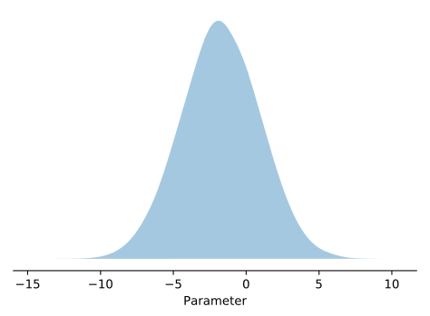

To plot confidence intervals, use the ``ci`` 
keyword argument.  For example, to plot the 90% confidence intervals:

.. code-block:: python3

    param.posterior_plot(ci=0.9)

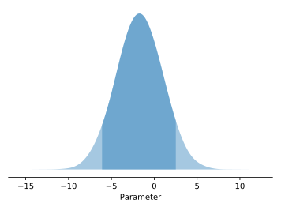

The default plot style is a kernel-density-estimated distribution, but this
can be changed with the ``style`` keyword.  For example, to plot with the 
histogram style:

.. code-block:: python3

    param.posterior_plot(style='hist', ci=0.9)

.. image:: img/user_guide/parameters/posterior_plot_3.svg
   :width: 70 %
   :align: center

Or just using plain lines:

.. code-block:: python3

    param.posterior_plot(style='line')

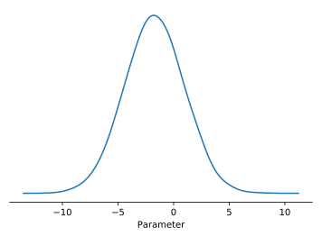

Examining a Parameter's prior
^^^^^^^^^^^^^^^^^^^^^^^^^^^^^

Similarly, you can take samples from a parameter's prior distribution using
the :meth:`prior_sample <.Parameter.prior_sample>` method:

.. code-block:: python3

    samples = param.prior_sample(n=1000)
    # samples is a ndarray with shape (1000,)

And you can plot the prior distribution using
the :meth:`prior_plot <.Parameter.prior_plot>` method:

.. code-block:: python3

    param.prior_plot()

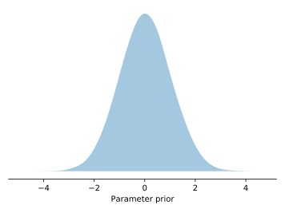

Specialized types of Parameters
-------------------------------

ProbFlow includes several specialized types of parameters.  These are all just
parameters with specialized default posterior types, priors, initializers, and
transforms, etc, which are suited for that parameter type.

Scale Parameters
^^^^^^^^^^^^^^^^

TL;DR: to make a standard deviation parameter, use the 
:class:`.ScaleParameter` class:

.. code-block:: python3

    std_dev = pf.ScaleParameter()

A parameter which comes up often in Bayesian modeling is a "scale" parameter.  For example, the standard deviation (:math:`\sigma`) in a linear regression with normally-distributed noise:

.. math::

    p(y~|~x) = \mathcal{N}(\beta x + \beta_0, ~ \sigma)

This :math:`\sigma` parameter cannot take values below 0, because the standard
deviation cannot be negative.  So, we can't use the default posterior and
prior for a parameter (which is a :class:`.Normal` distribution for the
posterior and ``Normal(0, 1)`` for the prior), because this default allows
negative values.

In Bayesian modeling, the `gamma distribution <https://en.wikipedia.org/wiki/
Gamma_distribution>`_ is often used as a posterior for the 
`precision <https://en.wikipedia.org/wiki/Precision_(statistics)>`_.  The 
precision is the reciprocal of the variance, and so the
`inverse gamma distribution <https://en.wikipedia.org/wiki/Inverse-gamma_distribution>`_ 
can be used as a variational posterior for the variance.

However, many models are parameterized in terms of the standard deviation,
which is the square root of the variance.  So, to create a standard deviation
parameter, we could first construct a variance parameter (:math:`\sigma^2`)
which uses an inverse gamma distribution as its variational posterior:

.. math::

    \sigma^2 \sim \text{InverseGamma}(\alpha, \beta)

and then transform this into a standard deviation parameter (:math:`\sigma`):

.. math::

    \sigma = \sqrt{\sigma^2}

This could be accomplished with ProbFlow by
`setting the posterior <#specifying-the-variational-posterior>`_ and
`the prior <#setting-the-prior>`_ to :class:`.InverseGamma`, which means we
would also have to specify the initializers and variable transformations
accordingly, and then
`transform the parameter <#transforming-parameters>`_ with a square root:

.. code-block:: python3

    def randn(shape):
        return tf.random.normal(shape)

    std_dev = pf.Parameter(posterior=pf.InverseGamma,
                           prior=pf.InverseGamma(5, 5),
                           transform=lambda x: tf.sqrt(x),
                           initializer={'concentration': randn,
                                        'scale': randn},
                           var_transform={'concentration': tf.nn.softplus,
                                          'scale': tf.nn.softplus})

Since that's such a pain, ProbFlow provides a :class:`.ScaleParameter` class
which automatically creates a parameter with the above variational posterior
and transforms, etc.  This makes it much easier to create a scale parameter:

.. code-block:: python3

    std_dev = pf.ScaleParameter()

Categorical Parameters
^^^^^^^^^^^^^^^^^^^^^^

Another type of specialized parameter provided by ProbFlow is the
:class:`.CategoricalParameter`, which uses a 
`categorical distribution <https://en.wikipedia.org/wiki/Categorical_distribution>`_ as the variational posterior, and a uniform
categorical prior.

To specify how many categories the parameter represents, use the ``k``
keyword argument.  For example, to create a categorical parameter which takes
one of three classes,

.. code-block:: pycon

    >>> cat_param = pf.CategoricalParameter(k=3)
    >>> cat_param.posterior_sample(n=10)
    array([1, 0, 0, 1, 2, 2, 0, 0, 0, 1], dtype=int32)

The ``shape`` keyword argument can be used as with a normal parameter:

.. code-block:: pycon

    >>> cat_param = pf.CategoricalParameter(k=3, shape=5)
    >>> cat_param.posterior_sample()
    array([1, 1, 1, 0, 2], dtype=int32)
    >>> cat_param.posterior_sample(n=10)
    array([[0, 2, 2, 2, 2],
           [0, 0, 2, 0, 2],
           [1, 2, 1, 1, 0],
           [1, 2, 1, 0, 0],
           [0, 2, 0, 2, 0],
           [1, 0, 0, 2, 0],
           [1, 1, 0, 0, 2],
           [0, 2, 1, 0, 0],
           [2, 0, 2, 1, 1],
           [2, 0, 0, 1, 2]], dtype=int32)

Dirichlet Parameter
^^^^^^^^^^^^^^^^^^^

The :class:`.DirichletParameter` is similar to the Categorical parameter, 
except it uses the 
`Dirichlet distribution <https://en.wikipedia.org/wiki/Dirichlet_distribution>`_
as the variational posterior, and a uniform
Dirichlet prior.  This means that samples from this parameter return 
categorical probability distributions, *not* samples from a categorical 
distribution.  The ``k`` keyword argument controls how many categories 
the parameter represents:

.. code-block:: pycon

    >>> param = pf.DirichletParameter(k=3)
    >>> param.posterior_sample()
    array([0.46866438, 0.10728444, 0.4240512 ], dtype=float32)
    >>> param.posterior_sample(n=2)
    array([[0.7168123 , 0.04725884, 0.2359289 ],
           [0.17213224, 0.3357264 , 0.4921414 ]], dtype=float32)

And the ``shape`` keyword argument can be used to set the size of the 
parameter array as usual:

.. code-block:: pycon

    >>> param = pf.DirichletParameter(k=2, shape=3)
    >>> param.posterior_sample()
    array([[0.59154356, 0.40845647],
           [0.31525746, 0.68474257],
           [0.20236614, 0.7976338 ]], dtype=float32)

Note that samples from this parameter have size 
``(shape[0], ... shape[n], k)``, not ``(shape[0], ... shape[n])``.

Bounded Parameters
^^^^^^^^^^^^^^^^^^

The :class:`.BoundedParameter` can be used to represent a parameter which 
has both an upper and a lower bound, and uses a normal posterior and prior,
with a logit transform to bound the parameter's values on both ends.

By default, the parameter is bounded between 0 and 1:

.. code-block:: python3

    param = pf.BoundedParameter()
    param.posterior_plot(style='hist', ci=0.9)

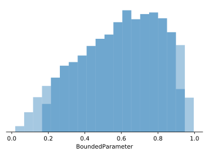

But the upper and lower bounds can be set using the ``max`` and ``min`` 
keyword arguments:

.. code-block:: python3

    param = pf.BoundedParameter(min=5, max=10)
    param.posterior_plot(style='hist', ci=0.9)

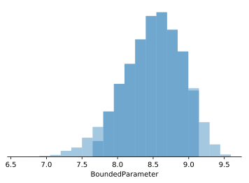

Positive Parameter
^^^^^^^^^^^^^^^^^^

The :class:`.PositiveParameter` can be used to represent a parameter which 
must be positive, but has no upper bound.  It uses a normal variational
posterior and prior, with a softplus transformation.

.. code-block:: python3

    param = pf.PositiveParameter()
    param.posterior_plot(style='hist', ci=0.9)

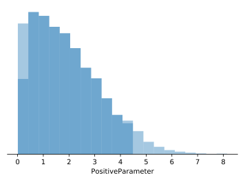

Deterministic Parameter
^^^^^^^^^^^^^^^^^^^^^^^

The :class:`.DeterministicParameter` can be used to represent a 
non-probabilistic parameter.  That is, it has no variational posterior 
distribution because its "variational posterior" is a single point value.

Every random sample from a deterministic parameter has the same value 
(though the parameters are still trainable):

.. code-block:: pycon

    >>> param = pf.DeterministicParameter()
    >>> param.posterior_sample(n=10)
    array([[2.3372688],
           [2.3372688],
           [2.3372688],
           [2.3372688],
           [2.3372688]], dtype=float32)

Multivariate Normal Parameter
^^^^^^^^^^^^^^^^^^^^^^^^^^^^^

The :class:`.MultivariateNormalParameter` uses a multivariate normal 
distribution (with full covariance) as the variational posterior, with a 
multivariate normal prior.  This comes in handy when you want to model 
a potential correlation between parameter(s).

The ``d`` keyword argument sets the dimensionality of the multivariate 
normal variational posterior used:

.. code-block:: python3

    param = pf.MultivariateNormalParameter(d=3)
    param.posterior_plot()

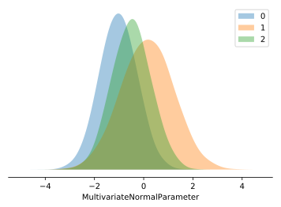

Samples from this parameter's variational posterior are in ``d`` dimensions:

.. code-block:: pycon

    >>> param.posterior_sample().shape
    (3,)

And this parameter models the full covariance structure of the multivariate
distribution:

.. code-block:: python3

    samples = param.posterior_sample(n=10000)

    import seaborn as sb
    sns.kdeplot(samples[:, 0], samples[:, 1])

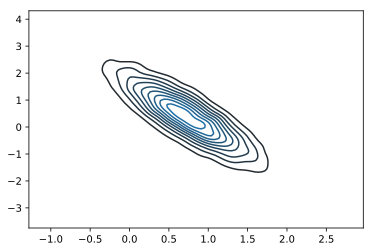
