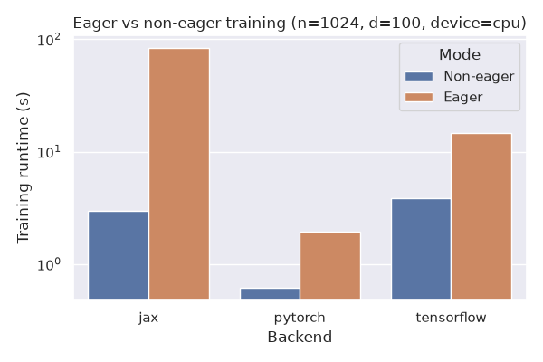
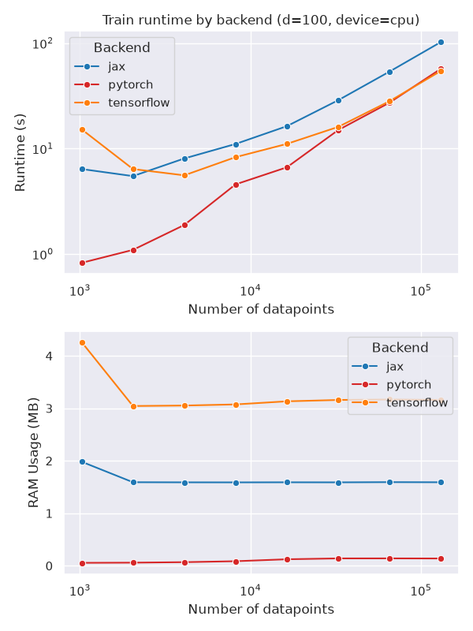
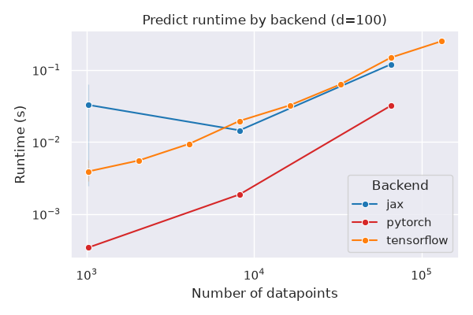
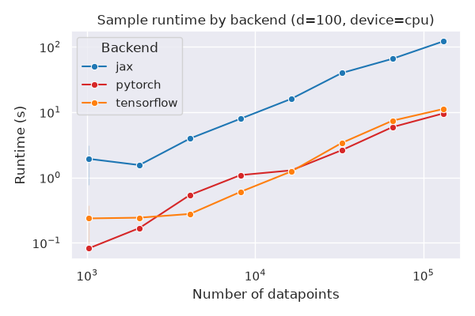
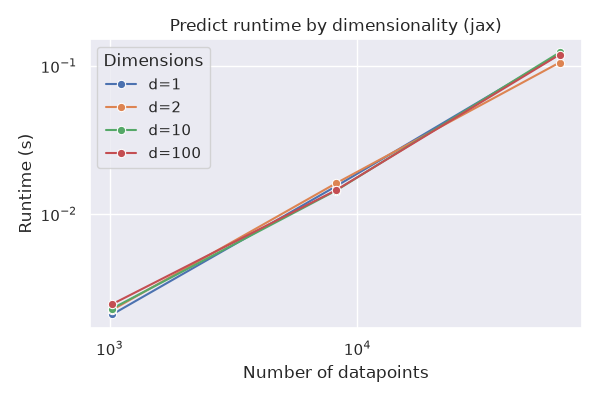
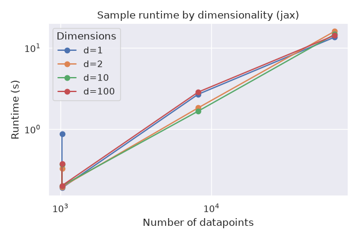
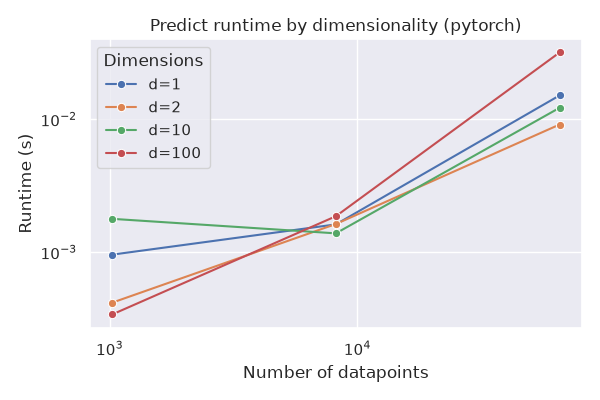
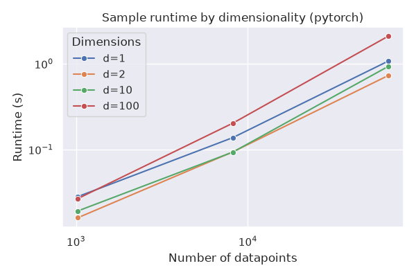
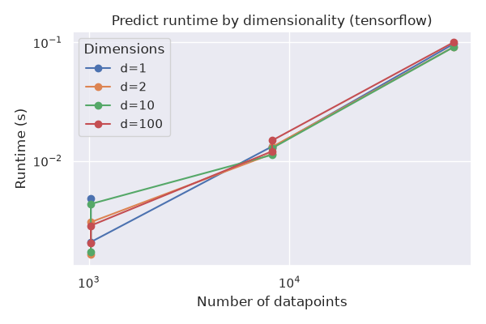
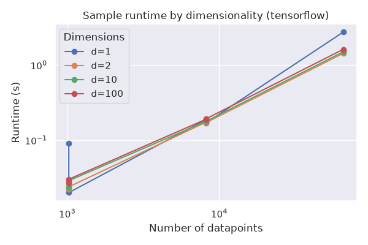

.. _user_guide_benchmarking:

Benchmarking
============

.. include:: ../macros.hrst

ProbFlow's benchmarking suite fits a Bayesian linear regression model (:class:`.LinearRegression`) with each supported backend (TensorFlow, PyTorch, and JAX), for a range of dataset sizes and data dimensionality.  For each combination it measures the time to train the model, the time to generate predictions, and the time to draw samples from the model's predictive distribution.  Training is additionally benchmarked in both eager and non-eager (compiled) modes, for smaller datasets (for larger datasets non-eager/compiled mode is always used).

Eager vs non-eager training
----------------------------

The plot below compares training runtime in eager vs non-eager (compiled) mode for each backend, using the smallest number of datapoints and the largest number of dimensions benchmarked.

Comparing backends
-------------------

The plots below show runtime as a function of the number of datapoints, at the largest number of dimensions benchmarked, with a separate line for each backend.  Only non-eager (compiled) training runs are included.

Comparing dimensionality
-------------------------

The plots below show runtime as a function of the number of datapoints, with a separate line for each number of dimensions.  Separate plots are shown for each backend, operation, and (for training) eager vs non-eager execution mode.

.. image:: ../img/benchmarking/dim_comparison_jax_train_eager.png
   :width: 70 %
   :align: center

.. image:: ../img/benchmarking/dim_comparison_jax_train_non-eager.png
   :width: 70 %
   :align: center

.. image:: ../img/benchmarking/dim_comparison_pytorch_train_eager.png
   :width: 70 %
   :align: center

.. image:: ../img/benchmarking/dim_comparison_pytorch_train_non-eager.png
   :width: 70 %
   :align: center

.. image:: ../img/benchmarking/dim_comparison_tensorflow_train_eager.png
   :width: 70 %
   :align: center

.. image:: ../img/benchmarking/dim_comparison_tensorflow_train_non-eager.png
   :width: 70 %
   :align: center

Full benchmarking results
-------------------------

The full set of benchmarking results:

.. list-table::
   :header-rows: 1

   * - operation
     - n_datapoints
     - n_dimensions
     - eager
     - backend
     - runtime_seconds
   * - predict
     - 1024
     - 1
     - 
     - jax
     - 0.0024
   * - predict
     - 1024
     - 1
     - 
     - jax
     - 0.1020
   * - predict
     - 1024
     - 1
     - 
     - pytorch
     - 0.0003
   * - predict
     - 1024
     - 1
     - 
     - pytorch
     - 0.0004
   * - predict
     - 1024
     - 1
     - 
     - tensorflow
     - 0.0021
   * - predict
     - 1024
     - 1
     - 
     - tensorflow
     - 0.0048
   * - predict
     - 1024
     - 2
     - 
     - jax
     - 0.0023
   * - predict
     - 1024
     - 2
     - 
     - jax
     - 0.0444
   * - predict
     - 1024
     - 2
     - 
     - pytorch
     - 0.0003
   * - predict
     - 1024
     - 2
     - 
     - pytorch
     - 0.0006
   * - predict
     - 1024
     - 2
     - 
     - tensorflow
     - 0.0016
   * - predict
     - 1024
     - 2
     - 
     - tensorflow
     - 0.0030
   * - predict
     - 1024
     - 10
     - 
     - jax
     - 0.0023
   * - predict
     - 1024
     - 10
     - 
     - jax
     - 0.0508
   * - predict
     - 1024
     - 10
     - 
     - pytorch
     - 0.0002
   * - predict
     - 1024
     - 10
     - 
     - pytorch
     - 0.0004
   * - predict
     - 1024
     - 10
     - 
     - tensorflow
     - 0.0017
   * - predict
     - 1024
     - 10
     - 
     - tensorflow
     - 0.0043
   * - predict
     - 1024
     - 100
     - 
     - jax
     - 0.0026
   * - predict
     - 1024
     - 100
     - 
     - jax
     - 0.0577
   * - predict
     - 1024
     - 100
     - 
     - pytorch
     - 0.0003
   * - predict
     - 1024
     - 100
     - 
     - pytorch
     - 0.0003
   * - predict
     - 1024
     - 100
     - 
     - tensorflow
     - 0.0020
   * - predict
     - 1024
     - 100
     - 
     - tensorflow
     - 0.0028
   * - predict
     - 8192
     - 1
     - 
     - jax
     - 0.0795
   * - predict
     - 8192
     - 1
     - 
     - pytorch
     - 0.0012
   * - predict
     - 8192
     - 1
     - 
     - pytorch
     - 0.0017
   * - predict
     - 8192
     - 1
     - 
     - tensorflow
     - 0.0129
   * - predict
     - 8192
     - 1
     - 
     - tensorflow
     - 0.0132
   * - predict
     - 8192
     - 2
     - 
     - jax
     - 0.0176
   * - predict
     - 8192
     - 2
     - 
     - pytorch
     - 0.0015
   * - predict
     - 8192
     - 2
     - 
     - pytorch
     - 0.0018
   * - predict
     - 8192
     - 2
     - 
     - tensorflow
     - 0.0114
   * - predict
     - 8192
     - 2
     - 
     - tensorflow
     - 0.0131
   * - predict
     - 8192
     - 10
     - 
     - jax
     - 0.0153
   * - predict
     - 8192
     - 10
     - 
     - pytorch
     - 0.0016
   * - predict
     - 8192
     - 10
     - 
     - pytorch
     - 0.0021
   * - predict
     - 8192
     - 10
     - 
     - tensorflow
     - 0.0112
   * - predict
     - 8192
     - 10
     - 
     - tensorflow
     - 0.0128
   * - predict
     - 8192
     - 100
     - 
     - jax
     - 0.0168
   * - predict
     - 8192
     - 100
     - 
     - pytorch
     - 0.0020
   * - predict
     - 8192
     - 100
     - 
     - pytorch
     - 0.0029
   * - predict
     - 8192
     - 100
     - 
     - tensorflow
     - 0.0120
   * - predict
     - 8192
     - 100
     - 
     - tensorflow
     - 0.0148
   * - predict
     - 65536
     - 1
     - 
     - jax
     - 0.1107
   * - predict
     - 65536
     - 1
     - 
     - pytorch
     - 0.0104
   * - predict
     - 65536
     - 1
     - 
     - tensorflow
     - 0.0968
   * - predict
     - 65536
     - 2
     - 
     - jax
     - 0.1091
   * - predict
     - 65536
     - 2
     - 
     - pytorch
     - 0.0113
   * - predict
     - 65536
     - 2
     - 
     - tensorflow
     - 0.0913
   * - predict
     - 65536
     - 10
     - 
     - jax
     - 0.1285
   * - predict
     - 65536
     - 10
     - 
     - pytorch
     - 0.0179
   * - predict
     - 65536
     - 10
     - 
     - tensorflow
     - 0.0910
   * - predict
     - 65536
     - 100
     - 
     - jax
     - 0.1374
   * - predict
     - 65536
     - 100
     - 
     - pytorch
     - 0.0204
   * - predict
     - 65536
     - 100
     - 
     - tensorflow
     - 0.1000
   * - sample
     - 1024
     - 1
     - 
     - jax
     - 0.1897
   * - sample
     - 1024
     - 1
     - 
     - jax
     - 0.8826
   * - sample
     - 1024
     - 1
     - 
     - pytorch
     - 0.0131
   * - sample
     - 1024
     - 1
     - 
     - pytorch
     - 0.0142
   * - sample
     - 1024
     - 1
     - 
     - tensorflow
     - 0.0201
   * - sample
     - 1024
     - 1
     - 
     - tensorflow
     - 0.0902
   * - sample
     - 1024
     - 2
     - 
     - jax
     - 0.1954
   * - sample
     - 1024
     - 2
     - 
     - jax
     - 0.3292
   * - sample
     - 1024
     - 2
     - 
     - pytorch
     - 0.0149
   * - sample
     - 1024
     - 2
     - 
     - pytorch
     - 0.0154
   * - sample
     - 1024
     - 2
     - 
     - tensorflow
     - 0.0223
   * - sample
     - 1024
     - 2
     - 
     - tensorflow
     - 0.0240
   * - sample
     - 1024
     - 10
     - 
     - jax
     - 0.2008
   * - sample
     - 1024
     - 10
     - 
     - jax
     - 0.3718
   * - sample
     - 1024
     - 10
     - 
     - pytorch
     - 0.0115
   * - sample
     - 1024
     - 10
     - 
     - pytorch
     - 0.0149
   * - sample
     - 1024
     - 10
     - 
     - tensorflow
     - 0.0235
   * - sample
     - 1024
     - 10
     - 
     - tensorflow
     - 0.0290
   * - sample
     - 1024
     - 100
     - 
     - jax
     - 0.2021
   * - sample
     - 1024
     - 100
     - 
     - jax
     - 0.3736
   * - sample
     - 1024
     - 100
     - 
     - pytorch
     - 0.0249
   * - sample
     - 1024
     - 100
     - 
     - pytorch
     - 0.0260
   * - sample
     - 1024
     - 100
     - 
     - tensorflow
     - 0.0268
   * - sample
     - 1024
     - 100
     - 
     - tensorflow
     - 0.0303
   * - sample
     - 8192
     - 1
     - 
     - jax
     - 2.6989
   * - sample
     - 8192
     - 1
     - 
     - pytorch
     - 0.1160
   * - sample
     - 8192
     - 1
     - 
     - pytorch
     - 0.1217
   * - sample
     - 8192
     - 1
     - 
     - tensorflow
     - 0.1702
   * - sample
     - 8192
     - 1
     - 
     - tensorflow
     - 0.1885
   * - sample
     - 8192
     - 2
     - 
     - jax
     - 1.8363
   * - sample
     - 8192
     - 2
     - 
     - pytorch
     - 0.0839
   * - sample
     - 8192
     - 2
     - 
     - pytorch
     - 0.1078
   * - sample
     - 8192
     - 2
     - 
     - tensorflow
     - 0.1712
   * - sample
     - 8192
     - 2
     - 
     - tensorflow
     - 0.1738
   * - sample
     - 8192
     - 10
     - 
     - jax
     - 1.6737
   * - sample
     - 8192
     - 10
     - 
     - pytorch
     - 0.0931
   * - sample
     - 8192
     - 10
     - 
     - pytorch
     - 0.1087
   * - sample
     - 8192
     - 10
     - 
     - tensorflow
     - 0.1781
   * - sample
     - 8192
     - 10
     - 
     - tensorflow
     - 0.1783
   * - sample
     - 8192
     - 100
     - 
     - jax
     - 2.8712
   * - sample
     - 8192
     - 100
     - 
     - pytorch
     - 0.2577
   * - sample
     - 8192
     - 100
     - 
     - pytorch
     - 0.2659
   * - sample
     - 8192
     - 100
     - 
     - tensorflow
     - 0.1903
   * - sample
     - 8192
     - 100
     - 
     - tensorflow
     - 0.1929
   * - sample
     - 65536
     - 1
     - 
     - jax
     - 13.5909
   * - sample
     - 65536
     - 1
     - 
     - pytorch
     - 1.1316
   * - sample
     - 65536
     - 1
     - 
     - tensorflow
     - 2.7448
   * - sample
     - 65536
     - 2
     - 
     - jax
     - 16.0379
   * - sample
     - 65536
     - 2
     - 
     - pytorch
     - 1.5100
   * - sample
     - 65536
     - 2
     - 
     - tensorflow
     - 1.4344
   * - sample
     - 65536
     - 10
     - 
     - jax
     - 14.7281
   * - sample
     - 65536
     - 10
     - 
     - pytorch
     - 1.1170
   * - sample
     - 65536
     - 10
     - 
     - tensorflow
     - 1.4994
   * - sample
     - 65536
     - 100
     - 
     - jax
     - 14.3014
   * - sample
     - 65536
     - 100
     - 
     - pytorch
     - 2.1531
   * - sample
     - 65536
     - 100
     - 
     - tensorflow
     - 1.6194
   * - train
     - 1024
     - 1
     - False
     - jax
     - 0.7552
   * - train
     - 1024
     - 1
     - False
     - pytorch
     - 0.1945
   * - train
     - 1024
     - 1
     - False
     - tensorflow
     - 1.6306
   * - train
     - 1024
     - 1
     - True
     - jax
     - 21.6066
   * - train
     - 1024
     - 1
     - True
     - pytorch
     - 3.2764
   * - train
     - 1024
     - 1
     - True
     - tensorflow
     - 3.8042
   * - train
     - 1024
     - 2
     - False
     - jax
     - 2.0456
   * - train
     - 1024
     - 2
     - False
     - pytorch
     - 0.1849
   * - train
     - 1024
     - 2
     - False
     - tensorflow
     - 0.7573
   * - train
     - 1024
     - 2
     - True
     - jax
     - 19.9129
   * - train
     - 1024
     - 2
     - True
     - pytorch
     - 0.1636
   * - train
     - 1024
     - 2
     - True
     - tensorflow
     - 2.4601
   * - train
     - 1024
     - 10
     - False
     - jax
     - 0.7875
   * - train
     - 1024
     - 10
     - False
     - pytorch
     - 0.1968
   * - train
     - 1024
     - 10
     - False
     - tensorflow
     - 0.8878
   * - train
     - 1024
     - 10
     - True
     - jax
     - 20.5121
   * - train
     - 1024
     - 10
     - True
     - pytorch
     - 0.1396
   * - train
     - 1024
     - 10
     - True
     - tensorflow
     - 2.5214
   * - train
     - 1024
     - 100
     - False
     - jax
     - 0.9232
   * - train
     - 1024
     - 100
     - False
     - pytorch
     - 0.1824
   * - train
     - 1024
     - 100
     - False
     - tensorflow
     - 0.8847
   * - train
     - 1024
     - 100
     - True
     - jax
     - 22.5697
   * - train
     - 1024
     - 100
     - True
     - pytorch
     - 0.1462
   * - train
     - 1024
     - 100
     - True
     - tensorflow
     - 2.6309
   * - train
     - 8192
     - 1
     - False
     - jax
     - 2.7505
   * - train
     - 8192
     - 1
     - False
     - pytorch
     - 0.7812
   * - train
     - 8192
     - 1
     - False
     - tensorflow
     - 1.4690
   * - train
     - 8192
     - 1
     - True
     - pytorch
     - 1.1378
   * - train
     - 8192
     - 1
     - True
     - tensorflow
     - 24.1006
   * - train
     - 8192
     - 2
     - False
     - jax
     - 2.8835
   * - train
     - 8192
     - 2
     - False
     - pytorch
     - 0.9581
   * - train
     - 8192
     - 2
     - False
     - tensorflow
     - 1.2202
   * - train
     - 8192
     - 2
     - True
     - pytorch
     - 1.4288
   * - train
     - 8192
     - 2
     - True
     - tensorflow
     - 21.2220
   * - train
     - 8192
     - 10
     - False
     - jax
     - 2.4104
   * - train
     - 8192
     - 10
     - False
     - pytorch
     - 0.9938
   * - train
     - 8192
     - 10
     - False
     - tensorflow
     - 1.3066
   * - train
     - 8192
     - 10
     - True
     - pytorch
     - 1.5152
   * - train
     - 8192
     - 10
     - True
     - tensorflow
     - 19.6000
   * - train
     - 8192
     - 100
     - False
     - jax
     - 2.3178
   * - train
     - 8192
     - 100
     - False
     - pytorch
     - 2.6130
   * - train
     - 8192
     - 100
     - False
     - tensorflow
     - 1.3932
   * - train
     - 8192
     - 100
     - True
     - pytorch
     - 1.6305
   * - train
     - 8192
     - 100
     - True
     - tensorflow
     - 18.8406
   * - train
     - 65536
     - 1
     - False
     - jax
     - 13.2332
   * - train
     - 65536
     - 1
     - False
     - pytorch
     - 6.9047
   * - train
     - 65536
     - 1
     - False
     - tensorflow
     - 5.9960
   * - train
     - 65536
     - 2
     - False
     - jax
     - 13.6310
   * - train
     - 65536
     - 2
     - False
     - pytorch
     - 7.9711
   * - train
     - 65536
     - 2
     - False
     - tensorflow
     - 5.8851
   * - train
     - 65536
     - 10
     - False
     - jax
     - 13.9110
   * - train
     - 65536
     - 10
     - False
     - pytorch
     - 7.7366
   * - train
     - 65536
     - 10
     - False
     - tensorflow
     - 5.9182
   * - train
     - 65536
     - 100
     - False
     - jax
     - 14.2639
   * - train
     - 65536
     - 100
     - False
     - pytorch
     - 9.4631
   * - train
     - 65536
     - 100
     - False
     - tensorflow
     - 6.6947
