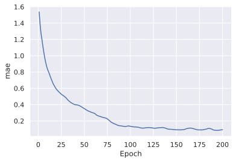
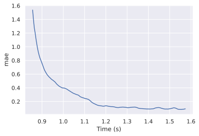
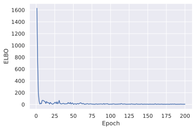
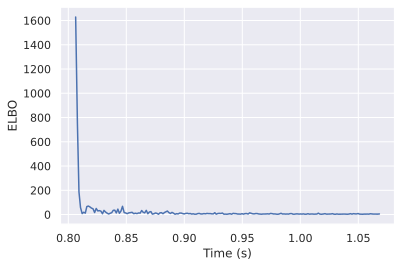
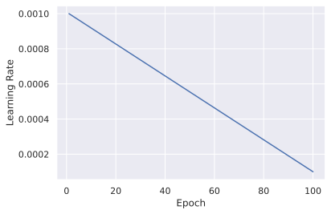
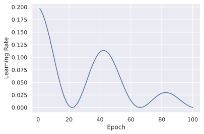
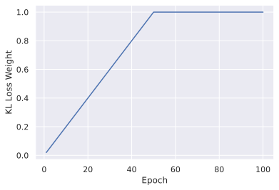
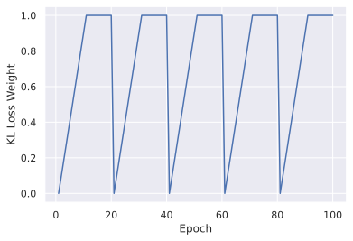
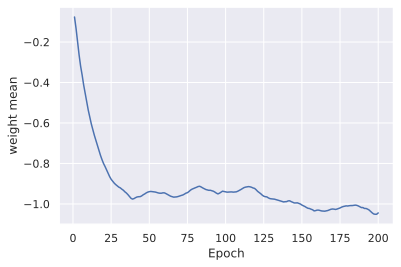
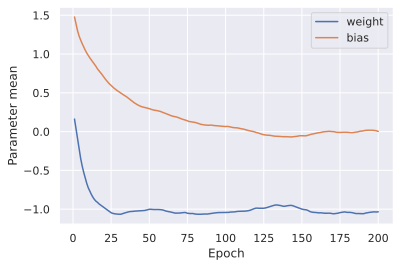

.. _user_guide_callbacks:

Callbacks
=========

.. include:: ../macros.hrst

Callbacks can be used to perform actions during the training process.  Usually
this involves running a function at the beginning or end of each epoch, or at
the start or end of training.  There are several different callbacks that come
built-in to probflow, but you can pretty easily :ref:`create your own as well
<rolling-own-callback>`!

.. _monitoring-a-metric:

Monitoring a metric
-------------------

It's useful to be able to monitor the performance of your model on validation
data over the course of training.  This lets you know how quickly the model is
learning, and whether the model has actually converged on a good solution (i.e.
the metric has stopped improving).

To monitor a metric over the course of training with ProbFlow, use the
:class:`.MonitorMetric` callback.  This takes the name of a metric (see
:meth:`.Model.metric` for a list of available metrics), and validation data.

For example, to record the mean absolute error of a model over the course of
training:

.. code-block:: python3

    #x_val and y_val are numpy arrays w/ validation data
    import probflow as pf

    monitor_mae = pf.MonitorMetric('mae', x_val, y_val)

    model.fit(x_train, y_train, callbacks=[monitor_mae])

Then, after training has finished, you can view the value of the metric as a
function of epoch:

.. code-block:: python3

    monitor_mae.plot()

Or as a function of walltime:

.. code-block:: python3

    monitor_mae.plot(x="time")

Additional keyword arguments to :meth:`.MonitorMetric.plot` are passed to
``matplotlib.pyplot.plt``, so you can also specify labels, line styles, etc.

.. _monitoring-the-loss:

Monitoring the loss
-------------------

Similarly, you can monitor the loss (the negative evidence lower bound, or ELBO
loss) over the course of training.  To monitor the ELBO loss, use the
:class:`.MonitorELBO` callback.  Note that this is capturing the ELBO loss on
the *training* data, while :class:`.MonitorMetric` captured the metric of the
model on validation data.  However, :class:`.MonitorELBO` adds no additional
time to training, while :class:`.MonitorMetric` does (because it has to
evaluate the model on the validation data each epoch).

To record the ELBO loss for each epoch of training data over the course of
training, we can create a :class:`.MonitorELBO` callback:

.. code-block:: python3

    monitor_elbo = pf.MonitorELBO()

    model.fit(x_train, y_train, callbacks=[monitor_elbo])

After training has finished, you can view the average value of the ELBO loss as
a function of epoch:

.. code-block:: python3

    monitor_elbo.plot()

Or as a function of walltime:

.. code-block:: python3

    monitor_elbo.plot(x="time")

.. _user-guide-early-stopping:

Ending training when a metric stops improving
---------------------------------------------

Often, we may want to end training early when some metric (say, MSE on the
validation data) stops improving.  This is both to be more efficient - why keep
training if it's already as good as it's gonna get? - but also to prevent
overfitting (though TBH overfitting by running training for too long is less of
a problem for Bayesian neural nets than it is for normal ones).

The :class:`.EarlyStopping` method can be used to stop training early when some
metric has stopped improving.  You can either use it in combination with
:class:`.MonitorMetric` (:ref:`see above <monitoring-a-metric>`),
:class:`.MonitorELBO` (also :ref:`see above <monitoring-the-loss>`), or with
any arbitrary function you define.  You can also perform early stopping with
some patience - i.e., don't immediately stop training if your metric is worse
than it was on the previous epoch, but only stop training when it has failed to
improve after :math:`n` epochs.

Using a metric
^^^^^^^^^^^^^^

To stop training when some accuracy metric stops improving, we can create a
:class:`.EarlyStopping` callback which monitors the current value of that
metric via a :class:`.MonitorMetric` callback.  For example, to end training
when the mean absolute error (MAE) on some validation data stops improving:

.. code-block:: python3

    import probflow as pf

    model = ...  # your ProbFlow model
    x_train, y_train= ...  # your training data
    x_val, y_val = ...  # your validation data

    monitor_mae = pf.MonitorMetric('mae', x_val, y_val)
    early_stopping = pf.EarlyStopping(monitor_mae)

    model.fit(x_train, y_train, callbacks=[monitor_mae, early_stopping])

Using the loss
^^^^^^^^^^^^^^

Instead of a predictive metric, you can stop training when the loss function
(the evidence lower bound, "ELBO") stops improving.  To do that, create an
:class:`.EarlyStopping` callback which monitors the current value of the ELBO
via a :class:`.MonitorELBO` callback:

.. code-block:: python3

    monitor_elbo = MonitorELBO()
    early_stopping = EarlyStopping(monitor_elbo)

    model.fit(x_train, y_train, callbacks=[monitor_elbo, early_stopping])

Using any arbitrary function
^^^^^^^^^^^^^^^^^^^^^^^^^^^^

You can also have :class:`.EarlyStopping` depend on any arbitrary function.
For example, to manually compute, say, the symmetric mean absolute percentage
error (SMAPE) and stop training when it stops improving,

.. code-block:: python3

    # model = your ProbFlow model
    # x_val, y_val = your validation data

    def smape():
        y_pred = model.predict(x_val)
        return np.mean(
            2 *np.abs(y_pred - y_val) / (np.abs(y_pred) + np.abs(y_val))
        )

    early_stopping = EarlyStopping(smape)

    model.fit(x_train, y_train, callbacks=[early_stopping])

Patience
^^^^^^^^

Often it's a good idea to have some patience before stopping early - i.e.
allow the metric being monitored to *not* improve for a few epochs.  This gives
the optimizer some time to get through any points on the loss surface at which
it may temporarily get stuck.  For example, to only stop training after the
metric has not improved for 5 consecutive epochs, use the ``patience`` keyword
argument to :class:`.EarlyStopping`:

.. code-block:: python3

    monitor_mae = MonitorMetric('mae', x_val, y_val)
    early_stopping = EarlyStopping(monitor_mae, patience=5)

    model.fit(x_train, y_train, callbacks=[monitor_mae, early_stopping])

Ending training after a fixed amount of time
--------------------------------------------

To end training after a set amount of time, use the :class:`.TimeOut` callback.
This callback simply takes the number of seconds after which to stop.

For example, to stop training after one hour

.. code-block:: python3

    time_out = pf.TimeOut(3600)

    model.fit(x_train, y_train, callbacks=[time_out])

.. _user-guide-lr-scheduler:

Changing the learning rate over training
----------------------------------------

Changing the learning rate over the course of training can lead to better fits.
It's common to anneal the learning rate (i.e. decrease it over the course of
training) or use cyclical learning rates to allow for faster optimization in
the early stages of training, but better fine-tuning in the later stages.

To set the learning rate as a function of epoch, use the
:class:`.LearningRateScheduler` callback.  This callback simply requires a
function which takes the epoch as input, and returns a learning rate.

For example, to anneal the learning rate from :math:`10^{-3}` to
:math:`10^{-4}` over the course of 100 epochs, first define your function which
computes the learning rate as a function of epoch:

.. code-block:: python3

    def learning_rate_fn(epoch):
        return np.linspace(1e-3, 1e-4, 100)[epoch-1]

Then, define a :class:`.LearningRateScheduler` callback which takes that
function, and use it to schedule the learning rate during training:

.. code-block:: python3

    lr_scheduler = pf.LearningRateScheduler(learning_rate_fn)

    model.fit(x_train, y_train, epochs=100, callbacks=[lr_scheduler])

You can plot the learning rate as a function of epoch:

.. code-block:: python3

    lr_scheduler.plot()

Or, to use a cyclical annealing learning rate:

.. code-block:: python3

    lr_scheduler = pf.LearningRateScheduler(
        lambda e: 0.1 * (1+np.cos(e/7)) * (1-0.01*e)
    )

    model.fit(x_train, y_train, epochs=100, callbacks=[lr_scheduler])

    lr_scheduler.plot()

.. _user-guide-kl-scheduler:

Changing the KL weight over training
------------------------------------

It can also help to change the weight of the contribution to the loss of the KL
divergence between the parameters' variational posteriors and their priors.
Sometimes it is easier for the model to fit if the likelihood is allowed to
dominate early in training, and then the regularization of the prior is
introduced later on by increasing the weight of the KL contribution to the
loss.  A cyclical annealing schedule is sometimes even better (see `Fu et al.,
2019 <https://arxiv.org/abs/1903.10145>`_).

To change the weight of the KL contribution to the ELBO loss over the course of
training, use the :class:`.KLWeightScheduler` callback.

For example, to increase the weight from 0 to 1 over the course of the first 50
epochs, and then keep at 1 for the last 50 epochs,

.. code-block:: python3

    kl_scheduler = pf.KLWeightScheduler(lambda e: min(1.0, e/50.0))

    model.fit(x_train, y_train, epochs=100, callbacks=[kl_scheduler])

    kl_scheduler.plot()

Or, to use a cyclical annealing schedule like that used in `Fu et al., 2019
<https://arxiv.org/abs/1903.10145>`_,

.. code-block:: python3

    kl_scheduler = pf.KLWeightScheduler(lambda e: min(1.0, e%20/10.0))

    model.fit(x_train, y_train, epochs=100, callbacks=[kl_scheduler])

    kl_scheduler.plot()

.. _user-guide-monitor-parameter:

Monitoring the value of parameter(s)
------------------------------------

For diagnosing and debugging models, it can be useful to record the value of
parameters over the course of training.  This allows you to see where they were
initialized, and how the optimization updated them over the course of training.

To record the mean of a parameter's variational posterior over the course of
training, use the :class:`.MonitorParameter` callback.

For example, if we have a simple linear regression model:

.. code-block:: python3

    class MyModel(pf.Model):

        def __init__(self):
            self.w = pf.Parameter(name="weight")
            self.b = pf.Parameter(name="bias")
            self.s = pf.Parameter(name="std")

        def __call__(self, x):
            return pf.Normal(x * self.w() + self.b(), self.s())

    model = MyModel()

Then we can record the mean of the weight parameter's variational posterior
over the course of training:

.. code-block:: python3

    monitor_weight = pf.MonitorParameter("weight")

    model.fit(x_train, y_train, callbacks=[monitor_weight])

And we can plot the weight over the course of training using the callback's
:meth:`.MonitorParameter.plot` method:

.. code-block:: python3

    monitor_weight.plot()

You can also monitor multiple parameters by passing a list to
:class:`.MonitorParameter`:

.. code-block:: python3

    monitor_params = pf.MonitorParameter(["weight", "bias"])

    model.fit(x_train, y_train, callbacks=[monitor_params])

    import matplotlib.pyplot as plt
    monitor_params.plot("weight", label="weight")
    monitor_params.plot("bias", label="bias")
    plt.legend()
    plt.ylabel("Parameter mean")
    plt.show()

.. _rolling-own-callback:

Rolling your own callback
-------------------------

It's pretty easy to make your own callback too!  Just create a class which
inherits from :class:`.Callback`, and implement any of its methods which you'd
like to use:

* ``__init__`` - setup
* ``on_train_start`` - gets called once at the beginning of training
* ``on_epoch_start`` - gets called at the beginning each epoch
* ``on_epoch_end`` - gets called at the end each epoch
* ``on_train_end`` - gets called once at the end of training

For example, to implement a callback which records the time it takes to run
each epoch,

.. code-block:: python3

    import time

    class TimeEpochs(pf.Callback):

        def __init__(self):
            self.epochs = []
            self.times = []
            self.current_epoch = 0

        def on_epoch_start(self):
            self.t0 = time.time()

        def on_epoch_end(self):
            self.current_epoch += 1
            self.epochs += [self.current_epoch]
            self.times += [time.time() - self.t0]

    time_epochs = TimeEpochs()

Then you can pass that callback object to :meth:`.Model.fit` just as with the
pre-built callbacks:

.. code-block:: python3

    model.fit(x, y, callbacks=[time_epochs])

Or, to create a callback which records your model's mean absolute calibration
error at the end of each epoch,

.. code-block:: python3

    # model = your probflow model
    import matplotlib.pyplot as plt

    class MonitorMACE(pf.Callback):

        def __init__(self, x_val, y_val):
            self.x_val = x_val
            self.y_val = y_val
            self.epochs = []
            self.maces = []
            self.current_epoch = 0

        def on_epoch_end(self):
            self.current_epoch += 1
            self.epochs += [self.current_epoch]
            self.maces += [
                model.calibration_metric("mace", self.x_val, self.y_val)
            ]

        def plot(self):
            plt.plot(self.epochs, self.maces)
            plt.xlabel("Epoch")
            plt.ylabel("Mean absolute calibration error")
