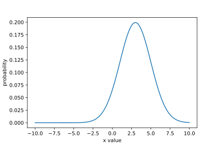

Distributions
=============

|Colab Badge|

.. |Colab Badge| image:: ../img/colab-badge.svg
    :target: https://colab.research.google.com/drive/17rJBiSYPl--pTnutOkjQhxveZUc787lI

.. include:: ../macros.hrst

Probability |Distributions| describe the probability of either a |Parameter| or
a datapoint taking a given value.  In ProbFlow, they're used mainly in three
places: as parameters' priors, as parameters' variational distributions, and as
observation distributions (the predicted distribution of the data which the
model predicts).  However, you can also use them as stand-alone objects or for
other reasons within your models.

Creating a distribution object
------------------------------

To create a distribution, just create an instance of a |Distribution|

.. code-block:: python3

    dist = pf.distributions.Normal(1, 2)

All ProbFlow distributions are also included in the main namespace, so you can
just do:

.. code-block:: python3

    dist = pf.Normal(1, 2)

Using a distribution as a prior
-------------------------------

See :ref:`setting-the-prior`.

Using a distribution as a variational posterior
-----------------------------------------------

See :ref:`specifying-the-variational-posterior`.

Using a distribution as an observation distribution
---------------------------------------------------

See :ref:`specifying-the-observation-distribution`.

Getting the log probability of a value along a distribution
-----------------------------------------------------------

ProbFlow distribution objects can also be used in a stand-alone way, and they
return values which are tensors of the backend type (e.g. if your backend is
Tensorflow, they will return ``tf.Tensor`` objects, not numpy arrays).

To get the log probability of some value along a probability distribution, use
the ``log_prob`` method:

.. code-block:: python3

    dist = pf.Normal(3, 2)

    x = np.linspace(-10, 10, 100)
    log_p = dist.log_prob(x)
    plt.plot(x, np.exp(log_p))

Getting the mean and mode of a distribution
-------------------------------------------

To get the mean of a distribution, use the ``mean`` method:

.. code-block:: pycon

    >>> dist = pf.Gamma(4, 5)
    >>> dist.mean()
    <tf.Tensor: shape=(), dtype=float32, numpy=0.8>

And to get the mode, use the ``mode`` method:

.. code-block:: pycon

    >>> dist.mode()
    <tf.Tensor: shape=(), dtype=float32, numpy=0.6>

Getting samples from a distribution
-----------------------------------

To draw random samples from a distribution, use the ``sample`` method:

.. code-block:: pycon

    >>> dist = pf.Normal(4, 5)
    >>> dist.sample()
    <tf.Tensor: shape=(), dtype=float32, numpy=5.124513>

You can take multiple samples from the same distribution using the ``n``
keyword argument:

.. code-block:: pycon

    >>> dist.sample(n=5)
    <tf.Tensor: shape=(5,), dtype=float32, numpy=array([3.9323747, 2.1640768, 5.909429 , 7.7332597, 3.4620957], dtype=float32)>

If the shape of the distribution's arguments have >1 dimension, the shape of
the samples array will be ``(Nsamples, DistributionShape1, ...,
DistributionShapeN)``:

.. code-block:: pycon

    >>> mean = np.random.randn(3, 4)
    >>> std = np.exp(np.random.randn(3, 4))
    >>> dist = pf.Normal(mean, std)
    >>> dist.sample(n=5).shape
    TensorShape([5, 3, 4])

Rolling your own distribution
-----------------------------

ProbFlow includes most common |Distributions| but to create a custom
distribution which uses a |tfp.Distribution| or a |torch.Distribution| just
create a class which inherits from :class:`.BaseDistribution`, and implements
the following methods:

- ``__init__``
- ``__call__``

Where the call method returns a backend distribution object (a
|tfp.Distribution| or a |torch.Distribution| ):

.. code-block:: python3

    import tensorflow as tf
    import tensorflow_probability as tfp
    tfd = tfp.distributions

    class NormalDistribution(pf.BaseDistribution):

        def __init__(self, mean, std):
            self.mean = mean
            self.std = std

        def __call__(self):
            return tfd.Normal(self.mean, self.std)

Or, to implement a probability distribution completely from scratch, create a
class which inherits from :class:`.BaseDistribution` and implements the
following methods:

- ``__init__``
- ``log_prob``
- ``mean``
- ``mode``
- ``sample``

For example, to manually implement a Normal distribution:

.. code-block:: python3

    class NormalDistribution(pf.BaseDistribution):

        def __init__(self, mean, std):
            self.mean = mean
            self.std = std

        def log_prob(self, x):
            return (
                -0.5*tf.math.square((x-self.mean)/self.std)
                - tf.log(self.std*2.506628274631)
            )

        def mean(self):
            return self.mean

        def mode(self):
            return self.mean

        def sample(self, n=1):
            return tf.random.normal(shape=n, mean=self.mean, stddev=self.std)
