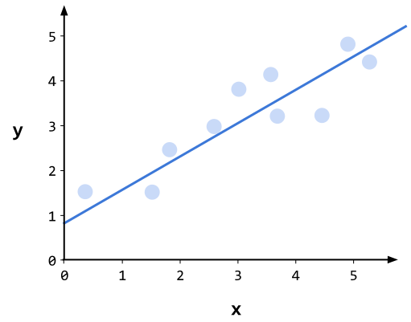
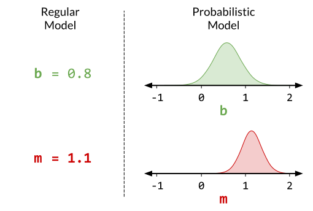

Bayesian Modeling
=================

.. include:: ../macros.hrst

This is just a brief high-level intro to Bayesian modeling, including what a
"Bayesian model" is, and why and when they're useful.  To jump to how to use
ProbFlow to work with Bayesian models, skip to :doc:`backend`.

A statistical model represents how data are generated.  There are different
kinds of models - such as
`discriminative models <https://en.wikipedia.org/wiki/Discriminative_model>`_
(where the model tries to predict some target :math:`y` based on features
:math:`x`), or
`generative models <https://en.wikipedia.org/wiki/Generative_model>`_
(where the model is just trying to determine how some target data is generated,
without necessarily any features to inform it) - but the common theme is that a
model embodies the process by which data is generated, and some assumptions
about how that happens.

For example, a
`linear regression <https://en.wikipedia.org/wiki/Linear_regression>`_
is a simple discriminative model - we're fitting a line to data points so that
given any :math:`x` value, we can predict the corresponding :math:`y` value.

Most models have parameters, which are values that define the model's
predictions.  With a linear regression model, there are two parameters which
define the shape of the line: the intercept (:math:`b`) and the slope
(:math:`m`).

.. image:: img/inference/line_fit_params.svg
   :width: 70 %
   :align: center

To fit a normal non-Bayesian model, we would want to find the parameters which
allow the model to best predict the data.  In the case of the linear
regression, we want to find the best slope value and the best intercept value,
such that the line best fits the data.

But how do we know that a certain value for any parameter really is the "true"
value?  In the linear regression example above, the best-fit line has an
intercept of 0.8, but surely those points could have been generated from a line
with an intercept of 1.0?  Or even conceivably 1.5, or 2!  Though those
intercepts seem increasingly unlikely.

With a probabilistic model, instead of simply looking for the single "best"
value for each parameter, we want to know how likely *any* parameter value is.
That is, we want to find a probability distribution over possible parameter
values.

The Bayesian framework adds another layer to probabilistic modeling.  With
Bayesian analysis, we also specify a "prior" distribution for each parameter -
that is, the probability distribution which we *expect* the parameter to take,
before having seen any of the data.  Then, there's the probability distribution
over parameter values the data (together with the model) suggests the parameter
should take - this is the "likelihood" distribution.  Bayesian analysis
combines the prior and likelihood distributions in a mathematically sound way
to create what's called the "posterior" distribution - the probability
distribution over a parameter's value to which we should update our beliefs
*after* having taken into account the data.

With a Bayesian analysis, when we have a lot of data and that data suggests the
true parameter value is different than what we expected, that evidence
overwhelms our prior beliefs, and the posterior will more strongly reflect the
likelihood than the prior distribution.  On the other hand, if there isn't much
data or if the data is very noisy, the meager evidence shouldn't be enough to
convince us our priors were wrong, and the posterior will more strongly reflect
the prior distribution.

.. image:: img/inference/prior_likelihood_posterior.svg
   :width: 70 %
   :align: center

There are a few different methods for fitting Bayesian models.  Simple models
can be solved analytically, but for more complicated models we have to settle
for approximations of the posterior distributions.
`Markov chain monte carlo <https://en.wikipedia.org/wiki/Markov_chain_Monte_Carlo>`_
(MCMC) is one method which uses sampling to estimate the posterior
distribution, and is usually very accurate, but can also be very slow for large
models or with large datasets.
`Variational inference <https://en.wikipedia.org/wiki/Variational_Bayesian_methods>`_
is a different method which uses simple distributions to approximate the
posteriors.  While this means variational inference is often not as accurate as
MCMC (because the simple variational posterior can't always perfectly match the
true posterior), it is usually much faster. Even faster is the
:doc:`method ProbFlow uses <math>` to fit models, called
`stochastic variational inference <http://jmlr.org/papers/v14/hoffman13a.html>`_
via "`Bayes by backprop <https://arxiv.org/abs/1505.05424>`_".

From a scientific standpoint, Bayesian modeling and analysis encourages being
transparent about your assumptions, and shifts the focus to probabilistic
interpretations of analysis results, instead of thinking of results in terms of
binary it-is-or-it-isn't "significance".

.. image:: https://media.giphy.com/media/uNgUzhakqXkyI/giphy.gif
   :width: 70 %
   :align: center

But from a practical or engineering standpoint, why use a probabilistic
Bayesian model instead of just a normal one?  Bayesian models get you certain
information you can't get from a normal model:

- **Parameter uncertainty**.  The posterior distributions give information as
  to how uncertain we should be about the values of specific parameters.
- **Predictive uncertainty**.  The predictions of Bayesian models are also
  probabilistic.  While they can just predict the most likely target value
  given some features, they are also able to output probability distributions
  over the expected target value.  This can be handy when you need to know how
  confident your model is in its predictions.
- **The ability to separate uncertainty from different sources**. There are
  different
  `sources of uncertainty <https://en.wikipedia.org/wiki/Uncertainty_quantification#Aleatoric_and_epistemic_uncertainty>`_
  in a model.  Two main types are epistemic uncertainty (uncertainty due to not
  having enough data, and therefore having uncertainty as to the true parameter
  values) and aleatoric uncertainty (uncertainty due to noise, or at least due
  to factors we can't or haven't measured).  Bayesian models allow you to
  determine how much uncertainty is due to each of these causes.  If epistemic
  uncertainty dominates, collecting more data will improve your model's
  performance.  But if aleatoric uncertainty dominates, you should consider
  collecting *different* data (or accepting that you've done your best!).
- **Built-in regularization**.  Both the strength of priors, and the random
  sampling used during stochastic variational inference, provide strong
  regularization and make it more difficult for Bayesian models to overfit.
- **The ability to inject domain knowledge into models**.  Priors can be used
  to add domain knowledge to Bayesian models by biasing parameter posteriors
  towards values which experts believe are more valid or likely.
- **Provides a framework for making decisions** using your model's
  probabilistic predictions via
  `Bayesian decision theory <http://en.wikipedia.org/wiki/Bayesian_decision_theory>`_.

.. and model comparison? (though ProbFlow doesn't support that yet)

However, there are a few important disadvantages to using Bayesian models:

- **Computation time**.  Bayesian models nearly always take longer to fit than
  non-probabilistic, non-Bayesian version of the same model.
- **Prior choices are left up to you, and they affect the result**.  The choice
  of the parameters' priors have to be made by the person building the model,
  and it's usually best to use somewhat informative priors.  Unfortunately, the
  prior can bias the result!  So the result of a Bayesian analysis is never
  really "unbiased."
- **Harder to debug**.  Bayesian models often take more time and effort to get
  working correctly than, say, gradient boosted decision trees or a simple
  t-test.  You have to decide whether that time is worth it for the advantages
  using a Bayesian model can have for your application.

This has been a quick and *very* non-formal intro to Bayesian modeling, but for
an actual introduction, some things I'd suggest taking a look at:

- `Doing Bayesian Data Analysis <https://sites.google.com/site/doingbayesiandataanalysis/what-s-new-in-2nd-ed>`_ by John Krusche
- `Bayesian Data Analysis <http://www.stat.columbia.edu/~gelman/book/>`_ by Andrew Gelman & co
- The `Stan user guide <https://mc-stan.org/docs/2_20/stan-users-guide/index.html>`_
- `Probabilistic Programming and Bayesian Methods for Hackers <https://camdavidsonpilon.github.io/Probabilistic-Programming-and-Bayesian-Methods-for-Hackers/>`_ by Cameron Davidson-Pilon
